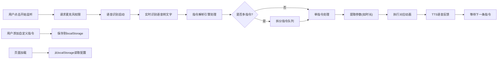

## 1. 产品概述

AI实时语音控制网页机器人是一个基于Web技术的交互式应用，用户通过语音指令控制屏幕上的卡通机器人执行各种动画动作。应用无需后端服务，完全在浏览器中运行，支持离线使用。

- **核心价值**：提供直观有趣的语音交互体验，展示Web Speech API的强大功能
- **目标用户**：对AI语音交互感兴趣的开发者、教育工作者和普通用户
- **使用场景**：技术演示、教学辅助、娱乐互动

## 2. 核心功能

### 2.1 功能模块

1. **机器人展示模块**：CSS+Canvas绘制的卡通机器人形象，支持情绪表达
2. **语音识别模块**：基于Web Speech API的实时语音转文字
3. **指令解析模块**：解析语音指令，支持连续多指令和数值参数
4. **动画控制模块**：控制机器人执行各种动画效果
5. **语音反馈模块**：TTS语音合成，机器人执行后语音回应
6. **自定义指令模块**：用户可添加新指令并关联动画
7. **数据持久化模块**：localStorage保存自定义指令配置
8. **触控按钮模块**：点击按钮触发指令作为备选输入方式

### 2.2 页面详情

| 页面名称 | 模块名称 | 功能描述 |
|-----------|-------------|---------------------|
| 主页面 | 机器人展示区 | Canvas绘制机器人，实时显示动画和情绪变化 |
| 主页面 | 控制面板区 | 语音控制开关、状态显示、识别文本展示 |
| 主页面 | 快捷按钮区 | 常用指令触控按钮，点击触发对应动画 |
| 主页面 | 自定义指令区 | 添加、编辑、删除自定义指令，配置关联动画 |
| 主页面 | 指令历史区 | 显示已识别的指令历史记录 |

## 3. 核心流程

## 4. 用户界面设计

### 4.1 设计风格
- **主色调**：科技蓝 (#4F46E5) + 活力橙 (#F97316) + 深灰背景 (#1E293B)
- **按钮风格**：圆角3D按钮，带渐变效果和悬浮动画
- **字体**：Orbitron (标题) + Quicksand (正文)，营造未来科技感
- **布局风格**：卡片式布局，机器人居中展示，控制面板分布四周
- **图标风格**：使用Emoji和CSS绘制图标，增强趣味性

### 4.2 页面设计概述

| 页面名称 | 模块名称 | UI元素 |
|-----------|-------------|-------------|
| 主页面 | 机器人展示区 | Canvas画布，居中显示，带发光边框效果 |
| 主页面 | 控制面板区 | 圆形麦克风按钮，状态指示灯，识别文字滚动显示 |
| 主页面 | 快捷按钮区 | 网格布局按钮，每个按钮带图标和文字说明 |
| 主页面 | 自定义指令区 | 表单输入区，指令列表，编辑弹窗 |
| 主页面 | 指令历史区 | 滚动列表，显示时间戳和指令内容 |

### 4.3 响应式设计
- **桌面端**：横向布局，机器人居中，左右两侧分布控制面板
- **平板端**：自适应网格布局，机器人占上方60%区域
- **移动端**：垂直布局，机器人在上，控制按钮在下，优化触控区域
- **触控优化**：按钮最小尺寸48x48px，增加触控反馈效果

### 4.4 动效设计
- **入场动画**：页面加载时机器人部件逐个组装动画
- **交互反馈**：按钮悬浮缩放、点击涟漪效果
- **状态切换**：语音识别状态的呼吸灯效果
- **情绪变化**：眼睛形状平滑过渡动画
- **指令执行**：动作间的流畅转场效果
