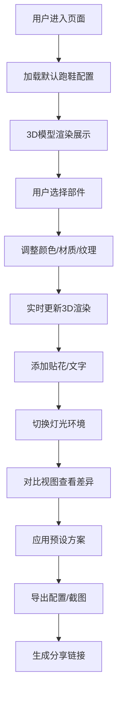

## 1. 产品概述

基于Three.js和WebGL的3D跑鞋定制配置器，用户可全方位交互定制跑鞋的各个部件，包括颜色、材质、纹理、贴花等，并支持导出、分享和对比功能。

- 产品目标：提供沉浸式的3D产品定制体验，让用户可以自由设计个性化跑鞋
- 目标用户：运动鞋爱好者、个性化定制需求用户、品牌设计师
- 核心价值：实时3D渲染预览、丰富的定制选项、便捷的分享导出功能

## 2. 核心特征

### 2.1 用户角色
| 角色 | 注册方式 | 核心权限 |
|------|---------|---------|
| 普通用户 | 无需注册，直接使用 | 所有定制功能、导出截图、分享配置 |

### 2.2 功能模块
1. **3D视图模块**：跑鞋3D模型展示、鼠标交互（旋转/缩放/平移）
2. **部件定制模块**：7个独立部件的颜色、材质、纹理定制
3. **贴花定制模块**：文字贴花、图片徽章上传
4. **灯光环境模块**：光照预设切换、手动光源调整
5. **对比视图模块**：分屏对比当前设计与默认设计
6. **预设方案模块**：3套设计师预设配色一键应用
7. **历史记录模块**：配置修改历史、撤销/重做
8. **导出分享模块**：配置JSON导出、截图生成、分享链接

### 2.3 页面详情
| 页面名称 | 模块名称 | 功能描述 |
|---------|---------|----------|
| 主配置页面 | 3D视图区 | 展示跑鞋3D模型，支持鼠标拖拽旋转、滚轮缩放、右键平移 |
| 主配置页面 | 左侧控制面板 | 部件选择、颜色选择器、材质切换、纹理选择 |
| 主配置页面 | 右侧工具栏 | 贴花设置、灯光控制、预设方案、历史记录、导出分享 |
| 主配置页面 | 底部状态栏 | 显示当前选中部件信息、操作提示 |

## 3. 核心流程

## 4. 用户界面设计

### 4.1 设计风格
- **主色调**：深黑色背景（#0a0a0a）配合高饱和强调色（#ff3366）
- **辅助色**：科技蓝（#00d4ff）、金属银（#c0c0c0）
- **按钮风格**：玻璃拟态效果，圆角8px，悬停有发光效果
- **字体**：Display字体使用Space Grotesk，正文字体使用Inter
- **布局风格**：三栏布局，左侧控制面板、中间3D视口、右侧工具栏
- **图标风格**：使用lucide-react线性图标，统一24px尺寸

### 4.2 页面设计概览
| 页面名称 | 模块名称 | UI元素 |
|---------|---------|--------|
| 主配置页 | 3D视图区 | 全屏WebGL画布、悬浮操作提示、选中部件高亮边框 |
| 主配置页 | 左侧控制面板 | 部件选择卡片组、16色色板网格、RGB滑块、材质下拉、纹理缩略图 |
| 主配置页 | 右侧工具栏 | 折叠式面板组、开关按钮、滑块控制、图标按钮组 |
| 主配置页 | 对比视图 | 垂直分隔线、左右视图同步旋转、默认配置标签 |

### 4.3 响应式
- 桌面端（>1200px）：三栏完整布局
- 平板端（768px-1200px）：左右面板可折叠，3D视口自适应
- 移动端（<768px）：垂直堆叠布局，控制面板改为底部抽屉
- 触控优化：支持双指缩放、单指旋转

### 4.4 3D场景指引
- **环境**：使用HDRI环境贴图，提供真实的反射效果
- **光照**：主方向光 + 环境光 + 补光三光源系统，支持阴影投射
- **相机**：PerspectiveCamera，初始位置(0, 1.5, 4)，fov 45度
- **交互**：OrbitControls，支持阻尼效果，最小距离2，最大距离8
- **后处理**：抗锯齿、环境光遮蔽、轻微泛光效果
- **模型**：程序化生成7个独立部件，每个部件独立材质
- **性能**：控制多边形总数在5万以内，目标帧率60fps
