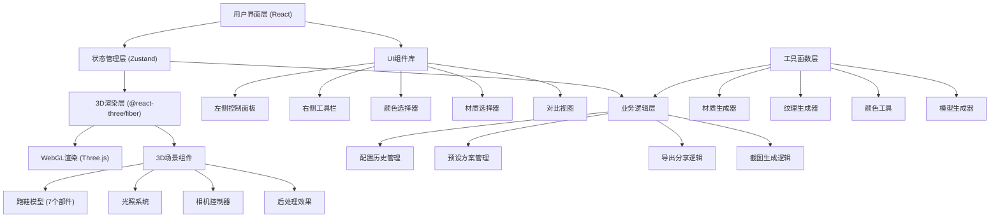

## 1. 架构设计



## 2. 技术描述

- **前端框架**：React@18 + TypeScript
- **构建工具**：Vite@5
- **样式方案**：TailwindCSS@3
- **状态管理**：Zustand@4
- **路由管理**：react-router-dom@6
- **3D渲染**：Three.js@0.160 + @react-three/fiber@8 + @react-three/drei@9 + @react-three/postprocessing@2
- **图标库**：lucide-react@0.294
- **后端**：无（纯前端应用）
- **数据持久化**：LocalStorage + URL参数

## 3. 路由定义

| 路由 | 用途 |
|-----|------|
| / | 主配置页面，所有功能入口 |
| /share/:configId | 分享链接加载页面，根据配置ID恢复设计 |

## 4. 数据模型

### 4.1 核心数据结构

```typescript
// 部件类型
type ShoePart = 'upper' | 'sole' | 'laces' | 'logo' | 'heel' | 'tongue' | 'lining';

// 材质类型
type UpperMaterial = 'leather' | 'mesh' | 'suede' | 'reflective';
type SoleMaterial = 'rubber' | 'eva' | 'carbon';

// 纹理类型
type TexturePattern = 'solid' | 'stripes' | 'dots' | 'camouflage' | 'carbon';

// 灯光预设
type LightingPreset = 'indoor' | 'outdoor' | 'stage';

// 字体类型
type DecalFont = 'arial' | 'impact' | 'script' | 'bold';

// 单个部件配置
interface PartConfig {
  color: string;
  material: UpperMaterial | SoleMaterial;
  texture: TexturePattern;
}

// 贴花配置
interface DecalConfig {
  text: string;
  font: DecalFont;
  color: string;
  position: { x: number; y: number };
  scale: number;
  badgeImage?: string; // base64
}

// 灯光配置
interface LightingConfig {
  preset: LightingPreset;
  mainLightIntensity: number;
  mainLightPosition: { x: number; y: number; z: number };
  ambientIntensity: number;
}

// 完整鞋配置
interface ShoeConfig {
  id: string;
  name: string;
  parts: Record<ShoePart, PartConfig>;
  decals: DecalConfig[];
  lighting: LightingConfig;
  createdAt: number;
  updatedAt: number;
}

// 历史记录
interface HistoryState {
  past: ShoeConfig[];
  present: ShoeConfig;
  future: ShoeConfig[];
}

// 预设方案
interface PresetScheme {
  id: string;
  name: string;
  description: string;
  thumbnail: string;
  config: Partial<ShoeConfig>;
}
```

### 4.2 预设颜色面板

```typescript
const COLOR_PALETTE = [
  '#000000', '#FFFFFF', '#FF0000', '#00FF00', 
  '#0000FF', '#FFFF00', '#FF00FF', '#00FFFF',
  '#FF3366', '#FF9900', '#9933FF', '#33CCFF',
  '#33FF99', '#CC3333', '#666666', '#CCCCCC'
];
```

### 4.3 预设方案数据

```typescript
const PRESET_SCHEMES: PresetScheme[] = [
  {
    id: 'classic-black-red',
    name: '经典黑红',
    description: '永恒的经典配色，低调中透着激情',
    thumbnail: 'data:image/png;base64,...',
    config: {
      parts: {
        upper: { color: '#1a1a1a', material: 'leather', texture: 'solid' },
        sole: { color: '#cc0000', material: 'rubber', texture: 'solid' },
        laces: { color: '#ff0000', material: 'mesh', texture: 'solid' },
        logo: { color: '#ffffff', material: 'reflective', texture: 'solid' },
        heel: { color: '#333333', material: 'carbon', texture: 'carbon' },
        tongue: { color: '#1a1a1a', material: 'mesh', texture: 'solid' },
        lining: { color: '#ff3333', material: 'mesh', texture: 'solid' }
      }
    }
  },
  {
    id: 'fresh-white-blue',
    name: '清新白蓝',
    description: '清爽的夏日配色，活力四射',
    thumbnail: 'data:image/png;base64,...',
    config: {
      parts: {
        upper: { color: '#ffffff', material: 'mesh', texture: 'stripes' },
        sole: { color: '#0066cc', material: 'eva', texture: 'solid' },
        laces: { color: '#3399ff', material: 'mesh', texture: 'solid' },
        logo: { color: '#003366', material: 'leather', texture: 'solid' },
        heel: { color: '#004080', material: 'rubber', texture: 'solid' },
        tongue: { color: '#e6f3ff', material: 'mesh', texture: 'solid' },
        lining: { color: '#b3d9ff', material: 'mesh', texture: 'solid' }
      }
    }
  },
  {
    id: 'bold-neon-green',
    name: '张扬荧光绿',
    description: '个性张扬，成为焦点',
    thumbnail: 'data:image/png;base64,...',
    config: {
      parts: {
        upper: { color: '#00ff00', material: 'reflective', texture: 'dots' },
        sole: { color: '#000000', material: 'carbon', texture: 'carbon' },
        laces: { color: '#33ff33', material: 'mesh', texture: 'solid' },
        logo: { color: '#00ff00', material: 'reflective', texture: 'solid' },
        heel: { color: '#1a1a1a', material: 'carbon', texture: 'carbon' },
        tongue: { color: '#00cc00', material: 'mesh', texture: 'dots' },
        lining: { color: '#003300', material: 'mesh', texture: 'solid' }
      }
    }
  }
];
```

## 5. 目录结构

```
src/
├── components/
│   ├── three/
│   │   ├── ShoeModel.tsx          # 跑鞋3D模型主组件
│   │   ├── ShoeParts.tsx          # 7个独立部件组件
│   │   ├── LightingSystem.tsx     # 光照系统组件
│   │   ├── DecalSystem.tsx        # 贴花系统组件
│   │   └── TextureGenerator.tsx   # 纹理生成工具
│   ├── ui/
│   │   ├── ColorPicker.tsx        # 颜色选择器（16色+RGB）
│   │   ├── MaterialSelector.tsx   # 材质选择器
│   │   ├── TextureSelector.tsx    # 纹理选择器
│   │   ├── PartSelector.tsx       # 部件选择器
│   │   ├── DecalEditor.tsx        # 贴花编辑器
│   │   ├── LightingPanel.tsx      # 灯光控制面板
│   │   ├── PresetGallery.tsx      # 预设方案库
│   │   ├── HistoryBar.tsx         # 历史记录栏
│   │   ├── CompareView.tsx        # 对比视图组件
│   │   ├── ExportPanel.tsx        # 导出面板
│   │   └── SharePanel.tsx         # 分享面板
│   ├── layout/
│   │   ├── LeftPanel.tsx          # 左侧控制面板
│   │   ├── RightPanel.tsx         # 右侧工具栏
│   │   ├── Viewport.tsx           # 3D视口
│   │   └── StatusBar.tsx          # 底部状态栏
│   └── App.tsx                    # 主应用组件
├── store/
│   ├── useConfigStore.ts          # 配置状态管理
│   └── useHistoryStore.ts         # 历史记录状态管理
├── utils/
│   ├── materialPresets.ts         # 材质预设参数
│   ├── colorUtils.ts              # 颜色工具函数
│   ├── configSerializer.ts        # 配置序列化/反序列化
│   ├── screenshot.ts              # 截图生成
│   └── shareUtils.ts              # 分享功能工具
├── types/
│   └── index.ts                   # TypeScript类型定义
├── data/
│   └── presets.ts                 # 预设方案数据
├── hooks/
│   ├── useShoeInteraction.ts      # 鞋模型交互钩子
│   └── useKeyboardShortcuts.ts    # 键盘快捷键钩子
├── App.tsx
├── main.tsx
└── index.css
```

## 6. 关键技术实现

### 6.1 3D模型生成
使用Three.js的几何原语程序化生成跑鞋7个部件，不依赖外部模型文件：
- 鞋面主体：使用ExtrudeGeometry + 自定义鞋型轮廓
- 鞋底：使用LatheGeometry或BoxGeometry变形
- 鞋带：使用TorusGeometry或TubeGeometry
- Logo：使用ShapeGeometry自定义标志形状
- 后跟支撑片：使用CylinderGeometry切片
- 鞋舌：使用PlaneGeometry弯曲变形
- 内衬：使用内侧偏移几何体

### 6.2 材质系统
每个部件使用独立的MeshStandardMaterial，根据材质类型设置不同的物理参数：
- 皮革：高粗糙度(0.6)、中等金属度(0.1)
- 网眼布：高透明度(0.7)、低粗糙度(0.3)、使用AlphaMap
- 麂皮：极高粗糙度(0.9)、零金属度
- 反光材料：低粗糙度(0.1)、高金属度(0.8)、使用envMapIntensity
- 橡胶：中等粗糙度(0.7)、零金属度
- EVA发泡：中等粗糙度(0.5)、低金属度(0.0)
- 碳纤维：低粗糙度(0.2)、高金属度(0.6)、使用normalMap

### 6.3 历史记录实现
使用immer.js实现不可变状态更新，采用经典的past/present/future模式：
- 每次配置修改自动推入历史栈
- 支持撤销(undo)和重做(redo)
- 历史记录上限50步，超出自动清理最旧记录

### 6.4 配置分享实现
- 使用LZ-String压缩配置数据
- Base64编码后作为URL参数传递
- 支持生成短链接（可选）
- 分享卡片包含缩略图和基本信息

### 6.5 截图功能
使用Three.js的WebGLRenderer直接读取像素：
- 临时提升渲染分辨率(2x或4x)
- 渲染后读取像素数据
- 转换为PNG Blob并触发下载
- 可选透明背景
