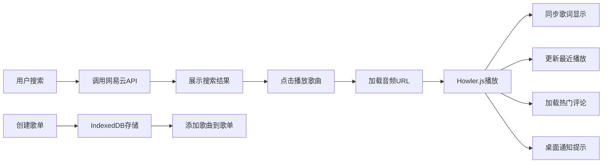

## 1. 产品概述

基于React和Howler.js构建的Web端音乐播放器，对接网易云音乐公开API，提供完整的音乐播放、搜索、歌单管理、歌词同步等功能。

- 面向音乐爱好者，提供一站式在线音乐播放体验
- 支持个性化歌单管理、歌词同步、音频可视化等高级功能
- 具备高设计质感的深色主题界面，流畅的交互动画

## 2. 核心功能

### 2.1 用户角色

| 角色 | 登录方式 | 核心权限 |
|------|----------|----------|
| 游客用户 | 无需登录 | 搜索歌曲、播放音乐、创建本地歌单、使用基础播放功能 |
| 登录用户 | 网易云账号登录 | 同步私人歌单、获取每日推荐、查看收藏歌曲 |

### 2.2 功能模块

1. **音乐搜索页**：歌曲/歌手/专辑搜索，搜索结果列表
2. **播放器控制栏**：播放/暂停、上一首/下一首、音量、进度条、循环模式
3. **歌单管理**：新建歌单、添加/移除歌曲、IndexedDB持久化存储
4. **播放列表**：临时播放队列、拖拽排序、移除歌曲
5. **歌词展示**：LRC歌词同步、当前行高亮、手动滚动
6. **账号登录**：网易云账号登录、私人歌单同步、每日推荐
7. **评论模块**：热门评论展示、分页查看
8. **最近播放**：30首最近播放记录、侧边栏展示
9. **电台推荐**：基于播放风格推荐相似电台
10. **音频可视化**：Canvas频谱动画、柱状图/波浪图切换
11. **歌单导出**：JSON/CSV格式导出

### 2.3 页面详情

| 页面名称 | 模块名称 | 功能描述 |
|----------|----------|----------|
| 主页面 | 搜索栏 | 支持歌曲、歌手、专辑关键词搜索 |
| 主页面 | 搜索结果列表 | 展示歌曲信息，点击播放，支持添加到歌单 |
| 主页面 | 侧边栏 | 我的歌单、最近播放、电台推荐导航 |
| 主页面 | 播放器控制栏 | 底部固定播放控制，包含所有播放操作 |
| 主页面 | 歌词面板 | 右侧抽屉式歌词展示，同步高亮 |
| 主页面 | 评论区 | 歌曲热门评论，分页加载 |
| 主页面 | 可视化面板 | 音频频谱动画展示 |
| 歌单详情页 | 歌单信息 | 歌单封面、名称、歌曲列表 |
| 登录页 | 登录表单 | 手机号/邮箱登录网易云账号 |

## 3. 核心流程

### 3.1 搜索播放流程
用户在搜索框输入关键词 → 调用搜索API获取结果 → 点击歌曲 → 加载音频URL → 开始播放 → 同步更新播放列表、最近播放、歌词、评论

### 3.2 歌单管理流程
点击新建歌单 → 输入歌单名称 → 保存到IndexedDB → 搜索歌曲 → 点击添加到歌单 → 选择目标歌单 → 保存关联关系

### 3.3 Mermaid流程图

## 4. 用户界面设计

### 4.1 设计风格
- **主色调**：深色背景（#0a0a0f）搭配霓虹紫色（#9333ea）和青蓝色（#06b6d4）渐变
- **辅助色**：粉色点缀（#ec4899）用于高亮当前播放
- **按钮风格**：圆角玻璃拟态，hover时有发光效果
- **字体**：展示字体使用 "Space Grotesk"，正文字体使用 "Inter"
- **布局**：三栏布局（侧边栏+主内容区+歌词/评论面板），底部固定播放器
- **图标**：Lucide图标库，统一线性风格

### 4.2 页面设计概览

| 页面名称 | 模块名称 | UI元素 |
|----------|----------|--------|
| 主页面 | 搜索栏 | 居中搜索框，玻璃拟态背景，发光边框 |
| 主页面 | 歌曲列表 | 卡片式布局，hover上浮动画，播放按钮悬浮显示 |
| 主页面 | 侧边栏 | 毛玻璃效果，歌单项hover高亮，滚动条美化 |
| 主页面 | 播放器 | 底部进度条拖拽，音量滑块，循环模式切换按钮组 |
| 主页面 | 歌词面板 | 渐隐边缘，当前行放大高亮，平滑滚动动画 |
| 主页面 | 可视化 | Canvas画布自适应，渐变色彩频谱动画 |

### 4.3 响应式设计
- 桌面端优先，1200px以上完整三栏布局
- 平板端（768-1200px）：两栏布局，歌词面板改为抽屉式
- 移动端（<768px）：单栏布局，底部导航切换不同功能模块

### 4.4 动画与交互
- 页面加载时元素渐入动画，staggered延迟效果
- 歌曲切换时封面旋转动画
- 播放/暂停按钮平滑过渡
- 音量、进度条滑块自定义样式
- 歌单项拖拽排序时的占位符动画
