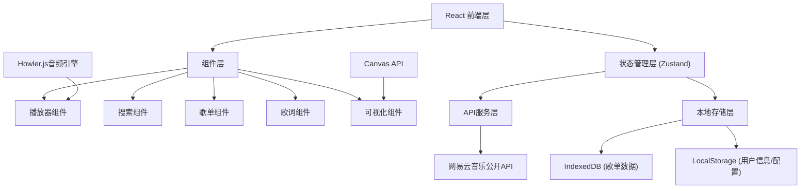
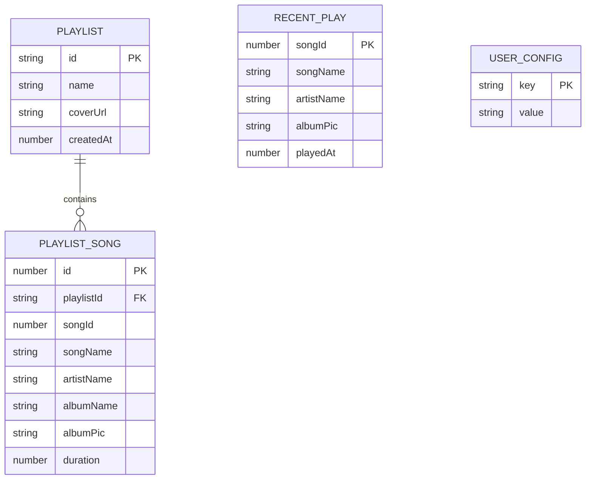

## 1. 架构设计



## 2. 技术描述

- **前端框架**：React@18 + TypeScript + Vite@5
- **状态管理**：Zustand@4
- **路由**：React Router DOM@6
- **样式方案**：TailwindCSS@3 + CSS变量
- **音频引擎**：Howler.js@2.2.4
- **图标库**：Lucide React@0.294
- **本地数据库**：IndexedDB (idb库封装)
- **HTTP客户端**：Axios@1.6
- **拖拽排序**：@dnd-kit/core + @dnd-kit/sortable
- **动画库**：Framer Motion@10

## 3. 路由定义

| 路由路径 | 页面组件 | 用途说明 |
|----------|----------|----------|
| `/` | HomePage | 主页，搜索和歌曲列表 |
| `/playlist/:id` | PlaylistDetailPage | 歌单详情页 |
| `/login` | LoginPage | 网易云账号登录 |
| `/radio` | RadioPage | 电台推荐页 |
| `/history` | HistoryPage | 最近播放记录页 |

## 4. API服务层定义

### 4.1 类型定义

```typescript
interface Song {
  id: number;
  name: string;
  artists: Array<{ id: number; name: string }>;
  album: { id: number; name: string; picUrl: string };
  duration: number;
  url?: string;
}

interface Playlist {
  id: string;
  name: string;
  coverUrl?: string;
  songs: Song[];
  createdAt: number;
}

interface LyricLine {
  time: number;
  text: string;
}

interface Comment {
  commentId: number;
  content: string;
  user: { nickname: string; avatarUrl: string };
  likedCount: number;
  time: number;
}
```

### 4.2 API接口列表

| 接口方法 | 路径 | 说明 |
|----------|------|------|
| `search` | `/search` | 搜索歌曲/歌手/专辑 |
| `getSongUrl` | `/song/url` | 获取歌曲播放地址 |
| `getLyric` | `/lyric` | 获取LRC歌词 |
| `getHotComments` | `/comment/hot` | 获取热门评论 |
| `login` | `/login/cellphone` | 手机号登录 |
| `getUserPlaylist` | `/user/playlist` | 获取用户歌单 |
| `getRecommendSongs` | `/recommend/songs` | 获取每日推荐 |
| `getSimilarRadio` | `/dj/similar` | 获取相似电台 |
| `getRecentPlayHistory` | `/record/recent/song` | 获取最近播放 |

## 5. 数据模型

### 5.1 IndexedDB数据模型



### 5.2 IndexedDB Store定义

1. **playlists** 存储用户创建的歌单
   - 主键：id (自增UUID)
   - 索引：name, createdAt

2. **playlist_songs** 存储歌单中的歌曲
   - 主键：自增id
   - 索引：playlistId, songId

3. **recent_play** 存储最近播放记录
   - 主键：songId
   - 索引：playedAt

4. **user_config** 存储用户配置
   - 主键：key

## 6. 核心模块说明

### 6.1 播放器核心 (usePlayer Hook)
- 封装Howler.js实例
- 管理播放状态、进度、音量
- 实现循环模式（单曲/列表/随机）
- 上一首/下一首切换逻辑

### 6.2 歌词解析器 (utils/lyricParser.ts)
- 解析LRC格式字符串
- 时间戳转换与匹配
- 当前歌词行计算

### 6.3 音频可视化 (utils/visualizer.ts)
- Web Audio API获取频谱数据
- Canvas绘制柱状图/波浪图
- 动画帧循环控制

### 6.4 全局快捷键 (hooks/useKeyboardShortcuts.ts)
- 空格键：播放/暂停
- 左右方向键：上一首/下一首
- 上下方向键：音量增减

### 6.5 桌面通知 (utils/notification.ts)
- Notification API权限请求
- 歌曲切换时显示通知
