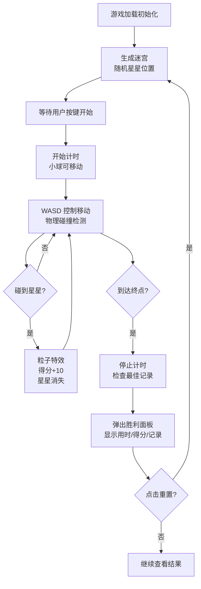

## 1. 产品概述
基于 Three.js 的 3D 迷宫滚球游戏，玩家控制小球在立体迷宫中从起点滚动到终点，通过收集星星获得分数，追求最快通关时间。

- 核心玩法：WASD 键盘控制小球移动，躲避墙壁，收集星星，到达终点
- 目标用户：休闲游戏玩家，Three.js 3D 交互爱好者
- 产品价值：提供沉浸式 3D 迷宫探索体验，融合物理碰撞、收集元素与竞速挑战

## 2. 核心特性

### 2.1 用户角色
| 角色 | 注册方式 | 核心权限 |
|------|----------|----------|
| 玩家 | 无需注册 | 完整游戏体验、本地记录保存 |

### 2.2 功能模块
1. **游戏主场景**：3D 迷宫渲染、小球物理运动、碰撞检测
2. **控制系统**：WASD 键盘输入、惯性摩擦物理、难度切换
3. **摄像头系统**：第一人称跟随、灵敏度调节
4. **道具系统**：随机星星生成、粒子特效、得分计算
5. **计时系统**：游戏计时、最佳记录 localStorage 持久化
6. **UI 界面**：得分显示、计时器、小地图、胜利面板、设置面板
7. **重置功能**：一键重置位置、星星、计时

### 2.3 页面详情
| 页面名称 | 模块名称 | 功能描述 |
|---------|---------|----------|
| 游戏主页面 | 3D 场景渲染 | Three.js 迷宫、小球、灯光、阴影、材质区分 |
| 游戏主页面 | 控制输入 | WASD 键位检测、移动向量计算 |
| 游戏主页面 | 物理系统 | 速度、加速度、惯性、摩擦力、碰撞检测 |
| 游戏主页面 | 摄像头 | 跟随小球、第三人称后方视角、可调节灵敏度 |
| 游戏主页面 | 星星道具 | 3 个随机位置、旋转动画、碰撞检测、粒子特效 |
| 游戏主页面 | 计时系统 | 开始计时、停止计时、时间格式化显示 |
| 游戏主页面 | 终点区域 | 半透明发光圆柱体、进入检测、胜利触发 |
| 游戏主页面 | 小地图 | 右上角俯视线框、红点标记位置 |
| 游戏主页面 | 胜利面板 | 显示用时、得分、是否破纪录 |
| 游戏主页面 | 设置面板 | 难度切换、镜头灵敏度滑块、重置按钮 |
| 游戏主页面 | 数据持久化 | localStorage 存储最佳通关时间 |

## 3. 核心流程

## 4. 界面设计

### 4.1 设计风格
- **主色调**：深色背景 (#0a0a12)，科技感霓虹点缀
- **强调色**：绿色入口 (#22c55e)、红色终点 (#ef4444)、灰色墙体 (#6b7280)、金色星星 (#fbbf24)
- **字体**：Orbitron 显示字体 + JetBrains Mono 等宽字体，营造科技游戏氛围
- **按钮风格**：圆角矩形、半透明玻璃态、hover 发光效果
- **布局**：全屏 3D 画布、左上角得分计时、右上角小地图、底部设置按钮
- **视觉效果**：柔和阴影、发光材质、粒子特效、平滑过渡动画

### 4.2 页面设计概览
| 页面名称 | 模块名称 | UI 元素 |
|---------|---------|---------|
| 游戏主页 | 3D 场景 | 立方体迷宫墙（绿/红/灰材质）、金色发光小球、旋转星星、发光终点柱、地面网格、阴影 |
| 游戏主页 | HUD 左上角 | 得分显示（金色数字）、计时器（白色等宽字体）、最佳记录（浅灰色小字） |
| 游戏主页 | 小地图右上 | 黑白线框俯视迷宫、红色圆点标记玩家位置、半透明背景 |
| 游戏主页 | 设置按钮 | 右下角齿轮图标、点击展开半透明面板 |
| 游戏主页 | 设置面板 | 难度切换按钮（简单/困难）、镜头灵敏度滑块、重置游戏按钮 |
| 游戏主页 | 胜利面板 | 居中半透明弹窗、金色边框、用时统计、得分统计、破纪录提示、再来一局按钮 |

### 4.3 响应式
- 桌面端优先设计，自适应不同屏幕尺寸
- 小地图和 HUD 元素使用固定定位，确保在各种分辨率下位置合理
- 3D 画布使用 `window.innerWidth/innerHeight` 全屏自适应
- 窗口大小变化时自动调整渲染尺寸和摄像头比例

### 4.4 3D 场景指引
- **环境氛围**：深色科幻风格，轻微雾效增强空间感
- **光照设置**：主方向光投射阴影，环境光提供基础照明，点光源增强星星和终点发光效果
- **摄像头设置**：第三人称跟随视角，位于小球后上方 45 度，可通过滑块调节跟随松紧度（插值系数）
- **构图焦点**：迷宫中心区域为主要玩法区，入口绿色、出口红色形成视觉引导
- **交互动画**：星星持续旋转上下浮动，小球滚动旋转，终点柱呼吸发光，收集粒子爆炸效果
- **后处理**：轻微抗锯齿、阴影柔和化、发光材质 bloom 效果
- **性能预算**：单页应用，迷宫 15x15 网格，3 个星星，总面数控制在 5000 以内，60fps 流畅运行
