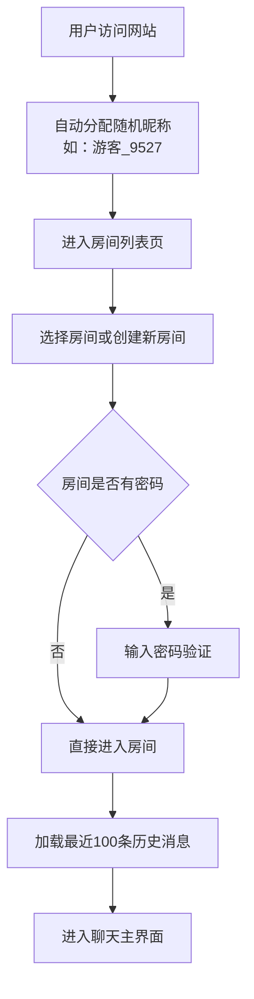
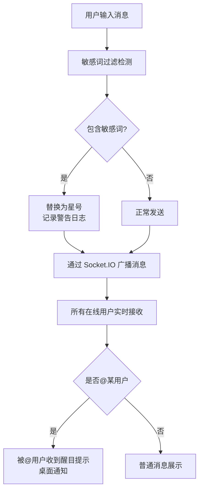

## 1. 产品概述

基于 Flask 和 Socket.IO 的实时匿名聊天室 Web 应用，无需注册登录即可使用，为用户提供便捷的即时通讯体验。

- 解决用户快速创建临时聊天空间的需求，支持多人实时交流、私聊、投票等丰富功能
- 面向需要快速协作交流、临时讨论的互联网用户，主打轻量、匿名、即时的产品特性

## 2. 核心功能

### 2.1 用户角色

| 角色 | 登录方式 | 核心权限 |
|------|----------|----------|
| 普通用户 | 自动分配随机昵称 | 浏览房间、加入房间、发送消息、私聊、上传图片、参与投票 |
| 房间创建者 | 自动分配随机昵称 | 包含普通用户所有权限，另可：发起投票、踢人、禁言、管理房间 |
| 系统管理员 | 配置敏感词 | 配置敏感词列表、查看警告日志 |

### 2.2 功能模块

1. **聊天室列表页**：展示活跃房间列表、创建新房间、加入房间
2. **聊天室主界面**：消息发送与展示、在线用户列表、房间活动日志
3. **私聊功能**：独立私聊窗口、点对点消息传递
4. **消息管理**：消息撤回、敏感词过滤、历史记录加载
5. **多媒体功能**：图片上传与预览、Emoji 表情
6. **互动功能**：@提醒、房间投票
7. **管理功能**：踢人、禁言、房间密码保护
8. **个性化设置**：主题切换、音效开关、在线状态

### 2.3 页面详情

| 页面名称 | 模块名称 | 功能描述 |
|----------|----------|----------|
| 聊天室列表页 | 房间列表 | 展示所有活跃房间，显示在线人数、创建时间、房间主题 |
| 聊天室列表页 | 创建房间 | 设置房间名称、主题描述、最大人数（≤100）、可选密码 |
| 聊天室主界面 | 消息区域 | 实时展示文字、Emoji、图片消息，支持撤回标记 |
| 聊天室主界面 | 在线用户列表 | 显示用户昵称、在线/离开状态，点击可发起私聊 |
| 聊天室主界面 | 活动日志 | 右侧面板滚动显示成员加入、离开、被踢等系统事件 |
| 聊天室主界面 | 输入区域 | 文字输入、Emoji 选择、图片上传、@用户选择器 |
| 私聊窗口 | 私聊消息 | 独立窗口展示私聊消息，仅双方可见 |
| 投票模块 | 投票功能 | 创建者发起投票，柱状图实时展示投票结果 |
| 设置面板 | 个性化设置 | 主题切换（浅色/深色/高对比度）、音效开关 |

## 3. 核心流程

### 用户进入聊天室流程

### 发送消息流程

## 4. 用户界面设计

### 4.1 设计风格

采用现代简约风格，结合渐变与玻璃态设计元素，打造沉浸式聊天体验。

- **主色调**：深邃蓝紫色渐变（#667eea → #764ba2），营造科技感与私密性
- **辅助色**：薄荷绿（#4ade80）表示在线状态，橙红色（#f87171）表示警告/离开
- **按钮风格**：圆角胶囊按钮，悬停时有轻微上浮动画和发光效果
- **字体**：标题使用「Space Grotesk」现代无衬线字体，正文使用「Inter」保证可读性
- **布局**：三栏式布局（在线用户 | 聊天区域 | 活动日志），卡片化消息气泡
- **图标**：使用 Font Awesome 图标，配合微妙的悬停动效

### 4.2 页面设计概述

| 页面名称 | 模块名称 | UI 元素 |
|----------|----------|----------|
| 房间列表页 | 房间卡片 | 毛玻璃效果卡片、渐变边框、在线人数徽章、创建时间标签 |
| 房间列表页 | 创建房间模态框 | 表单输入、滑块选择最大人数、密码切换按钮 |
| 聊天主界面 | 消息气泡 | 区分自己/他人消息，时间戳显示，撤回消息特殊样式 |
| 聊天主界面 | 在线用户列表 | 用户头像、状态指示灯、悬停显示操作菜单 |
| 聊天主界面 | 活动日志 | 时间线样式、图标标识事件类型、滚动动画 |
| 聊天主界面 | 输入区域 | 自适应高度文本框、Emoji 面板、图片上传按钮 |
| 私聊窗口 | 浮动窗口 | 可拖拽、最小化、关闭，消息气泡样式 |
| 投票模块 | 投票面板 | 实时柱状图、动画过渡、投票进度条 |
| 设置面板 | 主题切换 | 三个预览卡片、点击即时切换、平滑过渡动画 |

### 4.3 响应式设计

- 桌面端：三栏完整布局，充分利用屏幕空间
- 平板端：左右两栏可折叠，聊天区域居中
- 移动端：单栏布局，底部标签切换不同面板，优化触摸交互

### 4.4 动效设计

- 页面加载：元素渐入 + 位移动画， staggered 延迟营造节奏感
- 消息到达：从底部滑入 + 轻微弹跳效果
- 投票更新：柱状图高度平滑过渡动画
- 主题切换：300ms 渐变过渡，不突兀
- 在线状态变化：指示灯呼吸动画
