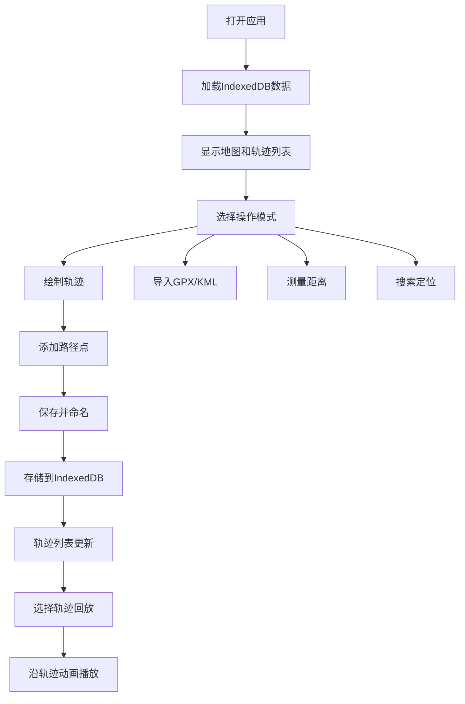

## 1. 产品概述
基于Vue和Leaflet的地图轨迹记录Web应用，无需后端，所有数据存储在浏览器IndexedDB中。用户可绘制、记录、回放轨迹，支持GPX/KML导入导出，提供专业级地图工具集。

## 2. 核心功能

### 2.1 用户角色
| 角色 | 注册方式 | 核心权限 |
|------|----------|----------|
| 普通用户 | 无需注册，本地使用 | 所有功能，数据存储在本地浏览器 |

### 2.2 功能模块
1. **主地图界面**：Leaflet地图展示、图层切换、工具栏
2. **轨迹绘制模块**：点击标记点、手动绘制多段轨迹、保存命名
3. **轨迹管理模块**：轨迹列表展示、距离/坐标/日期信息、多轨迹显示
4. **文件导入导出**：GPX/KML解析导入、GPX格式导出
5. **轨迹回放模块**：沿轨迹移动动画、实时速度/进度显示
6. **测量工具**：多点距离累计测量
7. **搜索定位模块**：地名搜索、GPS当前定位
8. **轨迹编辑模块**：删除路径点、拆分轨迹
9. **高程剖面图**：距离-海拔折线图展示

### 2.3 页面详情
| 页面名称 | 模块名称 | 功能描述 |
|----------|----------|----------|
| 主界面 | 地图容器 | Leaflet地图渲染，支持缩放拖拽 |
| 主界面 | 顶部工具栏 | 绘制模式切换、测量工具、图层选择、搜索框 |
| 主界面 | 左侧面板 | 轨迹列表、轨迹详情、导入导出按钮 |
| 主界面 | 底部控制面板 | 回放控制、进度条、速度显示 |
| 主界面 | 高程图表 | 可折叠的海拔剖面图 |

## 3. 核心流程
用户打开应用 → 选择绘制模式 → 在地图上点击添加路径点 → 完成后输入名称保存轨迹 → 可选择回放轨迹 → 支持导入GPX文件 → 可导出轨迹数据

## 4. 用户界面设计

### 4.1 设计风格
- **主色调**：深海蓝 (#1e3a5f) - 专业、可信赖的地图应用氛围
- **辅助色**：翠绿 (#10b981) - 轨迹绘制、琥珀橙 (#f59e0b) - 回放进度
- **按钮风格**：圆角8px，悬停有轻微上浮效果和阴影
- **字体**：Inter 用于界面文字，清晰易读
- **布局风格**：左侧固定面板 + 全屏地图 + 底部控制条
- **图标**：使用 Heroicons，线性风格

### 4.2 页面设计概览
| 页面名称 | 模块名称 | UI元素 |
|----------|----------|--------|
| 主界面 | 左侧轨迹面板 | 卡片式轨迹列表，悬停高亮，颜色标签 |
| 主界面 | 顶部工具栏 | 图标按钮组，搜索框，图层下拉菜单 |
| 主界面 | 地图区域 | 全屏Leaflet地图，路径点标记 |
| 主界面 | 底部控制条 | 播放/暂停按钮、进度条、速度显示、高程图开关 |

### 4.3 响应式设计
- 桌面端优先设计
- 平板端：左侧面板可折叠
- 移动端：底部工具栏，面板改为底部抽屉式
- 触摸设备优化路径点点击区域

### 4.4 动效设计
- 页面加载：地图淡入，面板滑入
- 轨迹绘制：路径点添加时缩放动效
- 回放动画：平滑移动，路径高亮跟随
- 悬停效果：按钮上浮，卡片阴影加深
