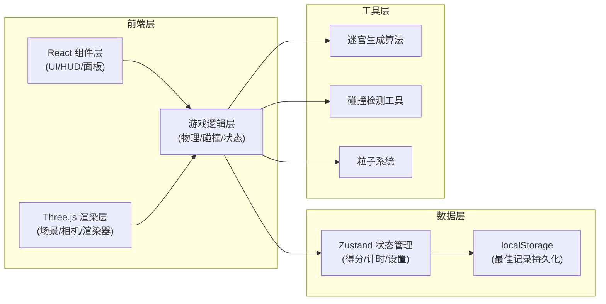

## 1. 架构设计



## 2. 技术选型

- **前端框架**：React@18 + TypeScript + Vite@5
- **3D 引擎**：three@0.160.0
- **状态管理**：zustand@4.4.7
- **样式方案**：tailwindcss@3.4.1
- **图标库**：lucide-react@0.294.0
- **物理系统**：自研简易物理（速度/加速度/摩擦/AABB 碰撞）

## 3. 目录结构

```
src/
├── components/
│   ├── GameCanvas.tsx       # Three.js 画布主组件
│   ├── HUD.tsx              # 得分、计时显示
│   ├── Minimap.tsx          # 小地图组件
│   ├── SettingsPanel.tsx    # 设置面板
│   └── VictoryPanel.tsx     # 胜利面板
├── hooks/
│   ├── useGameLoop.ts       # 游戏循环 Hook
│   ├── useKeyboard.ts       # 键盘输入 Hook
│   └── useLocalStorage.ts   # localStorage Hook
├── store/
│   └── useGameStore.ts      # Zustand 游戏状态
├── game/
│   ├── MazeGenerator.ts     # 迷宫生成算法
│   ├── Physics.ts           # 物理碰撞检测
│   ├── ParticleSystem.ts    # 粒子特效系统
│   └── types.ts             # 游戏类型定义
├── utils/
│   └── formatters.ts        # 时间格式化等工具
├── App.tsx
├── main.tsx
└── index.css
```

## 4. 路由定义

| 路由 | 用途 |
|------|------|
| / | 游戏主页面（单页应用，无其他路由） |

## 5. 数据模型

### 5.1 游戏状态

```typescript
// store/useGameStore.ts
interface GameState {
  score: number;
  time: number;
  isPlaying: boolean;
  isVictory: boolean;
  bestTime: number | null;
  difficulty: 'easy' | 'hard';
  cameraSensitivity: number; // 0.1 - 1.0
  collectedStars: number;
  
  setScore: (score: number) => void;
  setTime: (time: number) => void;
  startGame: () => void;
  endGame: () => void;
  setDifficulty: (d: 'easy' | 'hard') => void;
  setCameraSensitivity: (s: number) => void;
  collectStar: () => void;
  resetGame: () => void;
  loadBestTime: () => void;
}
```

### 5.2 迷宫数据

```typescript
// game/types.ts
interface MazeCell {
  x: number;
  z: number;
  isWall: boolean;
  isEntrance: boolean;
  isExit: boolean;
}

interface Star {
  id: number;
  x: number;
  z: number;
  collected: boolean;
  mesh: THREE.Object3D | null;
}

interface BallState {
  position: THREE.Vector3;
  velocity: THREE.Vector3;
  radius: number;
}
```

### 5.3 难度配置

```typescript
interface DifficultyConfig {
  speed: number;        // 移动速度
  friction: number;     // 摩擦系数
  acceleration: number; // 加速度
  collisionRadius: number; // 碰撞检测半径
}

const DIFFICULTIES: Record<'easy' | 'hard', DifficultyConfig> = {
  easy: { speed: 8, friction: 0.92, acceleration: 25, collisionRadius: 0.4 },
  hard: { speed: 14, friction: 0.96, acceleration: 40, collisionRadius: 0.45 },
};
```

### 5.4 localStorage 键名

- `maze_game_best_time`：最佳通关时间（秒）

## 6. 核心算法

### 6.1 迷宫生成（深度优先搜索）

```typescript
// 15x15 网格迷宫，1 为墙，0 为通道
// 起点 (1, 1)，终点 (13, 13)
// 确保入口墙面绿色，出口墙面红色
```

### 6.2 AABB 碰撞检测

```typescript
// 球体与立方体墙壁碰撞检测
// 计算球心到最近墙点的距离，小于半径则发生碰撞
// 碰撞响应：沿法线方向推出球体，速度分量归零
```

### 6.3 摄像头跟随

```typescript
// 目标位置 = 小球位置 + 后方向量 * 距离 + 向上向量 * 高度
// 当前位置 = lerp(当前位置, 目标位置, sensitivity)
// 摄像头始终 lookAt 小球位置
```

### 6.4 小地图渲染

```typescript
// Canvas 2D 绘制
// 遍历迷宫网格，通道为白色、墙壁为黑色
// 红色圆点标记小球当前位置，实时更新
```

## 7. 性能优化

- 使用 InstancedMesh 渲染重复的墙壁立方体
- 粒子系统使用 BufferGeometry 批量渲染
- 游戏循环使用 requestAnimationFrame，逻辑帧与渲染帧分离
- 碰撞检测空间划分，仅检测周围 3x3 网格的墙壁
- 不可见星星和粒子对象池复用
