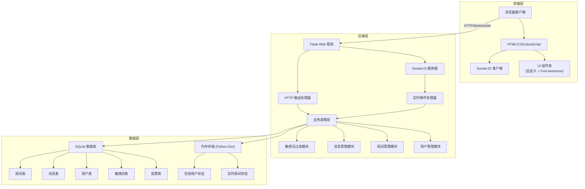
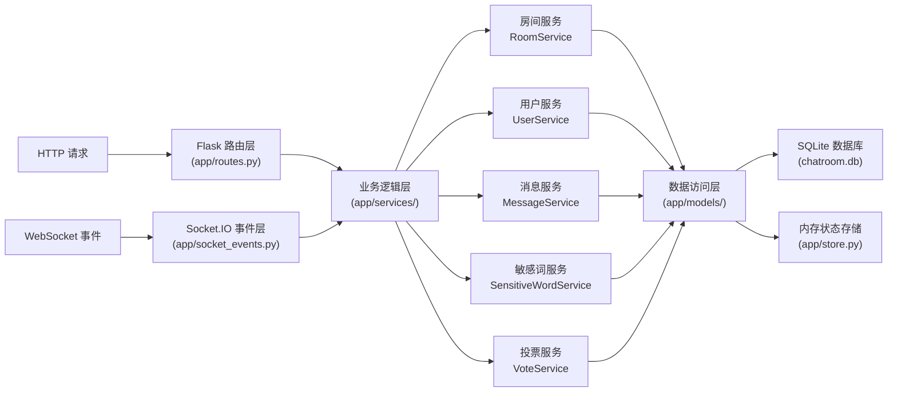
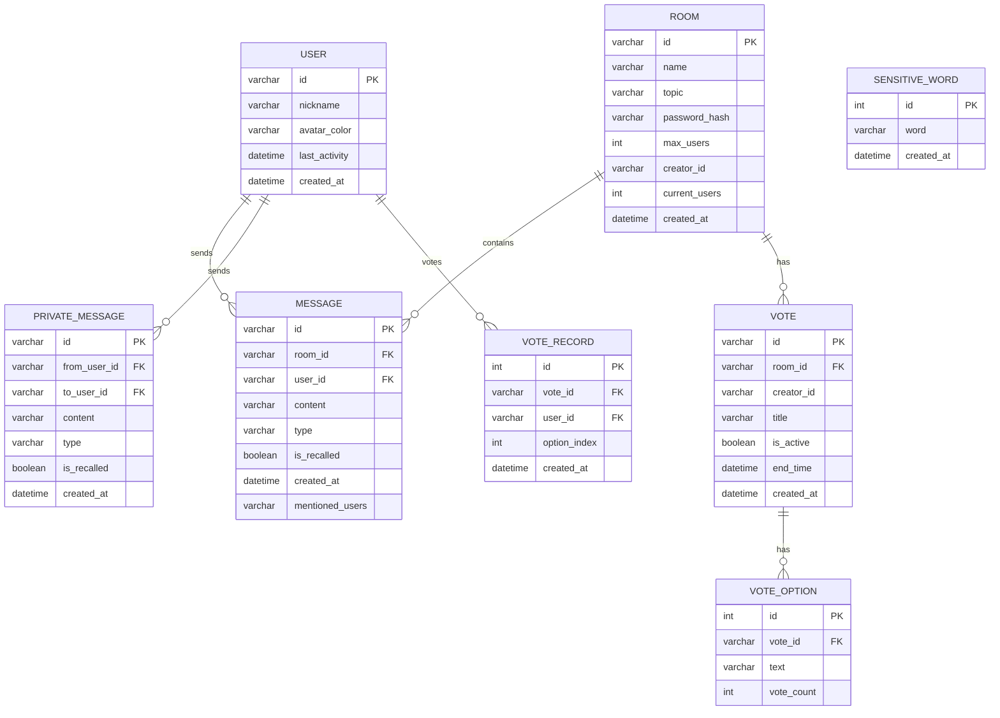

## 1. 架构设计



## 2. 技术描述

- **后端**：Python 3.10 + Flask 3.0 + Flask-SocketIO 5.3 + eventlet
- **前端**：原生 HTML5 + CSS3 + JavaScript ES6+ + Socket.IO Client 4.7
- **数据库**：SQLite（轻量级，无需额外安装配置）
- **初始化工具**：Python venv 虚拟环境 + pip 包管理
- **静态资源**：Font Awesome 6.4（图标）、原生 CSS 变量实现主题切换
- **图片存储**：本地文件系统存储上传图片，生成可访问 URL

## 3. 路由定义

| 路由 | 方法 | 用途 |
|------|------|------|
| `/` | GET | 聊天室列表页面 |
| `/room/<room_id>` | GET | 进入指定聊天室 |
| `/api/rooms` | GET | 获取所有活跃房间列表 |
| `/api/rooms` | POST | 创建新房间 |
| `/api/rooms/<room_id>/verify` | POST | 验证房间密码 |
| `/api/upload` | POST | 上传图片文件 |
| `/api/messages/<room_id>` | GET | 分页获取历史消息 |
| `/api/sensitive-words` | GET | 获取敏感词列表（管理员） |
| `/api/sensitive-words` | POST | 添加敏感词（管理员） |
| `/api/sensitive-words/<word_id>` | DELETE | 删除敏感词（管理员） |

## 4. Socket.IO 事件定义

### 客户端发送事件

```typescript
// 加入房间
interface JoinRoomEvent {
  room_id: string;
  user_id: string;
  nickname: string;
  password?: string;
}

// 发送公共消息
interface SendMessageEvent {
  room_id: string;
  user_id: string;
  content: string;
  type: 'text' | 'image' | 'emoji';
  mentioned_users?: string[];
}

// 发送私聊消息
interface SendPrivateMessageEvent {
  to_user_id: string;
  from_user_id: string;
  content: string;
  type: 'text' | 'image';
}

// 撤回消息
interface RecallMessageEvent {
  message_id: string;
  user_id: string;
  room_id: string;
}

// 发起投票
interface CreateVoteEvent {
  room_id: string;
  user_id: string;
  title: string;
  options: string[];
  duration?: number;
}

// 参与投票
interface VoteEvent {
  vote_id: string;
  user_id: string;
  option_index: number;
}

// 踢人
interface KickUserEvent {
  room_id: string;
  operator_id: string;
  target_user_id: string;
  reason?: string;
}

// 禁言
interface MuteUserEvent {
  room_id: string;
  operator_id: string;
  target_user_id: string;
  duration: number; // 分钟
  reason?: string;
}

// 心跳/活动更新
interface HeartbeatEvent {
  user_id: string;
  room_id: string;
}
```

### 服务端推送事件

```typescript
// 新消息通知
interface NewMessageEvent {
  message_id: string;
  room_id: string;
  user_id: string;
  nickname: string;
  content: string;
  type: string;
  timestamp: number;
  is_mentioned?: boolean;
}

// 私聊消息
interface NewPrivateMessageEvent {
  message_id: string;
  from_user_id: string;
  from_nickname: string;
  to_user_id: string;
  content: string;
  type: string;
  timestamp: number;
}

// 消息撤回通知
interface MessageRecalledEvent {
  message_id: string;
  room_id: string;
  user_id: string;
  nickname: string;
}

// 用户状态更新
interface UserStatusEvent {
  room_id: string;
  user_id: string;
  nickname: string;
  status: 'online' | 'away' | 'offline';
}

// 房间活动日志
interface RoomActivityEvent {
  room_id: string;
  type: 'join' | 'leave' | 'kick' | 'mute' | 'unmute';
  user_id: string;
  nickname: string;
  target_nickname?: string;
  reason?: string;
  timestamp: number;
}

// 投票更新
interface VoteUpdateEvent {
  vote_id: string;
  title: string;
  options: Array<{text: string, count: number}>;
  total_votes: number;
}

// 用户被踢通知
interface UserKickedEvent {
  room_id: string;
  reason: string;
}

// 用户被禁言通知
interface UserMutedEvent {
  room_id: string;
  duration: number;
  reason?: string;
}
```

## 5. 服务器架构图



## 6. 数据模型

### 6.1 数据模型定义



### 6.2 数据定义语言

```sql
-- 用户表
CREATE TABLE IF NOT EXISTS users (
    id VARCHAR(36) PRIMARY KEY,
    nickname VARCHAR(50) NOT NULL,
    avatar_color VARCHAR(7) NOT NULL,
    last_activity DATETIME DEFAULT CURRENT_TIMESTAMP,
    created_at DATETIME DEFAULT CURRENT_TIMESTAMP
);

-- 房间表
CREATE TABLE IF NOT EXISTS rooms (
    id VARCHAR(36) PRIMARY KEY,
    name VARCHAR(100) NOT NULL,
    topic VARCHAR(500),
    password_hash VARCHAR(255),
    max_users INT DEFAULT 50,
    creator_id VARCHAR(36) NOT NULL,
    current_users INT DEFAULT 0,
    created_at DATETIME DEFAULT CURRENT_TIMESTAMP
);

-- 消息表
CREATE TABLE IF NOT EXISTS messages (
    id VARCHAR(36) PRIMARY KEY,
    room_id VARCHAR(36) NOT NULL,
    user_id VARCHAR(36) NOT NULL,
    content TEXT NOT NULL,
    type VARCHAR(20) DEFAULT 'text',
    is_recalled BOOLEAN DEFAULT FALSE,
    mentioned_users TEXT,
    created_at DATETIME DEFAULT CURRENT_TIMESTAMP,
    FOREIGN KEY (room_id) REFERENCES rooms(id),
    FOREIGN KEY (user_id) REFERENCES users(id)
);

-- 私聊消息表
CREATE TABLE IF NOT EXISTS private_messages (
    id VARCHAR(36) PRIMARY KEY,
    from_user_id VARCHAR(36) NOT NULL,
    to_user_id VARCHAR(36) NOT NULL,
    content TEXT NOT NULL,
    type VARCHAR(20) DEFAULT 'text',
    is_recalled BOOLEAN DEFAULT FALSE,
    created_at DATETIME DEFAULT CURRENT_TIMESTAMP,
    FOREIGN KEY (from_user_id) REFERENCES users(id),
    FOREIGN KEY (to_user_id) REFERENCES users(id)
);

-- 敏感词表
CREATE TABLE IF NOT EXISTS sensitive_words (
    id INTEGER PRIMARY KEY AUTOINCREMENT,
    word VARCHAR(100) NOT NULL UNIQUE,
    created_at DATETIME DEFAULT CURRENT_TIMESTAMP
);

-- 投票表
CREATE TABLE IF NOT EXISTS votes (
    id VARCHAR(36) PRIMARY KEY,
    room_id VARCHAR(36) NOT NULL,
    creator_id VARCHAR(36) NOT NULL,
    title VARCHAR(200) NOT NULL,
    is_active BOOLEAN DEFAULT TRUE,
    end_time DATETIME,
    created_at DATETIME DEFAULT CURRENT_TIMESTAMP,
    FOREIGN KEY (room_id) REFERENCES rooms(id)
);

-- 投票选项表
CREATE TABLE IF NOT EXISTS vote_options (
    id INTEGER PRIMARY KEY AUTOINCREMENT,
    vote_id VARCHAR(36) NOT NULL,
    text VARCHAR(200) NOT NULL,
    vote_count INTEGER DEFAULT 0,
    FOREIGN KEY (vote_id) REFERENCES votes(id)
);

-- 投票记录表
CREATE TABLE IF NOT EXISTS vote_records (
    id INTEGER PRIMARY KEY AUTOINCREMENT,
    vote_id VARCHAR(36) NOT NULL,
    user_id VARCHAR(36) NOT NULL,
    option_index INTEGER NOT NULL,
    created_at DATETIME DEFAULT CURRENT_TIMESTAMP,
    UNIQUE(vote_id, user_id)
);

-- 索引
CREATE INDEX IF NOT EXISTS idx_messages_room ON messages(room_id);
CREATE INDEX IF NOT EXISTS idx_messages_created ON messages(created_at DESC);
CREATE INDEX IF NOT EXISTS idx_private_messages ON private_messages(from_user_id, to_user_id);
CREATE INDEX IF NOT EXISTS idx_votes_room ON votes(room_id);

-- 初始化敏感词
INSERT OR IGNORE INTO sensitive_words (word) VALUES 
('敏感词1'),
('敏感词2'),
('违禁词');
```
