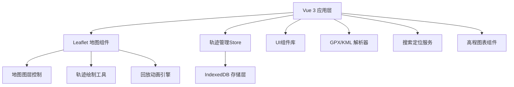
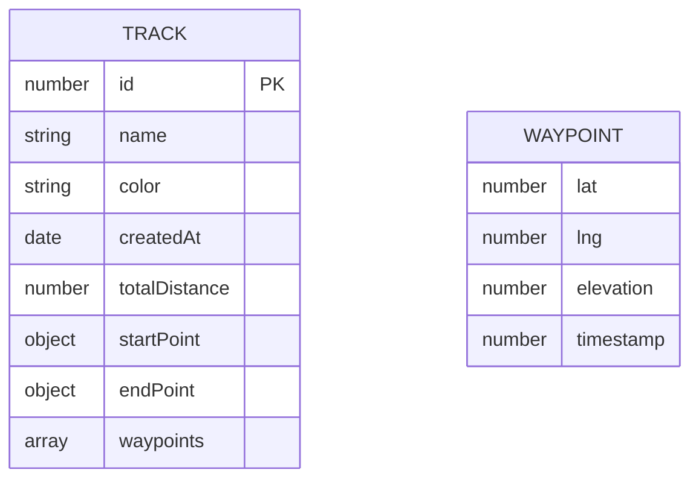

## 1. 架构设计



## 2. 技术描述
- **前端框架**：Vue 3 + Vite + TypeScript
- **状态管理**：Pinia
- **地图引擎**：Leaflet 1.9 + 官方类型定义
- **UI框架**：Tailwind CSS 3
- **本地存储**：IndexedDB (Dexie.js)
- **图表库**：Chart.js 用于高程剖面图
- **文件解析**：@tmcw/togeojson (GPX/KML解析)
- **图标库**：Heroicons Vue

## 3. 路由定义
| 路由 | 用途 |
|------|------|
| / | 主应用界面（单页应用） |

## 4. 数据模型

### 4.1 数据模型定义



### 4.2 IndexedDB Schema
```typescript
interface Track {
  id?: number;
  name: string;
  color: string;
  createdAt: Date;
  totalDistance: number;
  startPoint: { lat: number; lng: number };
  endPoint: { lat: number; lng: number };
  waypoints: Waypoint[];
}

interface Waypoint {
  lat: number;
  lng: number;
  elevation?: number;
  timestamp?: number;
}
```

## 5. 核心模块设计

### 5.1 Store 结构
- **useTrackStore**: 轨迹CRUD操作、IndexedDB同步
- **useMapStore**: 地图状态、绘制模式、测量状态
- **usePlaybackStore**: 回放控制、动画状态

### 5.2 工具函数
- **distance.ts**: Haversine公式计算两点距离、累计距离计算
- **gpxParser.ts**: GPX导入导出、KML转GPX
- **colors.ts**: 轨迹颜色生成器

### 5.3 组件拆分
- `MapContainer.vue` - 地图主容器
- `TrackList.vue` - 轨迹列表面板
- `TrackEditor.vue` - 轨迹编辑弹窗
- `PlaybackControls.vue` - 回放控制条
- `ElevationChart.vue` - 高程剖面图
- `SearchBar.vue` - 位置搜索组件
- `LayerSwitcher.vue` - 图层切换器
- `MeasureTool.vue` - 测量工具

## 6. 性能优化
- 轨迹点抽稀：大量点时使用Ramer-Douglas-Peucker算法
- 懒加载：轨迹列表虚拟滚动
- Web Worker：GPX解析在Worker中执行
- 节流：地图事件监听使用requestAnimationFrame
