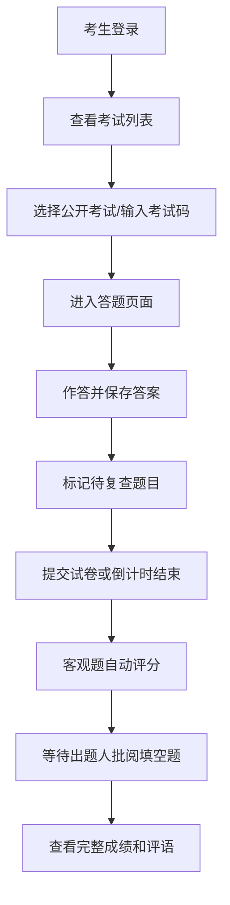
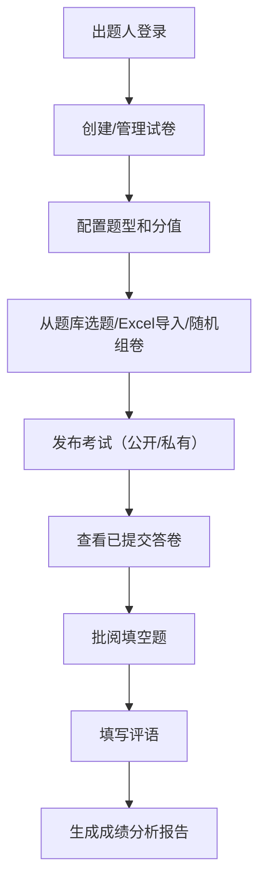
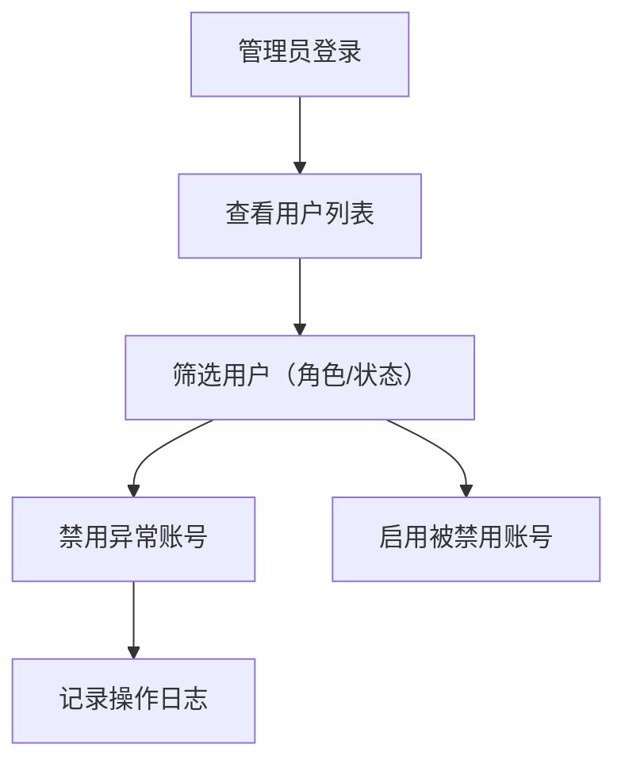

## 1. 产品概述

本系统是一个功能完善的在线考试平台，支持多角色用户管理、多样化题型、智能组卷、自动评分和数据分析等核心功能。主要解决传统考试效率低、批改繁琐、数据统计困难等问题，为教育机构和企业提供一站式在线测评解决方案。

- 目标用户：考生、出题人（教师）、系统管理员
- 核心价值：提升考试组织效率，实现无纸化考试，提供精准的成绩分析

## 2. 核心功能

### 2.1 用户角色

| 角色 | 注册方式 | 核心权限 |
|------|---------|---------|
| 考生 | 自主注册 | 参加公开/私有考试、查看成绩、错题本练习 |
| 出题人 | 管理员创建/自主注册 | 创建管理试卷、批阅填空题、成绩分析、批量导入试题 |
| 管理员 | 预置账号 | 用户管理（启用/禁用账号）、系统配置 |

### 2.2 功能模块

1. **用户认证模块**：注册、登录、角色选择、权限控制
2. **考试管理模块**：试卷创建、题型配置、分值设置、公开/私有设置
3. **答题模块**：单题保存答案、标记复查、倒计时、自动交卷
4. **评分模块**：客观题自动评分、填空题人工批阅、评语填写
5. **成绩分析模块**：最高分/最低分/平均分统计、分数分布柱状图
6. **错题本模块**：错题自动收集、反复练习
7. **题库模块**：Excel批量导入、试卷复制、随机组卷
8. **防作弊模块**：切屏次数限制、超限自动交卷
9. **用户管理模块**：账号管理、禁用/启用

### 2.3 页面详情

| 页面名称 | 模块名称 | 功能描述 |
|---------|---------|----------|
| 登录页 | 身份认证 | 用户登录、角色切换、注册入口 |
| 注册页 | 身份认证 | 考生/出题人注册、表单验证 |
| 首页 | 导航概览 | 角色欢迎页、快捷入口、通知公告 |
| 考试列表页 | 考试管理 | 公开考试列表、输入考试码进入私有考试 |
| 答题页 | 在线答题 | 题目展示、答案保存、标记复查、倒计时、切屏检测 |
| 试卷创建页 | 试卷管理 | 题型选择、题目编辑、分值设置、考试配置 |
| 题库管理页 | 题库管理 | 题目列表、Excel批量导入、试题分类 |
| 试卷管理页 | 试卷管理 | 试卷列表、复制、随机组卷配置 |
| 批阅页 | 评分管理 | 填空题批阅、分数调整、评语填写 |
| 成绩详情页 | 成绩查看 | 答卷详情、得分明细、试卷评语 |
| 成绩分析页 | 数据分析 | 最高分/最低分/平均分、分数分布柱状图 |
| 错题本页 | 错题练习 | 错题列表、练习模式、错题移除 |
| 用户管理页 | 系统管理 | 用户列表、角色管理、账号启用/禁用 |

## 3. 核心流程

### 3.1 考生考试流程

考生进入系统后，在考试列表中选择公开考试或输入考试码进入私有考试。答题时可逐题作答并标记待复查题目，系统实时保存答案。倒计时结束自动交卷，客观题立即出分，待出题人批阅填空题后可查看完整成绩和评语。

### 3.2 出题人工作流程

出题人登录后可创建试卷，支持多种题型和分值配置。从题库中选题或批量导入Excel试题，也可随机组卷。考生交卷后，出题人批阅填空题并填写评语，同时可查看成绩分析报告。

### 3.3 管理员管理流程

管理员负责用户账号管理，可查看所有用户信息，根据需要禁用或启用账号，维护系统安全。

## 4. 用户界面设计

### 4.1 设计风格

- **主色调**：深蓝色系（#1e3a8a），体现专业、稳重的教育氛围
- **辅助色**：翠绿色（#10b981）用于成功状态，橙红色（#f59e0b）用于警告，红色（#ef4444）用于错误
- **按钮风格**：圆角（8px）、悬停微动画、阴影层次感
- **字体**：标题使用"Noto Sans SC"粗体，正文使用"PingFang SC"常规
- **布局风格**：卡片式布局，左侧导航栏，顶部状态栏，主体内容区采用网格布局
- **图标风格**：使用Font Awesome线性图标，保持简洁统一

### 4.2 页面设计概述

| 页面名称 | 模块名称 | UI元素 |
|---------|---------|--------|
| 答题页 | 在线答题 | 顶部倒计时进度条、左侧题目导航（带标记状态）、中央题目卡片、底部操作按钮（上一题/下一题/标记/提交） |
| 试卷创建页 | 试卷管理 | 标签页切换（基本信息/题目编辑/预览发布）、题型添加面板、拖拽排序、分值实时计算 |
| 成绩分析页 | 数据分析 | 统计卡片（最高分/最低分/平均分/参考人数）、分数分布柱状图（Chart.js）、成绩排名列表 |
| 批阅页 | 评分管理 | 左右分栏（左侧题目列表，右侧答题内容和批阅区）、分数输入框、富文本评语框 |

### 4.3 响应式设计

- **桌面端**：左侧固定导航（240px），主内容区自适应
- **平板端**：导航栏可折叠，内容区单列布局
- **移动端**：底部导航Tab，内容区单列，题目卡片全屏展示
- **触摸优化**：按钮最小尺寸44px，滑动切换题目

## 5. 非功能需求

### 5.1 性能要求
- 页面加载时间 < 2秒
- 答题保存响应时间 < 500ms
- 支持1000人同时在线考试

### 5.2 安全要求
- 密码加密存储（bcrypt）
- Token身份认证
- 考试页面防复制、防右键
- 切屏检测防作弊

### 5.3 兼容性要求
- 支持Chrome、Firefox、Safari、Edge最新版本
- 移动端iOS 12+、Android 8+
