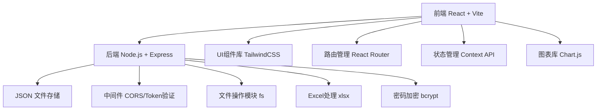
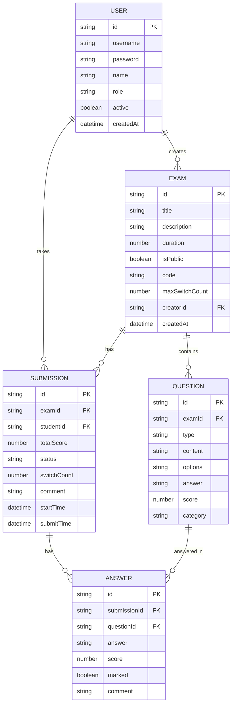
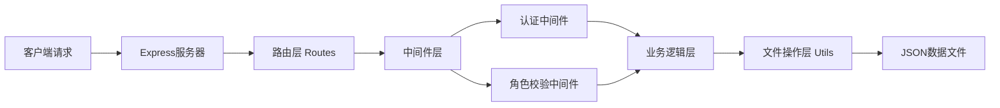

## 1. 架构设计

系统采用前后端分离架构，前端使用React构建单页应用，后端使用Node.js + Express提供RESTful API服务，数据存储采用JSON文件，便于快速开发和部署。



## 2. 技术描述

### 2.1 前端技术栈
- **框架**: React 18 + Vite 5
- **路由**: React Router DOM 6
- **样式**: TailwindCSS 3
- **状态管理**: React Context API + useReducer
- **图表**: Chart.js + react-chartjs-2
- **图标**: Font Awesome / lucide-react
- **HTTP客户端**: Axios
- **表单验证**: react-hook-form

### 2.2 后端技术栈
- **运行时**: Node.js 18+
- **框架**: Express 4
- **认证**: JWT (jsonwebtoken)
- **密码加密**: bcryptjs
- **Excel处理**: xlsx
- **CORS**: cors
- **文件上传**: multer
- **数据存储**: JSON文件 (data/*.json)

### 2.3 初始化工具
- 前端: npm create vite@latest
- 后端: npm init + 手动搭建Express

## 3. 目录结构

### 3.1 前端目录 (client/)
```
src/
├── components/          # 公共组件
│   ├── Layout/         # 布局组件
│   ├── Form/           # 表单组件
│   ├── Exam/           # 考试相关组件
│   └── Chart/          # 图表组件
├── contexts/           # Context状态管理
│   ├── AuthContext.jsx
│   └── ExamContext.jsx
├── pages/              # 页面组件
│   ├── auth/           # 登录注册
│   ├── student/        # 考生页面
│   ├── examiner/       # 出题人页面
│   └── admin/          # 管理员页面
├── hooks/              # 自定义Hooks
│   ├── useAuth.js
│   ├── useTimer.js
│   └── useAntiCheat.js
├── services/           # API服务
│   ├── api.js
│   ├── auth.js
│   ├── exam.js
│   └── user.js
├── utils/              # 工具函数
├── App.jsx
├── main.jsx
└── index.css
```

### 3.2 后端目录 (server/)
```
server/
├── data/               # JSON数据文件
│   ├── users.json
│   ├── exams.json
│   ├── questions.json
│   ├── answers.json
│   └── submissions.json
├── middleware/         # 中间件
│   ├── auth.js
│   └── roleCheck.js
├── routes/             # 路由
│   ├── auth.js
│   ├── users.js
│   ├── exams.js
│   ├── questions.js
│   ├── submissions.js
│   └── upload.js
├── utils/              # 工具函数
│   ├── fileHandler.js
│   ├── jwt.js
│   └── excelParser.js
├── server.js           # 入口文件
└── package.json
```

## 4. 路由定义

### 4.1 前端路由
| 路由路径 | 页面 | 权限 |
|---------|------|------|
| /login | 登录页 | 公开 |
| /register | 注册页 | 公开 |
| / | 首页 | 登录用户 |
| /exams | 考试列表 | 考生 |
| /exam/:id | 答题页 | 考生 |
| /my-scores | 我的成绩 | 考生 |
| /score/:id | 成绩详情 | 考生 |
| /mistakes | 错题本 | 考生 |
| /examiner/exams | 试卷管理 | 出题人 |
| /examiner/exam/create | 创建试卷 | 出题人 |
| /examiner/exam/edit/:id | 编辑试卷 | 出题人 |
| /examiner/questions | 题库管理 | 出题人 |
| /examiner/submissions | 答卷列表 | 出题人 |
| /examiner/submission/:id | 批阅答卷 | 出题人 |
| /examiner/analysis/:id | 成绩分析 | 出题人 |
| /admin/users | 用户管理 | 管理员 |

### 4.2 API接口定义

#### 用户认证接口
```typescript
POST /api/auth/register
Request: { username: string, password: string, role: 'student' | 'examiner', name: string }
Response: { success: boolean, user: User, token: string }

POST /api/auth/login
Request: { username: string, password: string }
Response: { success: boolean, user: User, token: string }
```

#### 考试接口
```typescript
GET /api/exams/public
Response: { exams: Exam[] }

POST /api/exams/private/access
Request: { code: string }
Response: { exam: Exam }

POST /api/exams
Request: { title: string, description: string, duration: number, isPublic: boolean, questions: Question[], maxSwitchCount: number }
Response: { exam: Exam }

GET /api/exams/:id
Response: { exam: Exam }

PUT /api/exams/:id
Request: Partial<Exam>
Response: { exam: Exam }

DELETE /api/exams/:id
Response: { success: boolean }

POST /api/exams/:id/copy
Response: { exam: Exam }

POST /api/exams/random
Request: { title: string, duration: number, criteria: { type: string, count: number }[] }
Response: { exam: Exam }
```

#### 题目接口
```typescript
GET /api/questions
Response: { questions: Question[] }

POST /api/questions
Request: { type: 'single' | 'multiple' | 'judge' | 'fill', content: string, options?: string[], answer: string | string[], score: number, category?: string }
Response: { question: Question }

POST /api/questions/import
Request: FormData (Excel file)
Response: { importedCount: number, questions: Question[] }
```

#### 答卷接口
```typescript
POST /api/submissions/start
Request: { examId: string }
Response: { submission: Submission }

PUT /api/submissions/:id/answer
Request: { questionId: string, answer: any, marked?: boolean }
Response: { success: boolean }

POST /api/submissions/:id/submit
Request: { switchCount: number }
Response: { submission: Submission }

GET /api/submissions/my
Response: { submissions: Submission[] }

GET /api/submissions/:id
Response: { submission: Submission, exam: Exam }

GET /api/submissions/exam/:examId
Response: { submissions: Submission[] }

PUT /api/submissions/:id/grade
Request: { questionId: string, score: number, comment?: string, overallComment?: string }
Response: { submission: Submission }
```

#### 成绩分析接口
```typescript
GET /api/analysis/exam/:examId
Response: {
  maxScore: number,
  minScore: number,
  avgScore: number,
  totalStudents: number,
  distribution: { range: string, count: number }[]
}
```

#### 错题本接口
```typescript
GET /api/mistakes
Response: { mistakes: Mistake[] }

POST /api/mistakes/:id/remove
Response: { success: boolean }
```

#### 用户管理接口
```typescript
GET /api/users
Response: { users: User[] }

PUT /api/users/:id/status
Request: { active: boolean }
Response: { user: User }
```

## 5. 数据模型

### 5.1 ER图



### 5.2 JSON数据结构

**users.json**
```json
[
  {
    "id": "uuid",
    "username": "admin",
    "password": "bcrypt_hash",
    "name": "系统管理员",
    "role": "admin",
    "active": true,
    "createdAt": "2024-01-01T00:00:00.000Z"
  }
]
```

**exams.json**
```json
[
  {
    "id": "uuid",
    "title": "期末考试",
    "description": "计算机基础",
    "duration": 120,
    "isPublic": true,
    "code": "EXAM2024",
    "maxSwitchCount": 3,
    "creatorId": "uuid",
    "createdAt": "2024-01-01T00:00:00.000Z"
  }
]
```

**questions.json**
```json
[
  {
    "id": "uuid",
    "examId": "uuid",
    "type": "single",
    "content": "题目内容",
    "options": ["A. 选项1", "B. 选项2"],
    "answer": "A",
    "score": 10,
    "category": "计算机基础"
  }
]
```

**submissions.json**
```json
[
  {
    "id": "uuid",
    "examId": "uuid",
    "studentId": "uuid",
    "totalScore": 0,
    "status": "pending|submitted|graded",
    "switchCount": 0,
    "overallComment": "",
    "startTime": "2024-01-01T00:00:00.000Z",
    "submitTime": null
  }
]
```

**answers.json**
```json
[
  {
    "id": "uuid",
    "submissionId": "uuid",
    "questionId": "uuid",
    "answer": "A",
    "score": 0,
    "marked": false,
    "comment": ""
  }
]
```

## 6. 服务器架构



### 6.1 核心业务流程

1. **答题自动评分**:
   - 单选题/多选题/判断题: 提交时自动比对答案计算分数
   - 填空题: 标记为待人工批阅，分数默认为0

2. **防作弊机制**:
   - 使用Page Visibility API检测页面可见性
   - 记录切屏次数，超过限制触发自动交卷
   - 考试页面禁用复制、右键菜单

3. **随机组卷算法**:
   - 按题型和数量要求从题库中筛选
   - 使用Fisher-Yates洗牌算法随机排序
   - 保证同题型题目不重复抽取

4. **Excel导入格式**:
   - 支持.xlsx/.xls格式
   - 列定义: 题型、题目内容、选项A、选项B、选项C、选项D、答案、分值、分类
