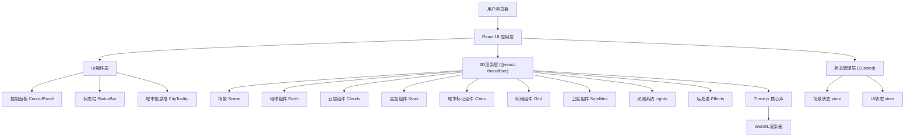

## 1. 架构设计



## 2. 技术描述

- **前端框架**: React@18.2.0 + TypeScript
- **构建工具**: Vite@5.0.0
- **样式方案**: TailwindCSS@3.4.0
- **3D引擎**: three@0.160.0
- **React 3D封装**: @react-three/fiber@8.15.0, @react-three/drei@9.92.0
- **后处理**: @react-three/postprocessing@2.15.0
- **状态管理**: zustand@4.4.0
- **动画库**: @react-spring/three@9.7.0
- **相机控制**: drei 内置 OrbitControls

## 3. 目录结构

```
src/
├── components/
│   ├── ui/
│   │   ├── ControlPanel.tsx      # 控制面板组件
│   │   ├── StatusBar.tsx         # 状态栏组件
│   │   └── CityTooltip.tsx       # 城市悬浮框组件
│   └── three/
│       ├── Earth.tsx             # 地球组件
│       ├── Clouds.tsx            # 云层组件
│       ├── Stars.tsx             # 星空背景
│       ├── Cities.tsx            # 城市标记
│       ├── GridHelper.tsx        # 经纬度网格
│       ├── Satellites.tsx        # 卫星和轨道
│       └── Scene.tsx             # 主场景容器
├── store/
│   └── useSceneStore.ts          # 全局状态管理
├── data/
│   └── cities.ts                 # 城市数据
├── utils/
│   ├── coords.ts                 # 坐标转换工具
│   └── screenshot.ts             # 截屏工具
├── App.tsx                       # 根组件
├── main.tsx                      # 入口文件
└── index.css                     # 全局样式
```

## 4. 路由定义

| 路由 | 用途 |
|------|------|
| / | 主页面，包含完整3D地球场景 |

## 5. 核心数据模型

### 5.1 城市数据模型

```typescript
interface City {
  id: string;
  name: string;
  lat: number;      // 纬度
  lng: number;      // 经度
  country: string;
  population: number;
}
```

### 5.2 场景状态模型

```typescript
interface SceneState {
  rotationSpeed: number;       // 地球自转速度
  showGrid: boolean;           // 显示网格
  isAnimating: boolean;        // 相机动画中
  currentTargetCity: City | null;
  fps: number;
  cameraPosition: { x: number; y: number; z: number };
  hoveredCity: City | null;
  sunPosition: { x: number; y: number; z: number };
}
```

## 6. 核心技术实现要点

### 6.1 经纬度坐标转换
```typescript
function latLngToVector3(lat: number, lng: number, radius: number): THREE.Vector3 {
  const phi = (90 - lat) * (Math.PI / 180);
  const theta = (lng + 180) * (Math.PI / 180);
  return new THREE.Vector3(
    -radius * Math.sin(phi) * Math.cos(theta),
    radius * Math.cos(phi),
    radius * Math.sin(phi) * Math.sin(theta)
  );
}
```

### 6.2 昼夜效果实现
- 使用单个DirectionalLight模拟太阳，位置随时间在XZ平面上旋转
- 地球材质使用MeshStandardMaterial，背光面自然变暗
- 城市标记使用Sprite和自发光材质，在夜晚也可见

### 6.3 大气层光晕效果
- 使用Fresnel Shader实现大气层边缘发光
- 自定义ShaderMaterial，在片元着色器中计算视线与法线夹角

### 6.4 性能优化
- 星空使用BufferGeometry批量渲染粒子
- 城市标记使用InstancedMesh减少Draw Call
- 后处理效果使用低分辨率Bloom
- 窗口resize使用防抖处理
