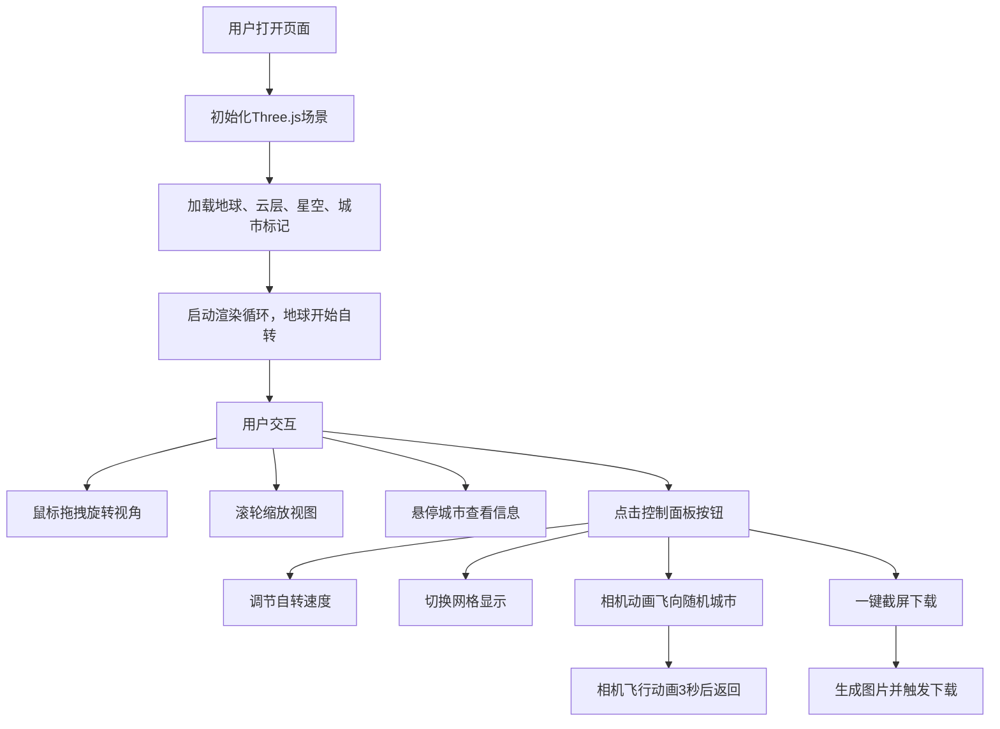

## 1. 产品概述

基于Three.js的交互式3D地球可视化应用，提供沉浸式的太空视角地球体验。用户可以自由探索地球表面，查看全球主要城市分布，体验昼夜变化效果，并通过动画视角快速定位到指定城市。

- 面向对地理、天文可视化感兴趣的用户，以及需要3D地球组件作为展示工具的开发者
- 展示WebGL技术在复杂3D场景中的应用，提供流畅的交互体验和精美的视觉效果

## 2. 核心功能

### 2.1 用户角色
| 角色 | 注册方式 | 核心权限 |
|------|---------|---------|
| 普通用户 | 无需注册 | 完整的3D场景浏览、交互、动画、截屏功能 |

### 2.2 功能模块
1. **3D地球主场景**：高清地球模型、自转、云层、大气层光晕、昼夜效果
2. **交互控制系统**：鼠标拖拽旋转、滚轮缩放、城市悬停信息显示
3. **城市标注系统**：10个主要城市标记、光晕效果、悬停信息面板
4. **空间辅助系统**：星空背景、经纬度网格、卫星轨道
5. **动画系统**：相机动画、卫星公转动画、地球自转
6. **功能控制面板**：自转速度调节、网格显隐、截屏、随机城市飞行
7. **状态显示系统**：实时帧率、相机坐标显示

### 2.3 页面详情
| 页面名称 | 模块名称 | 功能描述 |
|---------|---------|---------|
| 主页面 | 3D场景画布 | 全屏Three.js渲染区域，承载整个地球场景 |
| 主页面 | 控制面板 | 悬浮于画布右上角，包含所有操作按钮和滑块 |
| 主页面 | 状态信息栏 | 悬浮于画布底部，显示FPS和相机实时坐标 |
| 主页面 | 城市信息悬浮框 | 鼠标悬停城市时显示，包含名称和经纬度 |
| 主页面 | 相机动画提示 | 相机飞行过程中显示当前目标城市名称 |

## 3. 核心流程

## 4. 用户界面设计

### 4.1 设计风格
- **主色调**：深空蓝（#0a0e17）、科技青（#00d4ff）、地球蓝（#1a5276）
- **辅助色**：城市黄（#ffd700）、警示红（#ff6b6b）、卫星白（#ecf0f1）
- **按钮风格**：半透明玻璃态、圆角8px、悬停时发光边框效果
- **字体**：标题使用 'Orbitron' 科幻字体，正文使用 'Rajdhani' 现代无衬线字体
- **布局风格**：全屏沉浸式，控制面板悬浮式布局，无传统页面边框
- **图标风格**：线性图标，科技感线条，配合发光效果

### 4.2 页面设计概述
| 页面名称 | 模块名称 | UI元素 |
|---------|---------|-------|
| 主页面 | 3D场景 | 深邃太空背景、蓝色地球、白色云层、银色网格线、金色城市标记 |
| 主页面 | 控制面板 | 半透明深色面板、发光按钮、滑块控件、分组标签 |
| 主页面 | 状态栏 | 等宽字体显示、半透明背景、固定于底部 |
| 主页面 | 城市悬浮框 | 圆角卡片、科技边框、带箭头指向标记点 |

### 4.3 响应性
- 桌面端优先设计，画布自适应窗口大小
- 控制面板在小屏幕上自动调整为单列布局
- 触控设备支持单指旋转、双指缩放手势
- 状态栏文字大小随屏幕宽度自适应

### 4.4 3D场景指导
- **环境**：深空黑色背景，5000+粒子组成星空，星星随机闪烁
- **光照**：单个方向光模拟太阳，位置随时间缓慢移动，产生昼夜交替效果；环境光提供最低亮度
- **相机**：PerspectiveCamera，初始距离地球3倍半径，视角60度
- **构图**：地球位于画面中心，轨道环和卫星在外侧形成层次感
- **交互**：OrbitControls控制，阻尼效果让旋转更流畅，限制最小和最大缩放距离
- **后处理**：Bloom光晕效果让城市光点和大气层更明亮，轻微抗锯齿
- **资源**：使用CDN加载Three.js和高清地球贴图，总资源量控制在20MB以内
