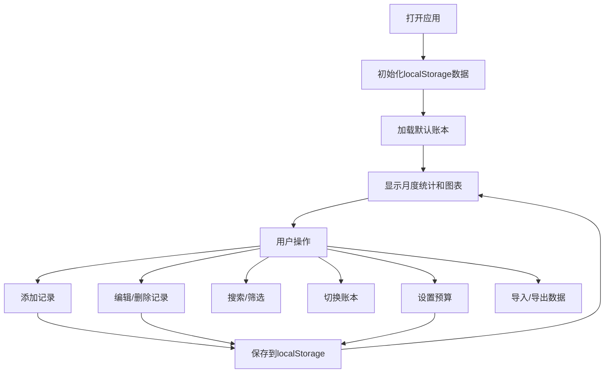

## 1. 产品概述

一款功能完善的个人记账Web应用，帮助用户管理日常收支，支持多账本、图表分析、预算管理和数据导入导出。

- 主要目的：帮助用户轻松记录和管理个人财务，直观了解收支情况
- 解决问题：传统记账方式繁琐，缺乏数据可视化和多维度统计分析
- 目标用户：有记账需求的个人用户
- 产品价值：提供简洁易用的界面，丰富的数据分析功能，帮助用户养成良好的理财习惯

## 2. 核心功能

### 2.1 用户角色

| 角色 | 注册方式 | 核心权限 |
|------|----------|----------|
| 普通用户 | 无需注册，本地使用 | 所有功能，数据存储在本地浏览器 |

### 2.2 功能模块

1. **主页面**：月度统计概览、收支列表、图表展示
2. **记录管理**：添加/编辑/删除收支记录，包含金额、类别、日期、备注
3. **多账本管理**：创建/切换不同账本（日常生活、旅行、家庭等）
4. **图表分析**：支出占比饼图、最近7天支出趋势折线图
5. **预算管理**：为支出类别设置月度预算，超支警告
6. **搜索功能**：按备注关键词搜索记录
7. **固定收支**：设置周期收支，一键添加为当月记录
8. **数据管理**：CSV导入导出功能
9. **货币设置**：人民币/美元切换，汇率手动设置

### 2.3 页面详情

| 页面名称 | 模块名称 | 功能描述 |
|---------|----------|----------|
| 主页面 | 顶部统计区 | 显示当月总收入、总支出、结余 |
| 主页面 | 账本切换区 | 多账本切换、创建新账本 |
| 主页面 | 图表展示区 | 支出占比环形图、7天支出趋势图 |
| 主页面 | 记录列表区 | 按月展示收支记录，支持编辑删除 |
| 主页面 | 搜索筛选区 | 按备注搜索、按类别筛选 |
| 添加记录弹窗 | 表单区 | 金额、类别、日期、备注输入 |
| 设置弹窗 | 预算设置 | 各类别月度预算设置 |
| 设置弹窗 | 固定收支 | 周期收支项目管理 |
| 设置弹窗 | 货币设置 | 货币单位切换、汇率设置 |
| 设置弹窗 | 数据管理 | CSV导入导出 |

## 3. 核心流程

用户打开应用 → 选择账本 → 查看当月收支统计和图表 → 添加/编辑/删除记录 → 搜索/筛选记录 → 设置预算 → 导出/导入数据

## 4. 用户界面设计

### 4.1 设计风格

- **主色调**：采用柔和的蓝绿色系（#10b981 绿色代表收入，#ef4444 红色代表支出，#3b82f6 蓝色为主色调）
- **辅助色**：中性灰色系用于背景和文字
- **按钮风格**：圆角设计，轻微阴影，hover时有颜色加深效果
- **字体**：使用现代无衬线字体 'Noto Sans SC' 作为主要字体，数字使用等宽字体增强可读性
- **布局风格**：卡片式布局，清晰的区域分隔，充足的留白
- **图标风格**：使用简洁的线性图标，类别使用emoji增强识别度

### 4.2 页面设计概述

| 页面名称 | 模块名称 | UI元素 |
|---------|----------|--------|
| 主页面 | 顶部统计区 | 三个统计卡片，分别显示收入（绿色）、支出（红色）、结余（蓝色），带有动画数字效果 |
| 主页面 | 账本切换区 | 标签页样式，支持左右滚动，当前账本高亮显示 |
| 主页面 | 图表展示区 | 左右布局，左侧环形图，右侧折线图，图表带有悬停提示 |
| 主页面 | 记录列表区 | 按日期分组，每条记录显示类别图标、金额、备注，右侧编辑删除按钮 |
| 主页面 | 底部操作区 | 悬浮添加按钮，日期选择器 |
| 弹窗 | 表单区 | 清晰的表单布局，类别选择使用网格布局，按钮在底部 |

### 4.3 响应式

- 采用桌面优先设计，使用Tailwind CSS响应式类
- 在平板设备上调整图表布局为上下排列
- 在移动设备上优化间距和字体大小，确保操作区域足够大
- 支持触摸操作，点击区域不小于44px

### 4.4 动效设计

- 页面加载时统计数字从0滚动到目标值
- 饼图和折线图有渐入动画
- 记录添加/删除时有平滑的过渡效果
- 弹窗有淡入和缩放动画
- 按钮和可点击元素有hover和active状态反馈
