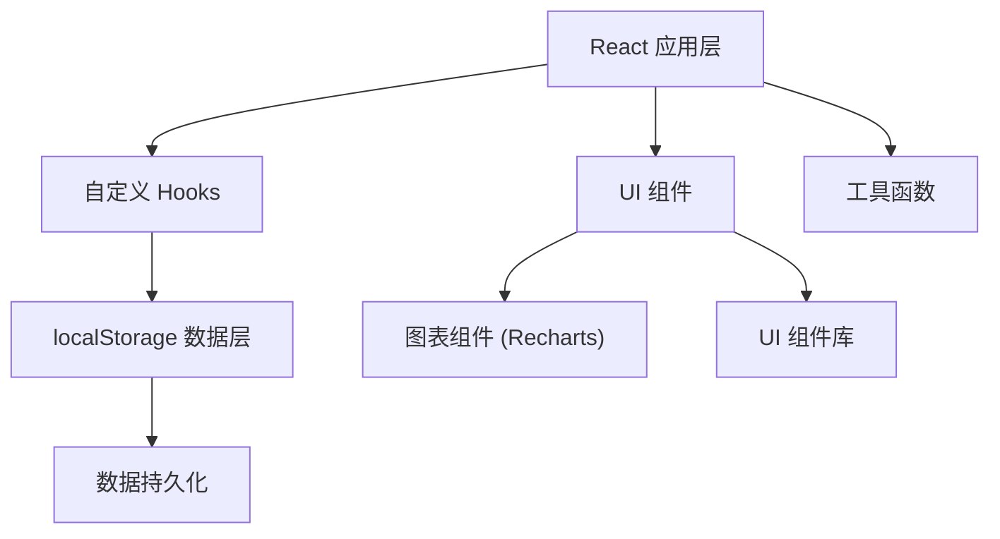
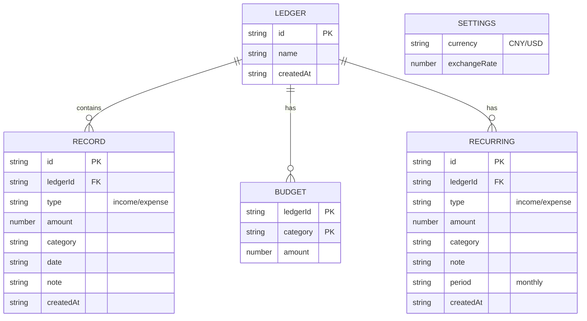

## 1. 架构设计



## 2. 技术描述

- **前端框架**: React@18 + React Hooks
- **构建工具**: Vite
- **样式方案**: TailwindCSS@3
- **图表库**: Recharts（轻量级React图表库）
- **图标**: Lucide React
- **数据存储**: 浏览器 localStorage
- **语言**: TypeScript

## 3. 目录结构

```
src/
├── components/          # React组件
│   ├── Header.tsx       # 顶部统计区
│   ├── LedgerTabs.tsx   # 账本切换
│   ├── Charts.tsx       # 图表组件（饼图+折线图）
│   ├── RecordList.tsx   # 记录列表
│   ├── RecordForm.tsx   # 添加/编辑记录表单
│   ├── SearchBar.tsx    # 搜索栏
│   ├── SettingsModal.tsx # 设置弹窗
│   └── BudgetSettings.tsx # 预算设置
├── hooks/               # 自定义Hooks
│   ├── useLocalStorage.ts # localStorage Hook
│   ├── useRecords.ts    # 记录管理Hook
│   └── useLedgers.ts    # 账本管理Hook
├── utils/               # 工具函数
│   ├── storage.ts       # localStorage操作
│   ├── csv.ts           # CSV导入导出
│   ├── currency.ts      # 货币转换
│   └── date.ts          # 日期处理
├── types/               # TypeScript类型定义
│   └── index.ts
├── constants/           # 常量配置
│   └── categories.ts    # 收支类别配置
├── App.tsx
├── main.tsx
└── index.css
```

## 4. 数据模型

### 4.1 数据模型定义



### 4.2 数据类型定义

```typescript
type TransactionType = 'income' | 'expense';

interface Category {
  key: string;
  name: string;
  icon: string;
  color: string;
}

interface Ledger {
  id: string;
  name: string;
  createdAt: string;
}

interface Record {
  id: string;
  ledgerId: string;
  type: TransactionType;
  amount: number;
  category: string;
  date: string;
  note: string;
  createdAt: string;
}

interface Budget {
  ledgerId: string;
  category: string;
  amount: number;
}

interface RecurringTransaction {
  id: string;
  ledgerId: string;
  type: TransactionType;
  amount: number;
  category: string;
  note: string;
  period: 'monthly';
  createdAt: string;
}

interface Settings {
  currency: 'CNY' | 'USD';
  exchangeRate: number;
}

interface AppData {
  ledgers: Ledger[];
  currentLedgerId: string;
  records: Record[];
  budgets: Budget[];
  recurring: RecurringTransaction[];
  settings: Settings;
}
```

## 5. 核心Hooks设计

### 5.1 useLocalStorage
```typescript
function useLocalStorage<T>(key: string, initialValue: T): [T, (value: T | ((prev: T) => T)) => void]
```

### 5.2 useRecords
```typescript
function useRecords(ledgerId: string) {
  const records: Record[];
  const addRecord: (record: Omit<Record, 'id' | 'ledgerId' | 'createdAt'>) => void;
  const updateRecord: (id: string, updates: Partial<Record>) => void;
  const deleteRecord: (id: string) => void;
  const searchRecords: (keyword: string) => Record[];
  const getMonthlyRecords: (year: number, month: number) => Record[];
  const getMonthlyStats: (year: number, month: number) => { income: number; expense: number; balance: number };
  const getCategoryExpense: (year: number, month: number) => { category: string; amount: number }[];
  const getLast7DaysTrend: () => { date: string; amount: number }[];
}
```

### 5.3 useLedgers
```typescript
function useLedgers() {
  const ledgers: Ledger[];
  const currentLedgerId: string;
  const currentLedger: Ledger | undefined;
  const addLedger: (name: string) => void;
  const switchLedger: (id: string) => void;
  const deleteLedger: (id: string) => void;
}
```

## 6. localStorage 键名

- `accounting_app_data` - 存储所有应用数据

## 7. 常量配置

### 7.1 收入类别
```typescript
const INCOME_CATEGORIES = [
  { key: 'salary', name: '工资', icon: '💰', color: '#10b981' },
  { key: 'bonus', name: '奖金', icon: '🎁', color: '#059669' },
  { key: 'investment', name: '理财', icon: '📈', color: '#047857' },
  { key: 'other_income', name: '其他', icon: '💵', color: '#065f46' },
];
```

### 7.2 支出类别
```typescript
const EXPENSE_CATEGORIES = [
  { key: 'food', name: '餐饮', icon: '🍜', color: '#ef4444' },
  { key: 'shopping', name: '购物', icon: '🛒', color: '#f97316' },
  { key: 'transport', name: '交通', icon: '🚗', color: '#eab308' },
  { key: 'entertainment', name: '娱乐', icon: '🎮', color: '#8b5cf6' },
  { key: 'housing', name: '住房', icon: '🏠', color: '#ec4899' },
  { key: 'utilities', name: '水电', icon: '💡', color: '#06b6d4' },
  { key: 'medical', name: '医疗', icon: '💊', color: '#14b8a6' },
  { key: 'education', name: '教育', icon: '📚', color: '#6366f1' },
  { key: 'other_expense', name: '其他', icon: '📝', color: '#64748b' },
];
```
