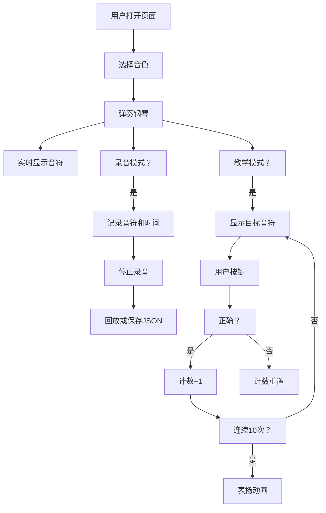

## 1. 产品概述
钢琴模拟器是一个基于Web技术的交互式音乐应用，用户可以通过鼠标或键盘弹奏虚拟钢琴，体验音乐创作的乐趣。
- 主要目的：提供一个功能丰富、易于使用的在线钢琴模拟器，支持学习、创作和分享音乐
- 目标用户：音乐爱好者、钢琴初学者、音乐教育工作者
- 产品价值：无需实体钢琴即可随时随地练习弹奏，支持录音、教学等多种功能

## 2. 核心功能

### 2.1 功能模块
1. **钢琴键盘区域**：两个八度的白键和黑键，支持鼠标点击和键盘按键
2. **音色切换**：钢琴、电子琴、风琴、吉他四种音色
3. **录音系统**：记录弹奏音符和时间间隔，支持回放
4. **文件管理**：保存录音为JSON文件，从JSON文件加载播放
5. **节拍器**：40-200BPM可调，滴答声配合视觉闪烁
6. **音效系统**：延音踏板、混响效果
7. **音符显示**：实时显示当前按下的琴键对应的音符名称
8. **教学模式**：随机显示音符，用户需按下正确琴键，连续答对10次显示表扬
9. **和弦助手**：一键播放C、G、Am等常用和弦
10. **音量控制**：音量滑块和静音按钮
11. **成绩记录**：最高连续答对记录保存到localStorage

### 2.2 页面详情
| 页面名称 | 模块名称 | 功能描述 |
|-----------|-------------|---------------------|
| 主页面 | 钢琴键盘 | 两个八度共24个白键、17个黑键，视觉区分，支持点击和悬停效果 |
| 主页面 | 音色选择器 | 四个音色按钮，点击切换当前音色 |
| 主页面 | 录音控制 | 录音、停止、播放三个按钮，状态指示 |
| 主页面 | 文件操作 | 保存JSON、加载JSON两个按钮 |
| 主页面 | 节拍器 | BPM滑块、启动/停止按钮、视觉指示器 |
| 主页面 | 音效控制 | 延音踏板开关、混响效果开关 |
| 主页面 | 音符显示 | 大字显示当前音符名称 |
| 主页面 | 教学模式 | 目标音符显示、当前成绩、最高成绩 |
| 主页面 | 和弦助手 | 常用和弦按钮组 |
| 主页面 | 音量控制 | 音量滑块、静音按钮 |

## 3. 核心流程

### 3.1 弹奏流程
用户打开页面 → 选择音色 → 通过鼠标点击或键盘按键弹奏 → 发出对应音色的声音 → 实时显示音符名称

### 3.2 录音流程
点击录音按钮 → 开始记录音符和时间间隔 → 弹奏钢琴 → 点击停止按钮 → 点击播放按钮回放录音 → 可选择保存为JSON文件

### 3.3 教学流程
开启教学模式 → 系统随机显示一个音符 → 用户按下对应琴键 → 正确则计数+1，错误则重置 → 连续答对10次显示表扬动画 → 最高成绩保存到localStorage

## 4. 用户界面设计

### 4.1 设计风格
- **主色调**：深色背景配合白色琴键，黑色黑键，金色点缀按钮
- **按钮风格**：圆角按钮，悬停有缩放和阴影效果，按下有凹陷感
- **字体**：使用现代无衬线字体，大字音符显示使用衬线字体增强音乐感
- **布局风格**：钢琴键盘居中，控制面板分布在上下区域，卡片式设计
- **整体风格**：现代简约的音乐工作室风格，专业但不失友好

### 4.2 页面设计概述
| 页面名称 | 模块名称 | UI元素 |
|-----------|-------------|-------------|
| 主页面 | 钢琴键盘 | 3D效果琴键，按下时有颜色变化和阴影，黑键突出显示 |
| 主页面 | 控制面板 | 圆角卡片，深色背景，金色图标和文字，分组排列 |
| 主页面 | 音符显示 | 大号字体，居中显示，颜色随音符变化 |
| 主页面 | 教学区域 | 目标音符用醒目颜色，成绩用数字徽章 |
| 主页面 | 和弦按钮 | 网格排列，音乐符号图标 |

### 4.3 响应式设计
- 桌面端优先，钢琴键盘横向排列
- 平板端适当缩小琴键尺寸
- 移动端将控制区域改为垂直排列，琴键自适应宽度

## 5. 非功能需求
- 音频响应延迟小于50ms
- 支持同时按下多个键（和弦）
- 页面加载时间小于2秒
- 支持Chrome、Firefox、Safari等主流浏览器
