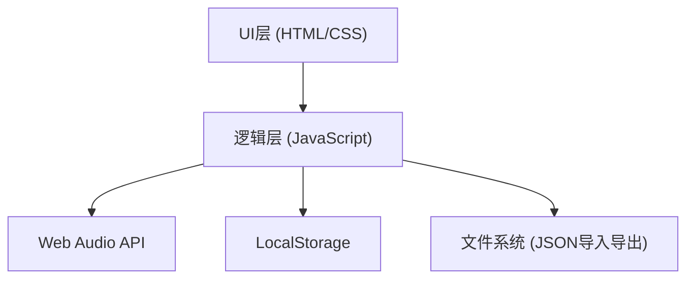

## 1. 架构设计



## 2. 技术描述
- **前端技术栈**：原生HTML5 + CSS3 + JavaScript (ES6+)
- **音频引擎**：Web Audio API (Oscillator + GainNode + ConvolverNode)
- **数据存储**：LocalStorage存储最高得分
- **文件格式**：JSON格式存储录音数据
- **构建工具**：无，纯静态页面

## 3. 文件结构
| 文件 | 用途 |
|-------|---------|
| index.html | 主页面，包含所有UI元素 |
| css/style.css | 样式文件 |
| js/audio.js | 音频引擎，音色生成 |
| js/piano.js | 钢琴键盘逻辑 |
| js/recorder.js | 录音和播放功能 |
| js/metronome.js | 节拍器功能 |
| js/teacher.js | 教学模式逻辑 |
| js/app.js | 主应用入口 |

## 4. 核心数据结构

### 4.1 音符频率映射
```javascript
const NOTE_FREQUENCIES = {
  'C4': 261.63, 'C#4': 277.18, 'D4': 293.66, 'D#4': 311.13,
  'E4': 329.63, 'F4': 349.23, 'F#4': 369.99, 'G4': 392.00,
  'G#4': 415.30, 'A4': 440.00, 'A#4': 466.16, 'B4': 493.88,
  // ... 两个八度
};
```

### 4.2 键盘映射
```javascript
const KEYBOARD_MAP = {
  'a': 'C4', 'w': 'C#4', 's': 'D4', 'e': 'D#4',
  'd': 'E4', 'f': 'F4', 't': 'F#4', 'g': 'G4',
  // ...
};
```

### 4.3 录音数据格式
```json
{
  "notes": [
    {"note": "C4", "time": 0, "duration": 500, "velocity": 0.8},
    {"note": "E4", "time": 250, "duration": 500, "velocity": 0.7}
  ],
  "totalDuration": 3000
}
```

### 4.4 和弦定义
```javascript
const CHORDS = {
  'C': ['C4', 'E4', 'G4'],
  'G': ['G4', 'B4', 'D5'],
  'Am': ['A4', 'C5', 'E5'],
  'F': ['F4', 'A4', 'C5'],
  // ...
};
```

## 5. 音色实现方案

### 5.1 钢琴音色
- 多个正弦波叠加模拟泛音
- 快速起音，指数衰减
- 轻微的立体声效果

### 5.2 电子琴音色
- 方波或锯齿波为主
- 加入颤音效果
- 中等衰减时间

### 5.3 风琴音色
- 多个正弦波叠加
- 慢速起音和释放
- 稳定的持续音

### 5.4 吉他音色
- 模拟拨弦效果
- 快速起音，较长的衰减
- 轻微的音高弯曲

## 6. 音效实现

### 6.1 延音踏板
- 延长音符的释放时间
- 当踏板按下时，音符不立即停止

### 6.2 混响效果
- 使用Web Audio API的ConvolverNode
- 生成脉冲响应模拟房间混响
- 干湿信号可调节

## 7. 性能优化
- 使用音频对象池避免频繁创建
- 琴键使用CSS transform而非重绘
- 节流处理高频率事件
