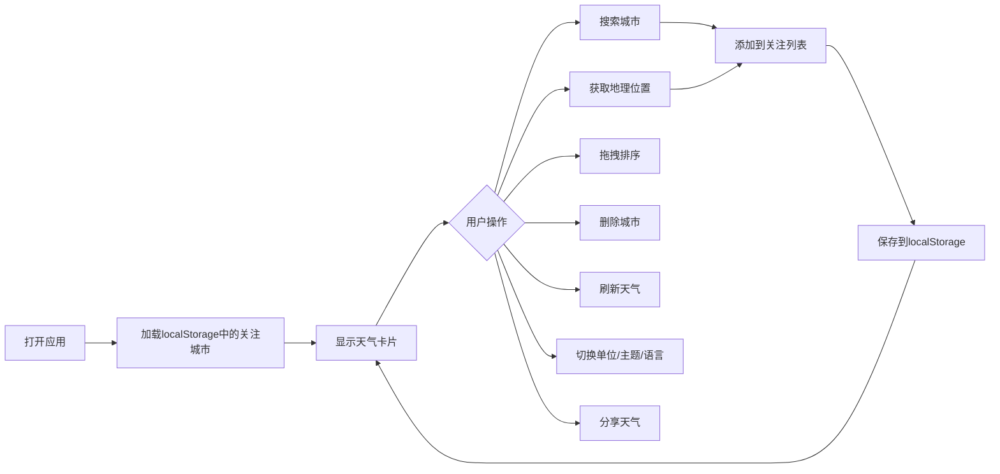

## 1. 产品概述

一个功能丰富的React天气预报卡片组件库，通过免费天气API获取数据，支持城市搜索、地理位置获取、多城市关注、拖拽排序、主题切换、温度单位转换、穿衣出行建议、历史搜索、天气预警、截图分享等功能。

- 主要目的：提供美观、易用的天气查询界面，支持多城市管理和个性化设置
- 目标用户：需要便捷查看天气信息的普通用户

## 2. 核心功能

### 2.1 功能模块

1. **首页**: 城市搜索栏、地理位置按钮、历史搜索记录、天气卡片展示区
2. **天气卡片**: 当前天气详情、3/7天预报、刷新按钮、删除按钮、预警横幅
3. **设置面板**: 温度单位切换、主题切换、语言切换

### 2.2 页面详情

| 页面名称 | 模块名称 | 功能描述 |
|---------|---------|---------|
| 首页 | 搜索栏 | 输入城市名称搜索，显示搜索建议 |
| 首页 | 地理位置 | 一键获取当前位置天气 |
| 首页 | 历史搜索 | 显示最近5个搜索记录，点击快速查询 |
| 首页 | 卡片区域 | 关注城市卡片并列显示，支持拖拽排序 |
| 天气卡片 | 当前天气 | 温度、高低温、天气状况、湿度、风速、风向、紫外线、空气质量 |
| 天气卡片 | 天气预报 | 3天/7天切换，显示日期、图标、高低温 |
| 天气卡片 | 预警横幅 | 黄色滚动预警条显示天气预警 |
| 天气卡片 | 建议面板 | 穿衣建议和出行建议 |
| 天气卡片 | 分享功能 | 生成精美截图卡片，支持下载 |
| 设置面板 | 单位切换 | 摄氏度/华氏度一键转换 |
| 设置面板 | 主题切换 | 晴天/雨天/雪天/夜间主题，自动推荐+手动覆盖 |
| 设置面板 | 语言切换 | 中文/英文双语支持 |

## 3. 核心流程

## 4. 用户界面设计

### 4.1 设计风格

- **主色调**: 根据主题动态变化（晴天：橙黄色系，雨天：蓝灰色系，雪天：白色系，夜间：深蓝色系）
- **按钮风格**: 圆角胶囊按钮，带微动画效果
- **字体**: 使用现代无衬线字体，搭配优雅的数字字体
- **布局风格**: 卡片式布局，毛玻璃效果（Glassmorphism），柔和阴影
- **图标风格**: 线性图标配合天气动效图标

### 4.2 页面设计概述

| 页面名称 | 模块名称 | UI元素 |
|---------|---------|--------|
| 首页 | 搜索栏 | 圆角输入框，搜索图标，自动完成下拉 |
| 首页 | 卡片区域 | 网格布局，拖拽手柄，悬停效果 |
| 天气卡片 | 头部 | 城市名称，预警横幅，刷新/删除按钮 |
| 天气卡片 | 主体 | 大温度显示，天气图标，详情网格 |
| 天气卡片 | 预报 | 横向滚动，日期切换标签 |
| 天气卡片 | 底部 | 建议文字，分享按钮 |
| 设置面板 | 浮动按钮 | 右下角悬浮设置入口 |

### 4.3 响应式设计

- Desktop-first 设计
- 桌面端：3-4列卡片网格
- 平板端：2列卡片网格
- 移动端：单列卡片全屏宽度
- 触摸优化：增大按钮可点击区域
