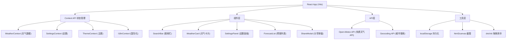

## 1. 架构设计



## 2. 技术描述

- **前端**: React@18 + TypeScript + tailwindcss@3 + vite@5
- **状态管理**: React Context API + useReducer
- **天气API**: Open-Meteo (免费，无需API Key)
- **拖拽**: @dnd-kit/core + @dnd-kit/sortable
- **截图**: html2canvas
- **图标**: lucide-react
- **国际化**: 自定义i18n Context

## 3. 目录结构

```
src/
├── components/
│   ├── SearchBar.tsx
│   ├── WeatherCard.tsx
│   ├── WeatherDetail.tsx
│   ├── ForecastList.tsx
│   ├── SettingsPanel.tsx
│   ├── ShareModal.tsx
│   └── AlertBanner.tsx
├── contexts/
│   ├── WeatherContext.tsx
│   ├── SettingsContext.tsx
│   ├── ThemeContext.tsx
│   └── I18nContext.tsx
├── hooks/
│   ├── useWeather.ts
│   ├── useGeolocation.ts
│   └── useLocalStorage.ts
├── services/
│   ├── weatherApi.ts
│   └── geocodingApi.ts
├── utils/
│   ├── temperature.ts
│   ├── suggestions.ts
│   └── theme.ts
├── types/
│   └── index.ts
├── i18n/
│   ├── zh.ts
│   └── en.ts
├── App.tsx
└── main.tsx
```

## 4. 数据模型

### 4.1 天气数据类型

```typescript
interface WeatherData {
  city: string;
  country: string;
  lat: number;
  lon: number;
  current: {
    temp: number;
    tempMin: number;
    tempMax: number;
    condition: string;
    conditionCode: string;
    humidity: number;
    windSpeed: number;
    windDirection: number;
    uvIndex: number;
    aqi: number;
  };
  forecast: Array<{
    date: string;
    tempMin: number;
    tempMax: number;
    conditionCode: string;
    precipitation: number;
  }>;
  alerts: Array<{
    headline: string;
    severity: string;
  }>;
}
```

### 4.2 设置类型

```typescript
interface Settings {
  temperatureUnit: 'celsius' | 'fahrenheit';
  theme: 'auto' | 'sunny' | 'rainy' | 'snowy' | 'night';
  language: 'zh' | 'en';
  followedCities: Array<{
    id: string;
    name: string;
    lat: number;
    lon: number;
  }>;
  searchHistory: string[];
}
```

## 5. API 定义

### 5.1 Open-Meteo Weather API

```
GET https://api.open-meteo.com/v1/forecast
  ?latitude={lat}
  &longitude={lon}
  &current=temperature_2m,relative_humidity_2m,apparent_temperature,precipitation,weather_code,wind_speed_10m,wind_direction_10m,uv_index
  &daily=temperature_2m_max,temperature_2m_min,precipitation_probability_max,weather_code
  &timezone=auto
  &forecast_days=7
```

### 5.2 Geocoding API

```
GET https://geocoding-api.open-meteo.com/v1/search
  ?name={city}
  &count=5
  &language=zh
  &format=json
```

## 6. 核心功能实现

### 6.1 主题系统
- 基于CSS变量实现动态主题切换
- 根据天气状况自动推荐主题
- 支持手动覆盖主题设置

### 6.2 温度转换
```typescript
const celsiusToFahrenheit = (c: number) => c * 9/5 + 32;
const formatTemp = (temp: number, unit: 'celsius' | 'fahrenheit') => 
  unit === 'celsius' ? `${Math.round(temp)}°C` : `${Math.round(celsiusToFahrenheit(temp))}°F`;
```

### 6.3 localStorage 持久化
- 关注城市列表
- 用户设置（单位、主题、语言）
- 搜索历史记录

### 6.4 截图分享
- 使用 html2canvas 捕获天气卡片
- 生成高清图片供下载
