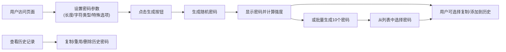

## 1. 产品概述

随机密码生成器是一个基于原生Web技术的在线密码生成工具，帮助用户快速生成安全可靠的随机密码，支持多种自定义选项和历史记录管理。

- **主要用途**：为用户提供安全、可定制的密码生成服务，解决用户创建强密码的需求
- **目标用户**：需要创建安全密码的普通互联网用户、开发者、系统管理员
- **产品价值**：提供一站式密码生成解决方案，兼顾安全性与易用性

## 2. 核心 Features

### 2.1 用户角色
| 角色 | 注册方式 | 核心权限 |
|------|----------|----------|
| 普通用户 | 无需注册 | 使用所有密码生成功能，管理本地历史记录 |

### 2.2 Feature 模块
1. **密码生成控制面板**：长度滑块、字符类型复选框、特殊选项开关
2. **密码展示区**：生成结果显示、复制按钮、强度指示器
3. **批量生成区**：一次生成10个密码，列表展示供选择
4. **历史记录区**：localStorage存储、复制/重用/删除功能
5. **主题切换**：深色/浅色模式切换

### 2.3 Page 详情
| 页面名称 | 模块名称 | Feature 描述 |
|----------|----------|--------------|
| 主页面 | 控制面板 | 长度滑块（8-32位）、字符类型复选框（大写/小写/数字/特殊符号，默认全选）、排除混淆字符开关、可发音密码开关 |
| 主页面 | 生成控制 | 单个生成按钮、批量生成10个按钮、添加到历史按钮 |
| 主页面 | 密码展示 | 密码文本框、复制到剪贴板按钮（成功提示）、密码强度指示器（弱/中/强） |
| 主页面 | 批量列表 | 10个密码列表展示，点击可复制或选择使用 |
| 主页面 | 历史记录 | 最多20条记录展示、单条复制/重用/删除、清空全部按钮 |
| 主页面 | 主题切换 | 深色/浅色模式切换按钮，状态持久化 |

## 3. 核心流程

**用户主流程**：
1. 用户打开页面，默认参数（长度16位，全字符类型）
2. 可调整参数：拖动滑块改变长度，勾选/取消字符类型
3. 可开启特殊选项：排除混淆字符、生成可发音密码
4. 点击"生成密码"按钮，立即生成并显示密码
5. 密码强度指示器实时更新
6. 点击复制按钮，密码复制到剪贴板并显示成功提示
7. 可选择"添加到历史"保存密码
8. 可点击"批量生成"一次生成10个密码供选择
9. 可在历史记录区查看、复制、重用或删除历史密码
10. 可切换深色/浅色主题

## 4. 用户界面设计

### 4.1 设计风格
- **设计风格**：现代简约科技风，带有密码安全主题的科技感
- **主色调**：深青色/蓝绿色系（代表安全、信任），搭配深色/浅色主题
- **辅助色**：
  - 强度弱：红色系 (#ef4444)
  - 强度中：黄色系 (#eab308)
  - 强度强：绿色系 (#22c55e)
- **按钮风格**：圆角设计，带有微妙阴影，悬停时有过渡动画
- **字体**：使用等宽字体显示密码（JetBrains Mono 或 Fira Code），界面字体使用现代无衬线字体
- **布局风格**：卡片式布局，分区域组织功能，视觉层次清晰
- **图标风格**：简洁线性图标，与整体风格统一

### 4.2 Page 设计概览
| 页面名称 | 模块名称 | UI 元素 |
|----------|----------|---------|
| 主页面 | 控制面板 | 滑块带有数字显示，复选框带自定义样式，开关按钮有平滑过渡动画 |
| 主页面 | 密码展示 | 密码框带有边框高亮，复制按钮在右侧，强度条有颜色渐变动画 |
| 主页面 | 批量列表 | 网格布局，每个密码项可悬停高亮，点击有反馈 |
| 主页面 | 历史记录 | 时间倒序排列，每条记录带操作按钮，悬停显示更多操作 |
| 主页面 | 主题切换 | 右上角固定位置，图标动画切换 |

### 4.3 响应式设计
- **桌面优先**：采用桌面端优先设计，最大宽度限制在1200px
- **移动端适配**：在768px以下断点调整布局为单列，滑块和按钮尺寸优化
- **触摸优化**：移动端按钮和可点击区域增大，确保易于点击

### 4.4 动画与交互
- 页面加载时元素淡入动画，错峰延迟显示
- 滑块拖动时实时更新长度显示
- 密码生成时有短暂的闪烁/过渡效果
- 复制成功提示采用toast消息，自动消失
- 强度条变化时有平滑的颜色过渡动画
- 主题切换有渐变过渡效果
