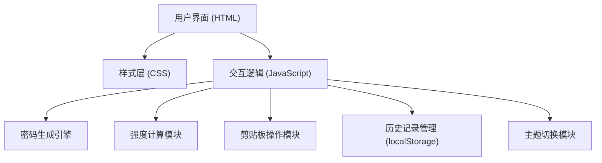

## 1. 架构设计



## 2. 技术选型说明

- **前端**：纯 HTML5 + CSS3 + 原生 JavaScript (ES6+)，无任何框架依赖
- **构建工具**：无需构建工具，直接浏览器运行
- **后端**：无后端，纯前端应用
- **数据存储**：浏览器 localStorage 存储历史记录
- **字体**：Google Fonts - JetBrains Mono（密码显示）、Inter（界面文字）
- **图标**：纯 CSS/SVG 实现，无外部图标库依赖

## 3. 目录结构

```
/
├── index.html          # 主页面
├── css/
│   └── style.css       # 样式文件（含主题变量）
├── js/
│   └── app.js          # 主逻辑文件
└── .trae/
    └── documents/      # 项目文档
```

## 4. 核心模块设计

### 4.1 密码生成引擎

```javascript
// 字符集定义
const CHAR_SETS = {
  uppercase: 'ABCDEFGHIJKLMNOPQRSTUVWXYZ',
  lowercase: 'abcdefghijklmnopqrstuvwxyz',
  numbers: '0123456789',
  symbols: '!@#$%^&*()_+-=[]{}|;:,.<>?',
  ambiguous: '0O1lI'  // 易混淆字符
};

// 发音密码音节库
const SYLLABLES = {
  vowels: 'aeiou',
  consonants: 'bcdfghjklmnpqrstvwxyz',
  blends: ['bl', 'br', 'cl', 'cr', 'dr', 'fl', 'fr', 'gl', 'gr', 'pl', 'pr', 'sc', 'sh', 'sk', 'sl', 'sm', 'sn', 'sp', 'st', 'sw', 'th', 'tr', 'tw', 'wh', 'wr']
};
```

### 4.2 强度计算算法

| 强度级别 | 判定条件 |
|---------|----------|
| 弱 | 长度 < 12 或 字符种类 < 2 |
| 中 | 长度 >= 12 且 字符种类 >= 2，或 长度 >= 16 且 字符种类 >= 1 |
| 强 | 长度 >= 16 且 字符种类 >= 3，或 长度 >= 24 且 字符种类 >= 2 |

### 4.3 历史记录数据结构

```javascript
// localStorage key: 'passwordHistory'
{
  id: string,        // 唯一标识
  password: string,  // 密码内容
  length: number,    // 密码长度
  charset: string[], // 使用的字符集
  timestamp: number, // 创建时间戳
  strength: string   // 强度等级
}
```

## 5. 核心功能实现要点

### 5.1 密码生成
- 使用 `window.crypto.getRandomValues()` 加密安全的随机数生成
- 确保每种选中的字符集至少有一个字符出现在结果中
- 可发音密码采用辅-元-辅音节交替模式
- 排除混淆字符选项从字符集中移除对应字符

### 5.2 剪贴板操作
- 使用现代 `navigator.clipboard.writeText()` API
- 降级方案：创建临时 textarea 元素执行 `document.execCommand('copy')`
- 复制成功后显示 2 秒 toast 提示

### 5.3 主题切换
- 使用 CSS 变量定义颜色系统
- 通过 `data-theme` 属性切换主题
- 主题偏好存储到 localStorage，页面加载时自动恢复

### 5.4 事件绑定
- 所有交互使用事件委托或直接事件监听
- 滑块使用 `input` 事件实时响应
- 防止重复生成的防抖处理（可选）

## 6. 浏览器兼容性

- 支持 Chrome 60+、Firefox 55+、Safari 12+、Edge 79+
- 使用 CSS 变量、flexbox、grid 等现代 CSS 特性
- localStorage 和 Clipboard API 均为现代浏览器标准支持
