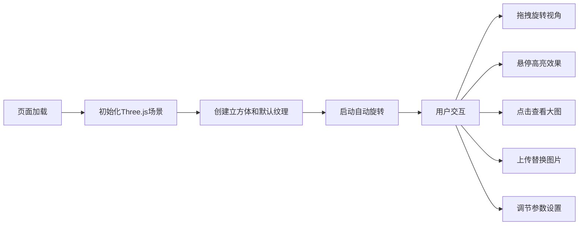

## 1. 产品概述
3D旋转立方体相册是一个基于Three.js的交互式网页应用。用户可以在3D空间中查看六面立方体相册，每个面展示不同的图片，支持丰富的交互功能和自定义设置。

- 主要目的：提供沉浸式的3D图片浏览体验，支持用户自定义相册内容
- 目标用户：摄影爱好者、设计师、需要展示图片集的用户

## 2. 核心功能

### 2.1 功能模块
1. **3D立方体展示**：场景中心的透明立方体框架，六面展示不同图片纹理
2. **自动旋转**：立方体持续绕Y轴缓慢自转
3. **鼠标交互**：拖拽旋转视角、滚轮缩放、悬停效果
4. **图片浏览**：点击面弹出大图模态框，支持左右切换
5. **图片上传**：支持上传本地图片替换任意面的纹理
6. **批量下载**：将六张图片打包下载为ZIP文件
7. **参数调节**：旋转速度滑块、星空背景开关
8. **材质切换**：标准材质、线框材质、半透明材质三种模式
9. **截图功能**：一键保存当前视角为PNG图片
10. **视角重置**：恢复相机到初始位置

### 2.2 页面详情
| 页面名称 | 模块名称 | 功能描述 |
|-----------|-------------|---------------------|
| 主页面 | 3D场景区域 | Three.js渲染的立方体相册场景 |
| 主页面 | 控制面板 | 旋转速度滑块、星空开关、材质切换按钮 |
| 主页面 | 操作按钮区 | 截图、重置视角、下载ZIP、上传图片按钮 |
| 主页面 | 模态框 | 点击面弹出的大图查看器，支持左右切换 |
| 主页面 | 上传面板 | 选择要替换的面，上传本地图片 |

## 3. 核心流程

## 4. 用户界面设计

### 4.1 设计风格
- 主色调：深色科技感背景配合霓虹蓝紫色调
- 按钮风格：圆角玻璃拟态、发光悬停效果
- 字体：现代无衬线字体
- 布局：全屏3D场景，悬浮控制面板
- 整体风格：未来科技感、沉浸式体验

### 4.2 页面设计概述
| 页面名称 | 模块名称 | UI Elements |
|-----------|-------------|-------------|
| 主页面 | 3D场景 | 全屏黑色背景，中心发光立方体，星空粒子背景 |
| 主页面 | 控制面板 | 右上角悬浮半透明面板，滑块、开关、按钮组 |
| 主页面 | 模态框 | 居中黑色半透明背景，大图展示，左右箭头 |
| 主页面 | 上传面板 | 底部悬浮面板，面选择器，文件上传按钮 |

### 4.3 响应性
- 全屏自适应，3D场景占满视口
- 控制面板在移动端调整布局
- 触摸设备支持手势操作
