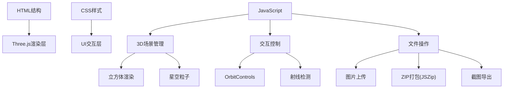

## 1. 架构设计
纯前端单页应用，基于Three.js实现3D渲染，所有逻辑在浏览器本地执行。



## 2. 技术描述
- 前端：原生HTML5 + CSS3 + JavaScript (ES6+)
- 3D引擎：Three.js (通过CDN引入)
- 控制器：OrbitControls (Three.js附加组件)
- 第三方库：JSZip (用于ZIP打包，通过CDN引入)
- 图片处理：Canvas API、Three.js TextureLoader

## 3. 文件结构
```
/
├── index.html          # 主页面
├── css/
│   └── style.css       # 样式文件
└── js/
    └── app.js          # 主应用逻辑
```

## 4. 核心功能实现

### 4.1 Three.js场景初始化
1. 创建Scene、PerspectiveCamera、WebGLRenderer
2. 设置环境光和平行光
3. 初始化OrbitControls实现拖拽旋转和缩放

### 4.2 立方体相册实现
1. 创建BoxGeometry，为每个面创建独立的Mesh
2. 使用MeshStandardMaterial加载Texture纹理
3. 每个面可独立设置材质属性（透明度、发光等）
4. 添加立方体边框线框增强视觉效果

### 4.3 鼠标交互
- **射线检测**：使用Raycaster检测鼠标悬停和点击的面
- **悬停效果**：修改材质opacity或emissive属性
- **点击事件**：弹出模态框显示大图
- **拖拽旋转**：OrbitControls控制相机

### 4.4 星空粒子系统
1. 创建BufferGeometry，生成大量随机顶点
2. 使用PointsMaterial设置粒子大小和颜色
3. 可通过开关控制可见性

### 4.5 图片上传与替换
1. FileReader读取用户上传的图片
2. 使用Three.js TextureLoader创建纹理
3. 实时更新对应面的material.map

### 4.6 ZIP打包下载
1. 使用JSZip库创建ZIP文件
2. 将每个面的纹理转换为Canvas导出图片
3. 添加到ZIP并触发下载

### 4.7 截图功能
1. 调用renderer.render()确保最新画面
2. 使用canvas.toDataURL()获取PNG数据
3. 创建下载链接触发保存

## 5. 数据结构

### 5.1 立方体面数据
```javascript
{
  index: number,        // 0-5 面对应索引
  name: string,         // 面名称（前、后、左、右、上、下）
  texture: Texture,     // Three.js纹理对象
  imageData: string,    // 图片数据URL
  material: MeshStandardMaterial  // 材质引用
}
```

### 5.2 应用状态
```javascript
{
  rotationSpeed: number,    // 旋转速度 0-0.05
  starfieldEnabled: boolean, // 星空开关
  materialMode: 'standard' | 'wireframe' | 'transparent',
  currentFaceIndex: number  // 当前选中的面
}
```

## 6. 关键技术点
1. **性能优化**：使用BufferGeometry处理粒子系统，合理设置纹理大小
2. **内存管理**：及时释放不再使用的纹理对象
3. **响应式**：监听窗口resize事件，更新相机和渲染器
4. **兼容性**：使用WebGLRenderer检测，提供降级方案
