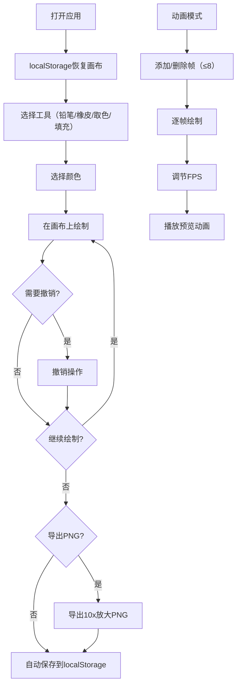

## 1. 产品概述

像素画绘制工具是一款基于Web的轻量级像素艺术创作应用，专为像素艺术家、游戏开发者和爱好者设计。用户可以在32x32的网格画布上创作像素画，支持多种绘制工具、多帧动画制作、以及导入导出功能。

- **核心价值**：提供简单直观的像素画创作体验，无需安装复杂软件，浏览器即可使用
- **目标用户**：像素艺术爱好者、独立游戏开发者、UI设计师、学生

## 2. 核心功能

### 2.1 用户角色
| 角色 | 注册方式 | 核心权限 |
|------|----------|----------|
| 普通用户 | 无需注册 | 使用全部绘制功能，本地保存作品 |

### 2.2 功能模块
1. **画布绘制模块**：32x32网格画布，鼠标点击/拖拽绘制
2. **工具模块**：铅笔、橡皮擦、取色器、填充桶
3. **颜色模块**：24色调色板、自定义颜色选择器
4. **历史模块**：撤销/重做（最多20步）
5. **视图模块**：网格线开关、放大镜
6. **文件模块**：清空画布、PNG导出/导入
7. **存储模块**：localStorage自动保存/恢复
8. **动画模块**：最多8帧独立绘制、逐帧播放、帧率调节

### 2.3 功能详情
| 页面 | 模块 | 功能描述 |
|------|------|----------|
| 主页面 | 画布区域 | 32x32像素网格，鼠标点击或拖拽绘制像素 |
| 主页面 | 工具栏 | 铅笔、橡皮擦、取色器、填充桶工具切换 |
| 主页面 | 调色板 | 24种预设颜色点击选择，颜色选择器自定义颜色 |
| 主页面 | 历史控制 | 撤销按钮、重做按钮，最多保存20步历史 |
| 主页面 | 视图控制 | 网格线显示开关、放大镜（悬停显示放大视图） |
| 主页面 | 文件操作 | 清空画布、导出PNG（10x放大）、导入PNG（缩放到32x32） |
| 主页面 | 动画控制 | 添加/删除帧（最多8帧）、帧切换、播放/暂停、FPS调节 |

## 3. 核心流程

用户打开应用 → 画布自动恢复上次保存的作品 → 选择工具和颜色 → 在画布上绘制 → 可随时撤销/重做 → 完成后导出PNG或自动保存 → 可切换到动画模式创建多帧动画

## 4. 用户界面设计

### 4.1 设计风格
- **设计方向**：复古像素风格 + 现代简约UI，致敬经典像素画编辑器
- **主色调**：深灰色背景 (#1a1a2e) + 霓虹蓝点缀 (#4361ee)
- **辅助色**：像素绿 (#4cc9f0)、警示红 (#f72585)
- **字体**：使用 'Press Start 2P' 等宽像素字体作为标题，'JetBrains Mono' 作为界面字体
- **按钮风格**：像素化边框，悬停时有微妙的亮度变化和像素抖动效果
- **布局**：左侧工具栏 + 中央画布 + 右侧调色板和动画控制

### 4.2 界面布局
| 区域 | 模块 | UI元素 |
|------|------|--------|
| 左侧 | 工具栏 | 工具图标按钮（铅笔✏️、橡皮擦🧽、取色器💧、填充桶🪣）、撤销↶、重做↷ |
| 中央 | 画布区 | 32x32网格画布、悬停放大镜预览窗口 |
| 右侧 | 调色板 | 24色预设网格、颜色选择器、当前色/背景色显示 |
| 顶部 | 文件操作 | 清空、导入、导出按钮 |
| 底部 | 视图控制 | 网格线开关、动画模式开关 |
| 右侧底部 | 动画控制 | 帧列表、添加/删除帧、播放控制、FPS滑块 |

### 4.3 交互细节
- 绘制时鼠标光标变为十字准星
- 取色器模式下光标变为吸管
- 填充桶模式下光标变为油漆桶
- 工具按钮选中时有发光边框效果
- 放大镜随鼠标移动实时更新
- 动画播放时帧指示器有流动光效

### 4.4 响应式
- 桌面端为主，采用固定宽度布局，最小支持1024px宽度
- 画布居中显示，周围留白用于放大镜预览
- 移动端可适当缩放，但不作为主要优化目标
