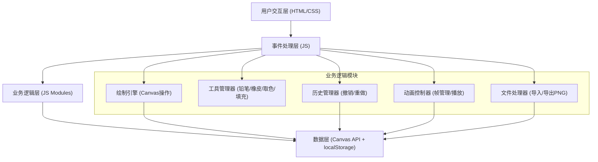

## 1. 架构设计

本项目为纯前端单页应用，采用原生HTML、CSS、JavaScript实现，无需后端服务。所有数据存储在浏览器localStorage中。



## 2. 技术描述

- **前端**：原生 HTML5 + CSS3 + JavaScript (ES6+)
- **渲染技术**：HTML5 Canvas API 进行像素级绘制
- **数据存储**：浏览器 localStorage API 保存用户作品
- **文件处理**：Canvas toDataURL / FileReader API 处理PNG导入导出
- **无外部依赖**：不使用任何第三方库、框架或CDN资源，全部原生实现

## 3. 文件结构

```
/
├── index.html              # 主页面，包含所有DOM结构
├── styles.css              # 全部样式定义
├── app.js                  # 主应用入口，事件绑定和初始化
├── modules/
│   ├── canvas.js           # Canvas绘制引擎
│   ├── tools.js            # 工具管理器
│   ├── history.js          # 历史记录管理器
│   ├── animation.js        # 动画控制器
│   ├── palette.js          # 调色板管理器
│   └── fileHandler.js      # 文件导入导出处理
└── .trae/
    └── documents/
        ├── PRD.md          # 产品需求文档
        └── tech-arch.md    # 技术架构文档（本文件）
```

### 模块职责说明

| 文件 | 职责 | 核心数据/方法 |
|------|------|--------------|
| `index.html` | 页面结构 | 画布容器、工具栏、调色板、动画控制区的DOM结构 |
| `styles.css` | 视觉样式 | 像素风格UI、响应式布局、动画效果 |
| `app.js` | 应用入口 | 初始化所有模块、绑定全局事件、协调各模块通信 |
| `canvas.js` | 绘制引擎 | `gridData[32][32]` 像素数据、`drawPixel()`、`render()`、`clear()` |
| `tools.js` | 工具管理 | `currentTool`、`usePencil()`、`useEraser()`、`useEyedropper()`、`useFillBucket()` |
| `history.js` | 历史管理 | `historyStack[]`、`historyIndex`、`saveState()`、`undo()`、`redo()` |
| `animation.js` | 动画控制 | `frames[]`、`currentFrame`、`fps`、`addFrame()`、`removeFrame()`、`play()`、`stop()` |
| `palette.js` | 调色板 | `presetColors[24]`、`currentColor`、`selectColor()`、`customColor()` |
| `fileHandler.js` | 文件处理 | `exportPNG(scale=10)`、`importPNG(file)`、`saveToLocalStorage()`、`loadFromLocalStorage()` |

## 4. 核心数据结构

### 4.1 像素数据结构
```javascript
// 单帧像素数据 - 32x32二维数组，存储每个像素的颜色值（十六进制字符串）
type FrameData = string[][];  // frameData[y][x] = '#RRGGBB'

// 默认值：所有像素为白色 '#FFFFFF'
```

### 4.2 历史记录结构
```javascript
// 历史栈 - 最多保存20步完整画布状态
type HistoryState = {
  frames: FrameData[];      // 所有帧的完整快照
  currentFrame: number;     // 当前帧索引
};

type HistoryStack = {
  stack: HistoryState[];    // 状态栈
  index: number;            // 当前指针位置
  maxSize: 20;              // 最大历史记录数
};
```

### 4.3 动画数据结构
```javascript
type Animation = {
  frames: FrameData[];      // 最多8帧
  currentFrame: number;     // 当前编辑帧索引
  fps: number;              // 帧率 1-30
  isPlaying: boolean;       // 播放状态
  intervalId: number|null;  // 播放定时器ID
  maxFrames: 8;             // 最大帧数
};
```

### 4.4 工具类型
```javascript
type ToolType = 'pencil' | 'eraser' | 'eyedropper' | 'fillbucket';
```

### 4.5 localStorage存储格式
```javascript
// localStorage key: 'pixelArtData'
type StorageData = {
  version: '1.0';
  frames: FrameData[];
  currentFrame: number;
  currentColor: string;
  currentTool: ToolType;
  showGrid: boolean;
  fps: number;
  savedAt: number;  // timestamp
};
```

## 5. 核心算法

### 5.1 洪水填充算法 (Flood Fill)
```
算法：BFS广度优先搜索
输入：起始坐标 (x,y)、目标颜色 targetColor、填充颜色 fillColor
输出：修改后的像素数据

1. 如果 targetColor === fillColor，直接返回
2. 创建队列 queue，将起始点加入队列
3. 创建 visited 集合防止重复访问
4. 当队列不为空：
   a. 取出队首像素 (cx, cy)
   b. 如果越界或已访问或颜色不匹配 targetColor，跳过
   c. 标记为已访问，设置颜色为 fillColor
   d. 将上下左右四个相邻像素加入队列
```

### 5.2 图像缩放算法 (导入PNG时)
```
算法：最近邻采样 (Nearest Neighbor)
输入：原图像 ImageData (width x height)
输出：32x32 FrameData

1. 计算缩放比例 scaleX = width / 32, scaleY = height / 32
2. 遍历目标像素 (dx, dy) 0-31:
   a. 对应原图像坐标 sx = Math.floor(dx * scaleX)
   b. 对应原图像坐标 sy = Math.floor(dy * scaleX)
   c. 读取原图像 (sx, sy) 处的RGBA值
   d. 转换为十六进制颜色存入 FrameData[dy][dx]
```

### 5.3 放大镜渲染
```
1. 监听鼠标在画布上的位置 (mx, my)
2. 以 (mx, my) 为中心，取 8x8 范围的像素
3. 在放大镜画布上以 scale=8 倍放大绘制
4. 高亮显示中心像素位置
```

## 6. 事件处理流程

### 6.1 鼠标绘制流程
```
mousedown → 标记 isDrawing=true → 记录起始点 → 执行工具操作
mousemove → 如果 isDrawing=true → 执行工具操作 → 更新放大镜
mouseup → 标记 isDrawing=false → 保存历史状态
mouseleave → 标记 isDrawing=false
```

### 6.2 触摸事件支持（可选）
```
touchstart → 转换为 mousedown
touchmove → 转换为 mousemove
touchend → 转换为 mouseup
```

## 7. 性能优化点

1. **Canvas分层**：使用两层Canvas，一层绘制像素，一层绘制网格线，避免重绘
2. **局部重绘**：只重绘修改过的像素区域，而非整个画布
3. **防抖保存**：localStorage保存使用防抖（300ms），避免频繁写入
4. **历史记录优化**：使用浅拷贝对比，相同状态不重复入栈
