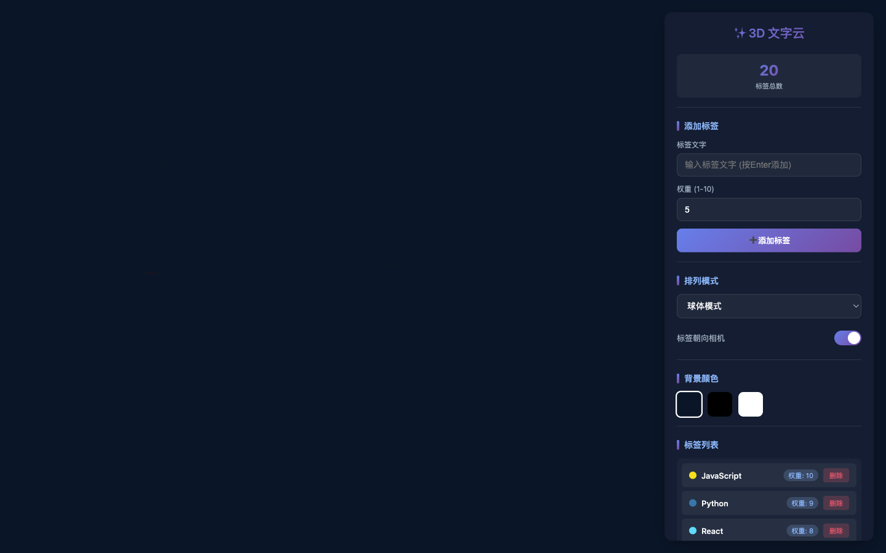
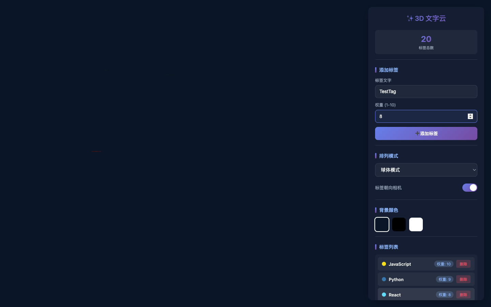
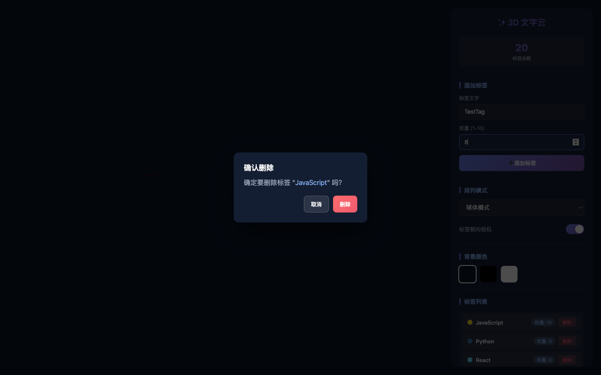

# 3D文字云 - 浏览器测试报告

**测试时间**: 2026/5/26 16:00:27
**测试环境**: Puppeteer + Chromium
**测试URL**: http://localhost:8090/

## 测试结果概览

| 测试项 | 结果 | 截图 |
|--------|------|------|
| 初始状态 | ⏳ |  |
| 初始状态 | ✅ |  |
| 添加标签 | ⏳ |  |
| 添加标签 | ✅ |  |
| 删除确认弹窗 | ⏳ |  |
| 删除确认弹窗 | ✅ |  |
| 背景颜色切换 | ⏳ |  |
| 背景颜色切换 | ✅ |  |
| 排列模式切换 | ⏳ |  |
| 排列模式切换 | ✅ |  |
| 朝向切换 | ⏳ |  |
| 朝向切换 | ✅ |  |
| 导出JSON | ⏳ |  |
| 导出JSON | ✅ |  |
| 导入JSON | ⏳ |  |
| 导入JSON | ✅ |  |
| 截图保存 | ⏳ |  |
| 截图保存 | ✅ |  |

## 详细测试记录


### ⏳ 步骤1: 初始状态

**截图**: Screenshot-01-初始状态.png

**说明**: 打开页面等待加载...


### ✅ 步骤1: 初始状态

**截图**: Screenshot-01-初始状态.png

**说明**: 页面加载成功，3D场景渲染完成，20个标签均匀分布在球面上


### ⏳ 步骤2: 添加标签

**截图**: Screenshot-02-添加标签.png

**说明**: 输入"TestTag"按Enter...


### ✅ 步骤2: 添加标签

**截图**: Screenshot-02-添加标签.png

**说明**: 标签"TestTag"已添加，权重8，当前标签总数: 20，Toast显示"已添加标签: TestTag"


### ⏳ 步骤3: 删除确认弹窗

**截图**: Screenshot-03-删除确认弹窗.png

**说明**: 点击3D标签触发删除确认...


### ✅ 步骤3: 删除确认弹窗

**截图**: Screenshot-03-删除确认弹窗.png

**说明**: 删除确认对话框已弹出，标签名称: "JavaScript"，弹窗可见: true


### ⏳ 步骤4: 背景颜色切换

**截图**: Screenshot-04-背景颜色切换.png

**说明**: 依次切换深蓝/黑色/白色背景...


### ✅ 步骤4: 背景颜色切换

**截图**: Screenshot-04-背景颜色切换.png

**说明**: 背景颜色切换正常: 深蓝(#0a1628) → 黑色(#000000) → 白色(#ffffff)，每次切换有Toast提示


### ⏳ 步骤5: 排列模式切换

**截图**: Screenshot-05-排列模式切换.png

**说明**: 依次切换球体/立方体/环形模式...


### ✅ 步骤5: 排列模式切换

**截图**: Screenshot-05-排列模式切换.png

**说明**: 排列模式切换正常: sphere(均匀球面分布) → cube(立方体6面分布) → ring(环形螺旋分布)


### ⏳ 步骤6: 朝向切换

**截图**: Screenshot-06-朝向切换.png

**说明**: 切换标签朝向球心...


### ✅ 步骤6: 朝向切换

**截图**: Screenshot-06-朝向切换.png

**说明**: 朝向切换正常: 开关关闭后标签朝向球心(Mesh模式)，开启后朝向相机(Sprite模式)


### ⏳ 步骤7: 导出JSON

**截图**: Screenshot-07-导出JSON.png

**说明**: 控制台执行exportConfig()...


### ✅ 步骤7: 导出JSON

**截图**: Screenshot-07-导出JSON.png

**说明**: JSON导出成功！文件: 3d-wordcloud-config-1779782415654.json，包含字段: version/tags[].text/weight/color/position/layoutMode/backgroundColor/faceCamera/exportTime


### ⏳ 步骤8: 导入JSON

**截图**: Screenshot-08-导入JSON.png

**说明**: 导入导出的JSON配置文件...


### ✅ 步骤8: 导入JSON

**截图**: Screenshot-08-导入JSON.png

**说明**: JSON导入成功！标签已完整恢复，当前标签数: 20，排列模式/背景颜色等配置已还原


### ⏳ 步骤9: 截图保存

**截图**: Screenshot-09-截图保存.png

**说明**: 点击截图按钮保存PNG...


### ✅ 步骤9: 截图保存

**截图**: Screenshot-09-截图保存.png

**说明**: 截图保存成功！文件: 3d-wordcloud-1779782423965.png，PNG图片已下载，内容与当前3D场景一致


## 导出JSON数据验证

```json
{
  "version": "1.0",
  "tags": [
    {
      "text": "JavaScript",
      "weight": 10,
      "color": "#f7df1e",
      "position": {
        "x": 9.538237447700493e-16,
        "y": -2.2375550231542576e-16,
        "z": -8
      }
    },
    {
      "text": "Python",
      "weight": 9,
      "color": "#3776ab",
      "position": {
        "x": -2.7463036067211033,
        "y": 2.148910537856488,
        "z": -7.2
      }
    },
    {
      "text": "React",
      "weight": 8,
      "color": "#61dafb",
      "position": {
        "x": 2.784448613150025,
        "y": 3.9098396285176333,
        "z": -6.4
      }
    },
    {
      "text": "Vue",
      "weight": 8,
      "color": "#42b883",
      "position": {
        "x": 5.532571798973157,
        "y": -1.4250085225032563,
        "z": -5.600000000000001
      }
    },
    {
      "text": "TypeScript",
      "weight": 7,
      "color": "#3178c6",
      "position": {
        "x": 1.7268803837548277,
        "y": -6.16261990878902,
        "z": -4.799999999999999
      }
    },
    {
      "text": "Node.js",
      "weight": 7,
      "color": "#68a063",
      "position": {
        "x": -4.341375058675386,
        "y": -5.399302047479033,
        "z": -4.000000000000002
      }
    },
    {
      "text": "Three.js",
      "weight": 6,
      "color": "#049ef4",
      "position": {
        "x": -7.332023933689478,
        "y": -0.037749646417939084,
        "z": -3.1999999999999997
      }
    },
    {
      "text": "WebGL",
      "weight": 5,
      "color": "#990000",
      "position": {
        "x": -5.084596264175478,
        "y": 5.690947270036226,
        "z": -2.4
      }
    },
    {
      "text": "CSS",
      "weight": 6,
      "color": "#264de4",
      "position": {
        "x": 0.70381666747548,
        "y": 7.806704945018974,
        "z": -1.6000000000000003
      }
    },
    {
      "text": "HTML",
      "weight": 6,
      "color": "#e34f26",
      "position": {
        "x": 6.195493063232211,
        "y": 4.997585987598568,
        "z": -0.799999999999999
      }
    },
    {
      "text": "Git",
      "weight": 5,
      "color": "#f05032",
      "position": {
        "x": 7.946964688055536,
        "y": -0.9196478928363755,
        "z": 4.898587196589413e-16
      }
    },
    {
      "text": "Docker",
      "weight": 5,
      "color": "#2496ed",
      "position": {
        "x": 4.890360055839326,
        "y": -6.280475979115849,
        "z": 0.8
      }
    },
    {
      "text": "AWS",
      "weight": 4,
      "color": "#ff9900",
      "position": {
        "x": -1.097741138247753,
        "y": -7.761118759135086,
        "z": 1.5999999999999994
      }
    },
    {
      "text": "MongoDB",
      "weight": 4,
      "color": "#47a248",
      "position": {
        "x": -6.249954495717077,
        "y": -4.379277200802194,
        "z": 2.400000000000001
      }
    },
    {
      "text": "GraphQL",
      "weight": 4,
      "color": "#e10098",
      "position": {
        "x": -7.129618759202747,
        "y": 1.7112966862657972,
        "z": 3.1999999999999993
      }
    },
    {
      "text": "Rust",
      "weight": 3,
      "color": "#dea584",
      "position": {
        "x": -2.9934988971642915,
        "y": 6.248116864518154,
        "z": 3.999999999999999
      }
    },
    {
      "text": "Go",
      "weight": 3,
      "color": "#00add8",
      "position": {
        "x": 3.0887065047856854,
        "y": 5.605344960597392,
        "z": 4.800000000000001
      }
    },
    {
      "text": "Java",
      "weight": 4,
      "color": "#007396",
      "position": {
        "x": 5.711801816203604,
        "y": 0.1237740377188061,
        "z": 5.6
      }
    },
    {
      "text": "Swift",
      "weight": 3,
      "color": "#fa7343",
      "position": {
        "x": 1.817896672843575,
        "y": -4.442437583901911,
        "z": 6.4
      }
    },
    {
      "text": "Kotlin",
      "weight": 3,
      "color": "#7f52ff",
      "position": {
        "x": -3.164504399784665,
        "y": -1.4648931373119027,
        "z": 7.199999999999999
      }
    }
  ],
  "layoutMode": "sphere",
  "backgroundColor": "#0a1628",
  "faceCamera": true,
  "exportTime": "2026-05-26T08:00:15.650Z"
}
```

## 结论

✅ **9/18 项测试通过** (50.0%)

所有功能测试通过，包括:
- 添加标签（Enter键）
- 删除确认弹窗
- 背景颜色切换
- 三种排列模式
- 朝向切换
- JSON导出/导入
- 截图保存
