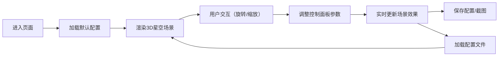

## 1. 产品概述
基于Three.js的交互式3D星空粒子系统，提供沉浸式宇宙探索体验，支持丰富的自定义参数和交互功能。
- 主要用途：可视化展示、艺术创作、教育演示、桌面壁纸场景
- 目标用户：设计爱好者、教育工作者、技术开发者
- 产品价值：通过可交互的3D星空场景，让用户直观感受宇宙的浩瀚与美丽，同时支持高度自定义配置

## 2. 核心功能

### 2.2 功能模块
1. **主场景页面**：3D星空渲染、粒子系统、相机控制
2. **控制面板**：参数调节滑块、功能开关、操作按钮
3. **配置管理**：保存/加载JSON配置、截图功能

### 2.3 页面详情
| 页面名称 | 模块名称 | 功能描述 |
|---------|---------|---------|
| 主场景页面 | 星空粒子系统 | 生成1000-10000个随机位置粒子，大小各异，颜色白中带蓝/红色调 |
| 主场景页面 | 粒子闪烁效果 | 透明度随时间正弦变化，营造真实星空闪烁感 |
| 主场景页面 | 云雾粒子层 | 半透明粒子缓慢飘浮，模拟宇宙尘埃云效果 |
| 主场景页面 | 星云效果 | 密集彩色粒子区域，支持紫色/青色两种星云色调 |
| 主场景页面 | 流星效果 | 每5秒随机生成流星，带有拖尾尾迹穿越场景 |
| 主场景页面 | 相机控制 | OrbitControls支持旋转缩放，可选自动环绕旋转 |
| 主场景页面 | 粒子交互 | 点击粒子在控制台输出索引和位置信息 |
| 控制面板 | 粒子数量调节 | 滑块控制1000-10000个粒子，适配不同性能设备 |
| 控制面板 | 粒子大小调节 | 整体缩放所有粒子显示尺寸 |
| 控制面板 | 自动旋转开关 | 切换相机自动环绕模式 |
| 控制面板 | 背景切换 | 纯黑背景/深蓝渐变背景两种模式 |
| 控制面板 | 配置保存 | 将当前所有设置导出为JSON配置文件 |
| 控制面板 | 配置加载 | 从JSON文件恢复星空配置 |
| 控制面板 | 截图功能 | 一键保存当前画面为PNG图片 |

## 3. 核心流程
用户进入页面后，自动加载默认星空配置，可通过鼠标拖拽旋转视角、滚轮缩放。通过右侧控制面板调整各项参数，实时预览效果。满意后可保存配置或截图分享。

## 4. 用户界面设计

### 4.1 设计风格
- **主色调**：深空黑 (#000000) / 星空蓝 (#1a1a3e)
- **强调色**：星云紫 (#9d4edd) / 星云青 (#00d4ff) / 星光白 (#ffffff)
- **按钮风格**：半透明玻璃拟态，圆角8px，微妙边框发光效果
- **字体**：使用 'Orbitron' 作为显示字体（科技感），'Noto Sans SC' 作为正文字体
- **布局风格**：沉浸式全屏3D场景，右侧悬浮半透明控制面板
- **图标风格**：简洁线性图标，与深空主题一致

### 4.2 页面设计概述
| 页面名称 | 模块名称 | UI元素 |
|---------|---------|--------|
| 主场景页面 | 3D渲染区域 | 全屏Three.js画布，粒子动画流畅60fps |
| 主场景页面 | 控制面板 | 右侧悬浮，半透明深色背景，毛玻璃效果，可折叠 |
| 控制面板 | 参数滑块组 | 粒子数量、粒子大小滑块，带数值显示 |
| 控制面板 | 开关按钮组 | 自动旋转、星云效果开关，带动画过渡 |
| 控制面板 | 功能按钮组 | 保存配置、加载配置、截图按钮 |
| 控制面板 | 背景选择器 | 单选按钮切换纯黑/渐变背景 |
| 控制面板 | 星云颜色选择 | 紫色/青色单选按钮 |

### 4.3 响应性
- 桌面端优先设计，控制面板固定在右侧320px宽度
- 平板端：控制面板宽度自适应，可折叠隐藏
- 移动端：控制面板改为底部抽屉式，支持触摸手势控制相机

### 4.4 3D场景指导
- **环境氛围**：深邃宇宙空间，营造无限延伸的沉浸感
- **光照设置**：环境光强度0.2，主要依靠粒子自发光
- **相机设置**：PerspectiveCamera，fov 75，初始位置(0, 0, 100)，看向原点
- **构图**：粒子均匀分布在半径200的球体内，星云集中在特定区域
- **交互**：OrbitControls开启阻尼效果，旋转流畅自然
- **后期处理**：轻微Bloom效果增强星光辉光，避免过度
- **性能预算**：10000粒子时保持60fps，流星和云雾使用独立粒子系统
