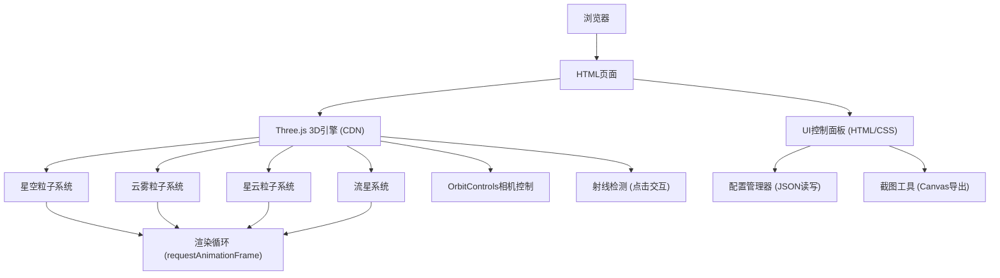

## 1. 架构设计



## 2. 技术描述

- **前端架构**：原生HTML5 + CSS3 + JavaScript (ES6+)
- **3D引擎**：Three.js r160 (通过CDN引入)
  - `three.module.js` - 核心引擎
  - `OrbitControls.js` - 相机轨道控制器
- **UI框架**：原生CSS实现玻璃拟态控制面板，无需额外UI库
- **初始化方式**：直接通过 `<script type="module">` 加载ES模块
- **后端**：无后端，纯前端静态页面
- **数据存储**：浏览器本地文件读写 (File API)

## 3. 目录结构

| 文件 | 用途 |
|------|------|
| `/index.html` | 主页面，包含Three.js画布和控制面板UI |
| `/app.js` | 核心逻辑：场景初始化、粒子系统、动画循环 |
| `/styles.css` | 样式文件：控制面板、玻璃拟态效果 |

## 4. 核心类与模块

### 4.1 StarField 类
- 负责星空粒子系统的创建和管理
- 方法：`init(count)`, `update(time)`, `setSize(scale)`, `dispose()`
- 属性：粒子位置缓冲区、颜色缓冲区、大小数组

### 4.2 NebulaSystem 类
- 负责星云效果
- 方法：`init(color)`, `setEnabled(enabled)`, `setColor(color)`

### 4.3 CloudSystem 类
- 负责云雾粒子层
- 方法：`init()`, `update(time)`
- 特性：粒子缓慢随机飘浮

### 4.4 MeteorSystem 类
- 负责流星效果
- 方法：`spawn()`, `update(deltaTime)`
- 特性：每5秒自动生成，带拖尾效果

### 4.5 ConfigManager 类
- 负责配置保存和加载
- 方法：`save()`, `load(file)`, `getConfig()`, `applyConfig(config)`

### 4.6 UIManager 类
- 负责控制面板交互
- 方法：`bindEvents()`, `updateUI()`

## 5. 性能优化策略

1. **BufferGeometry**：使用 `BufferGeometry` 而非 `Geometry`，所有粒子共享几何体
2. **PointsMaterial**：使用 `PointsMaterial` 批量渲染，单个Draw Call
3. **透明度优化**：关闭 `depthWrite`，启用 `transparent`
4. **粒子数量动态调整**：重建几何体时正确释放旧资源
5. **射线检测优化**：使用 `Raycaster`，仅在点击时检测
6. **动画帧节流**：流星更新使用 `deltaTime` 控制，避免性能波动

## 6. 关键技术点

### 6.1 粒子闪烁效果
```
opacity = baseOpacity + sin(time * speed + phase) * amplitude
```
每个粒子有独立的相位和速度，营造自然闪烁

### 6.2 流星拖尾
使用 `Line` 几何体，动态更新顶点位置，形成拖尾效果

### 6.3 配置序列化
保存所有可配置参数：
- particleCount, particleSize
- autoRotate, nebulaEnabled, nebulaColor
- backgroundType, cloudEnabled, meteorEnabled

### 6.4 截图实现
使用 `renderer.domElement.toDataURL('image/png')` 导出画布
