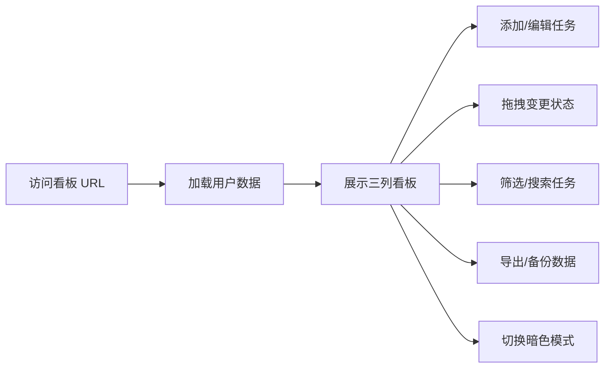

## 1. 产品概述

基于Flask的简易待办事项看板Web应用，提供直观的任务管理界面。支持多用户独立看板、拖拽任务状态变更、优先级筛选、实时搜索、CSV导入导出、统计仪表板等功能。

- 主要目的：提供轻量级、功能完善的个人/团队任务管理工具
- 目标用户：需要高效管理日常任务的个人用户或小团队
- 产品价值：无需数据库部署，即开即用，数据可导出备份

## 2. 核心功能

### 2.1 用户角色
| 角色 | 注册方式 | 核心权限 |
|------|----------|----------|
| 普通用户 | URL参数区分 | 管理自己的看板，添加/编辑/删除任务 |

### 2.2 功能模块
1. **看板主页**：三列看板布局（待办、进行中、已完成），任务卡片展示
2. **任务管理**：添加、编辑、删除任务，拖拽变更状态
3. **筛选搜索**：按优先级筛选，按标题实时搜索
4. **数据管理**：CSV导入导出，JSON备份恢复
5. **统计仪表板**：任务状态统计、优先级饼图、今日完成数量
6. **主题切换**：亮色/暗色模式切换

### 2.3 页面详情
| 页面名称 | 模块名称 | 功能描述 |
|----------|----------|----------|
| 看板主页 | 任务卡片 | 显示标题、描述、优先级、截止日期，过期红色标记 |
| 看板主页 | 拖拽功能 | 支持在三列之间拖拽移动任务 |
| 看板主页 | 工具栏 | 搜索框、优先级筛选、添加任务按钮 |
| 看板主页 | 统计面板 | 显示各状态任务数量、饼图、今日完成数 |
| 数据管理 | CSV导入 | 批量导入任务，检测重复标题可跳过或覆盖 |
| 数据管理 | CSV导出 | 导出所有任务为CSV文件 |
| 数据管理 | 备份恢复 | 下载JSON备份，从文件恢复数据 |

## 3. 核心流程

用户访问应用 → 通过URL参数指定用户（如/todo/user1）→ 查看个人看板 → 添加/编辑/拖拽任务 → 筛选/搜索任务 → 导出/备份数据 → 切换主题

## 4. 用户界面设计

### 4.1 设计风格
- **主色调**：蓝色系（#3b82f6），现代简约风格
- **辅助色**：绿色（进行中）、紫色（已完成）、红色（过期）
- **按钮风格**：圆角8px，hover时有轻微放大和阴影效果
- **字体**：系统无衬线字体，清晰易读
- **布局风格**：三列卡片式看板，网格布局，卡片带阴影
- **图标风格**：使用emoji图标，简洁直观

### 4.2 页面设计概述
| 页面名称 | 模块名称 | UI元素 |
|----------|----------|--------|
| 看板主页 | 顶部导航 | 标题、用户标识、主题切换按钮、导出/导入按钮 |
| 看板主页 | 三列看板 | 每列带标题和任务计数，支持拖放 |
| 看板主页 | 任务卡片 | 圆角卡片，优先级颜色标签，截止日期显示 |
| 看板主页 | 统计仪表板 | 卡片式统计，饼图可视化 |
| 模态框 | 任务表单 | 添加/编辑任务的弹出表单 |

### 4.3 响应性
- Desktop-first设计，三列并排布局
- 平板设备：两列布局，第三列换行
- 移动设备：单列垂直布局，支持滚动
- 触摸优化：增大点击区域，支持触摸拖拽

### 4.4 动画效果
- 页面加载时任务卡片淡入动画
- 拖拽时的视觉反馈（半透明、缩放）
- 状态变更时的平滑过渡
- 按钮hover时的微动画
