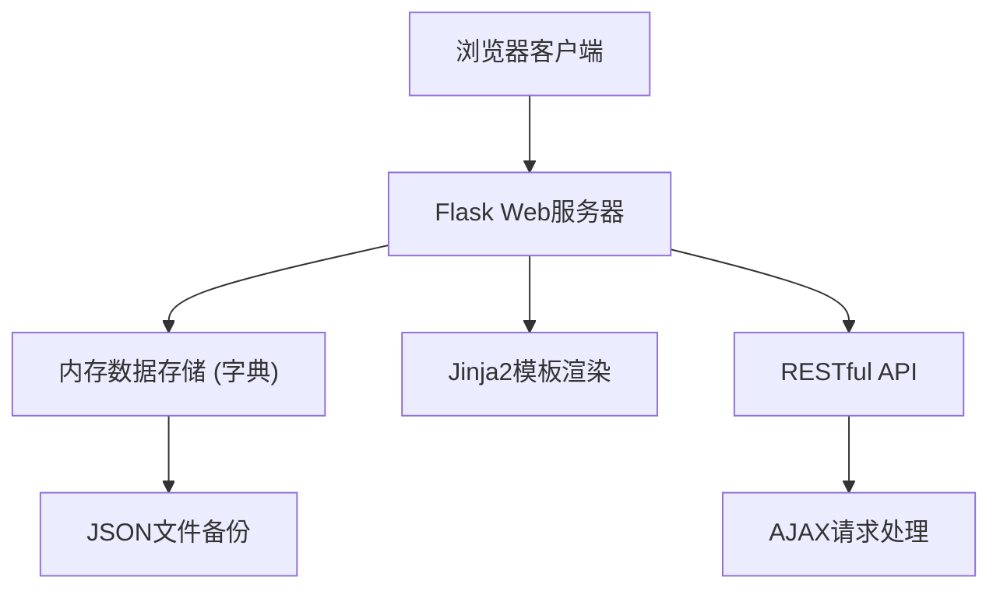
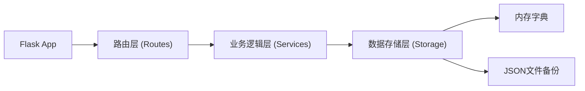
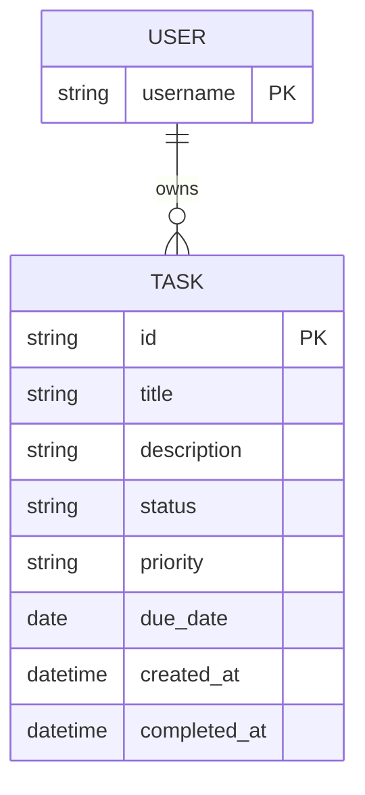

## 1. 架构设计



## 2. 技术描述

- **后端框架**：Flask@2.x + Python@3.9+
- **前端**：原生HTML5 + CSS3 + JavaScript (ES6+)
- **模板引擎**：Jinja2
- **数据存储**：内存字典 + JSON文件定期备份
- **图表库**：Chart.js (CDN引入)
- **样式**：Tailwind CSS v3 (CDN引入)

## 3. 路由定义

| 路由 | 方法 | 用途 |
|------|------|------|
| `/` | GET | 重定向到默认用户看板 |
| `/todo/<username>` | GET | 用户看板主页 |
| `/api/tasks/<username>` | GET | 获取用户所有任务 |
| `/api/tasks/<username>` | POST | 创建新任务 |
| `/api/tasks/<username>/<task_id>` | PUT | 更新任务 |
| `/api/tasks/<username>/<task_id>` | DELETE | 删除任务 |
| `/api/tasks/<username>/<task_id>/status` | PATCH | 更新任务状态（拖拽） |
| `/api/export/csv/<username>` | GET | 导出任务为CSV |
| `/api/import/csv/<username>` | POST | 从CSV导入任务 |
| `/api/backup/json/<username>` | GET | 下载JSON备份 |
| `/api/restore/json/<username>` | POST | 从JSON恢复数据 |
| `/api/stats/<username>` | GET | 获取统计数据 |

## 4. API定义

### 4.1 任务数据结构
```typescript
interface Task {
  id: string;
  title: string;
  description: string;
  status: 'todo' | 'in_progress' | 'completed';
  priority: 'high' | 'medium' | 'low';
  due_date: string | null;  // ISO date format
  created_at: string;
  completed_at: string | null;
}
```

### 4.2 响应格式
```typescript
interface ApiResponse<T> {
  success: boolean;
  data?: T;
  error?: string;
}
```

### 4.3 统计数据结构
```typescript
interface Stats {
  total: number;
  byStatus: {
    todo: number;
    in_progress: number;
    completed: number;
  };
  byPriority: {
    high: number;
    medium: number;
    low: number;
  };
  completedToday: number;
  overdue: number;
}
```

## 5. 服务器架构



### 5.1 核心模块
- `app.py` - Flask应用入口，路由定义
- `storage.py` - 数据存储管理，内存字典操作，JSON备份
- `templates/index.html` - 主页面模板
- `static/css/style.css` - 自定义样式
- `static/js/app.js` - 前端交互逻辑

## 6. 数据模型

### 6.1 数据结构



### 6.2 内存存储结构
```python
# 顶层数据结构
data = {
    "users": {
        "user1": {
            "tasks": {
                "task-uuid-1": {
                    "id": "task-uuid-1",
                    "title": "任务标题",
                    "description": "任务描述",
                    "status": "todo",
                    "priority": "high",
                    "due_date": "2024-01-15",
                    "created_at": "2024-01-01T00:00:00",
                    "completed_at": None
                }
            }
        }
    }
}
```

### 6.3 备份机制
- 定时备份：每5分钟自动将内存数据写入`data/backup.json`
- 手动备份：通过API触发下载
- 启动恢复：应用启动时从`data/backup.json`加载数据
