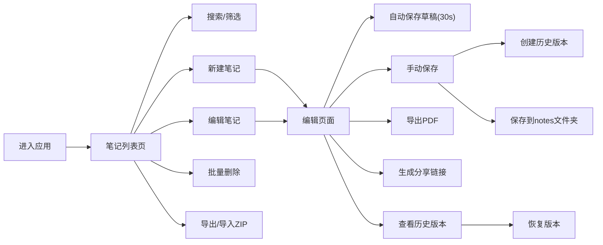

## 1. 产品概述

基于Flask的简易记事本Web应用，采用文件系统存储而非数据库，为个人用户提供轻量级的笔记管理解决方案。支持笔记的创建、编辑、删除、搜索、标签分类、版本控制、PDF导出、ZIP备份恢复、分享链接等功能，满足用户日常知识管理和信息记录的需求。

- 主要用途：个人知识管理、日常笔记记录、信息整理
- 目标用户：需要简洁高效笔记工具的个人用户
- 产品价值：无需复杂配置，数据以纯文本形式存储易于迁移，功能完善且轻量

## 2. 核心功能

### 2.1 用户角色

| 角色 | 注册方式 | 核心权限 |
|------|----------|----------|
| 普通用户 | 无需注册，本地使用 | 完整的笔记管理权限，包括创建、编辑、删除、导出、分享等 |
| 分享访问者 | 无需注册，通过链接访问 | 仅可查看分享的笔记内容，无法编辑或删除 |

### 2.2 功能模块

1. **笔记列表页**：笔记展示、搜索过滤、标签筛选、批量操作、ZIP导入导出
2. **笔记编辑页**：标题/内容编辑、标签管理、自动保存草稿、PDF导出、分享链接
3. **笔记查看页**：内容渲染、内部链接跳转、历史版本查看与恢复
4. **历史版本页**：版本列表展示、版本内容对比、版本恢复

### 2.3 页面详情

| 页面名称 | 模块名称 | 功能描述 |
|----------|----------|------------|
| 笔记列表页 | 搜索栏 | 实时按标题过滤笔记列表 |
| 笔记列表页 | 标签筛选区 | 显示所有标签，点击筛选对应笔记 |
| 笔记列表页 | 笔记列表 | 显示标题、创建时间、修改时间、标签，支持多选 |
| 笔记列表页 | 批量操作栏 | 批量删除选中笔记 |
| 笔记列表页 | 工具栏 | 新建笔记、导出全部ZIP、导入ZIP恢复 |
| 笔记编辑页 | 编辑区 | 标题输入、内容文本域、标签输入 |
| 笔记编辑页 | 操作栏 | 保存、删除、导出PDF、分享、查看历史 |
| 笔记编辑页 | 自动保存 | 30秒自动保存草稿到临时文件 |
| 笔记查看页 | 内容展示 | 渲染纯文本，[[笔记标题]]转换为内部链接 |
| 历史版本页 | 版本列表 | 显示每次保存的时间和版本大小 |
| 历史版本页 | 版本操作 | 查看版本内容、恢复到指定版本 |

## 3. 核心流程

用户打开应用 → 进入笔记列表页 → 查看/搜索/筛选笔记 → 点击新建或编辑 → 在编辑页输入标题和内容 → 添加标签 → 自动保存草稿 → 手动保存时创建历史版本 → 可导出PDF或生成分享链接 → 可从列表页批量删除或导出ZIP备份。

## 4. 用户界面设计

### 4.1 设计风格

- **主色调**：深蓝 #1e3a5f 作为主色，配合浅灰背景 #f5f7fa，强调色为琥珀橙 #f59e0b
- **按钮风格**：圆角8px，悬停时有轻微阴影和颜色加深效果
- **字体**：使用"Noto Sans SC"和"JetBrains Mono"组合，正文14px，标题18-24px
- **布局风格**：顶部导航栏 + 侧边标签栏 + 主内容区的三栏布局
- **图标**：使用简洁的线性图标，配合emoji增强视觉识别

### 4.2 页面设计概述

| 页面名称 | 模块名称 | UI元素 |
|----------|----------|--------|
| 笔记列表页 | 顶部导航 | Logo、搜索框、新建按钮、导出/导入按钮 |
| 笔记列表页 | 侧边栏 | 标签列表、标签统计数量 |
| 笔记列表页 | 笔记卡片 | 标题、时间、标签、复选框、操作按钮 |
| 笔记编辑页 | 编辑区 | 标题输入框、标签输入框、内容文本域 |
| 笔记编辑页 | 工具栏 | 保存、删除、PDF导出、分享、历史按钮 |
| 笔记查看页 | 内容区 | 标题、元信息、标签、内容文本 |

### 4.3 响应性

- 桌面端优先设计，采用三栏布局
- 平板端折叠标签栏为抽屉式
- 移动端单列布局，导航栏简化
- 所有交互元素支持触摸操作

### 4.4 视觉细节

- 卡片采用细微阴影和圆角，悬停时阴影加深
- 列表项有条纹背景区分
- 自动保存有状态指示器
- 删除操作有模态框确认
- 页面加载有淡入动画
