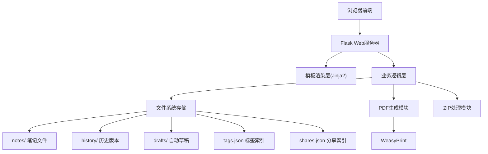
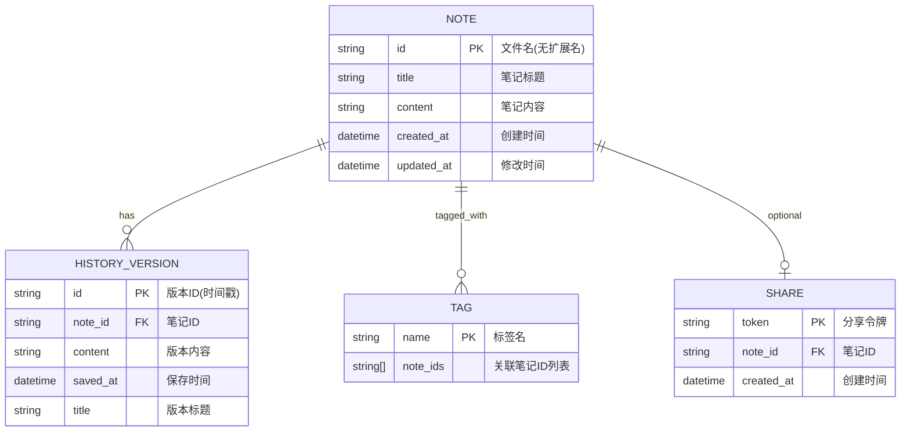

## 1. 架构设计



## 2. 技术描述

- **后端框架**：Flask 3.0 + Python 3.10+
- **模板引擎**：Jinja2
- **前端**：原生HTML + CSS3 + 原生JavaScript（无jQuery）
- **PDF生成**：WeasyPrint（纯Python实现，无需额外安装系统依赖）
- **文件存储**：本地文件系统，无数据库
- **数据格式**：笔记为纯文本(.txt)，索引为JSON
- **编码**：统一使用UTF-8

## 3. 路由定义

| Route | Method | Purpose |
|-------|--------|---------|
| `/` | GET | 笔记列表首页，展示所有笔记 |
| `/note/new` | GET | 新建笔记页面 |
| `/note/new` | POST | 保存新笔记 |
| `/note/<note_id>` | GET | 查看单篇笔记 |
| `/note/<note_id>/edit` | GET | 编辑笔记页面 |
| `/note/<note_id>/edit` | POST | 保存编辑的笔记 |
| `/note/<note_id>/delete` | POST | 删除单篇笔记 |
| `/note/<note_id>/pdf` | GET | 导出笔记为PDF |
| `/note/<note_id>/share` | POST | 生成分享链接 |
| `/share/<token>` | GET | 访问分享的笔记（只读） |
| `/note/<note_id>/history` | GET | 查看笔记历史版本列表 |
| `/note/<note_id>/history/<version>` | GET | 查看指定历史版本内容 |
| `/note/<note_id>/history/<version>/restore` | POST | 恢复到指定历史版本 |
| `/note/<note_id>/draft` | POST | 自动保存草稿 |
| `/notes/batch_delete` | POST | 批量删除笔记 |
| `/export/zip` | GET | 导出所有笔记为ZIP |
| `/import/zip` | POST | 从ZIP导入恢复笔记 |
| `/tag/<tag_name>` | GET | 按标签筛选笔记 |
| `/search` | GET | 搜索笔记API（返回JSON） |

## 4. API 定义

### 4.1 搜索API

**请求**：`GET /search?q=关键词`

**响应**：
```json
{
  "success": true,
  "notes": [
    {
      "id": "note_id",
      "title": "笔记标题",
      "created_at": "2024-01-01 12:00:00",
      "updated_at": "2024-01-01 13:00:00",
      "tags": ["标签1", "标签2"]
    }
  ]
}
```

### 4.2 自动保存草稿API

**请求**：`POST /note/<note_id>/draft`
```json
{
  "title": "笔记标题",
  "content": "笔记内容",
  "tags": ["标签1", "标签2"]
}
```

**响应**：
```json
{
  "success": true,
  "saved_at": "2024-01-01 12:00:00"
}
```

### 4.3 生成分享链接API

**请求**：`POST /note/<note_id>/share`

**响应**：
```json
{
  "success": true,
  "token": "abc123xyz",
  "share_url": "/share/abc123xyz"
}
```

## 5. 数据模型

### 5.1 数据模型定义



### 5.2 文件结构

```
项目根目录/
├── app.py                    # Flask主应用
├── requirements.txt          # 依赖列表
├── notes/                    # 笔记文件存储
│   ├── note1.txt
│   └── note2.txt
├── history/                  # 历史版本
│   ├── note1/
│   │   ├── 20240101_120000.txt
│   │   └── 20240101_130000.txt
│   └── note2/
├── drafts/                   # 自动保存草稿
│   ├── note1_draft.txt
│   └── new_draft.txt
├── static/                   # 静态资源
│   ├── css/
│   │   └── style.css
│   └── js/
│       └── app.js
├── templates/                # Jinja2模板
│   ├── base.html
│   ├── index.html
│   ├── edit.html
│   ├── view.html
│   └── history.html
├── tags.json                 # 标签索引
└── shares.json               # 分享链接索引
```

### 5.3 笔记文件格式

文件名：`{note_id}.txt`

文件内容格式：
```
===META===
Title: 笔记标题
Created: 2024-01-01 12:00:00
Updated: 2024-01-01 13:00:00
Tags: 标签1,标签2
===CONTENT===
笔记正文内容...
可以包含[[另一篇笔记标题]]格式的内部链接
```

### 5.4 索引JSON格式

**tags.json**:
```json
{
  "工作": ["note1", "note3"],
  "学习": ["note2"],
  "个人": ["note1", "note2"]
}
```

**shares.json**:
```json
{
  "abc123xyz": {
    "note_id": "note1",
    "created_at": "2024-01-01 12:00:00"
  }
}
```

## 6. 核心模块说明

### 6.1 笔记管理模块
- 笔记ID生成：使用标题的slug + 时间戳确保唯一性
- 内部链接解析：正则匹配`[[标题]]`转换为超链接
- 元信息读写：从文件头部解析和写入元数据

### 6.2 版本控制模块
- 每次保存前将当前内容复制到history目录
- 版本文件命名：`{YYYYMMDD}_{HHMMSS}.txt`
- 版本恢复：将历史版本内容覆盖当前笔记并创建新版本

### 6.3 自动保存模块
- 前端JavaScript定时器，30秒无操作后触发保存
- 草稿文件单独存储，不影响正式笔记
- 编辑页面加载时检查并提示是否恢复草稿

### 6.4 标签管理模块
- 保存笔记时更新tags.json索引
- 支持添加/删除标签
- 按标签筛选时从索引快速查找

### 6.5 PDF导出模块
- 使用WeasyPrint渲染HTML为PDF
- 导出内容包含标题、标签、时间和正文
- 支持自定义页眉页脚
