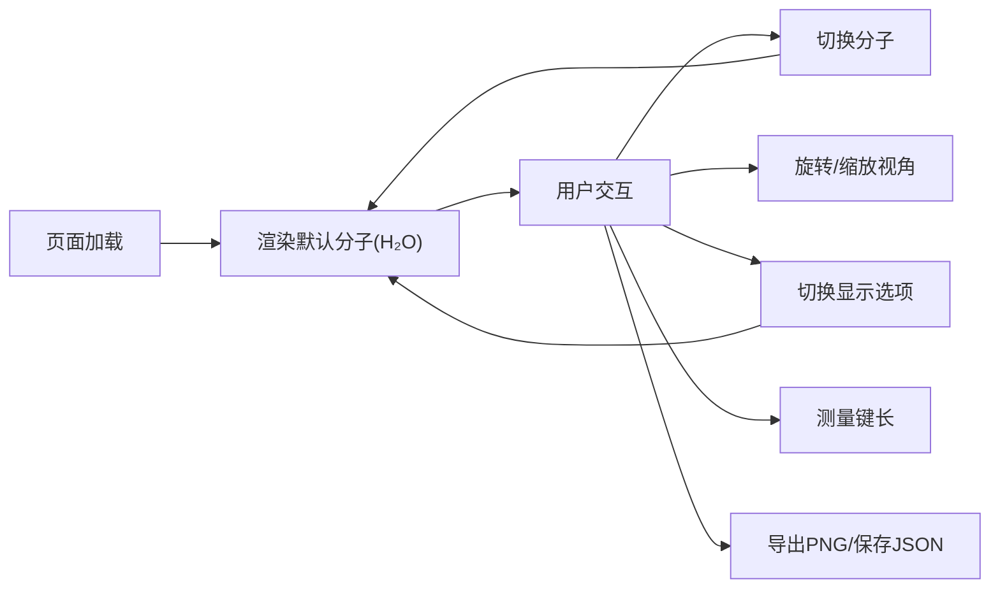

## 1. 产品概述

基于Three.js的3D分子结构可视化网页应用，为化学教育和研究提供交互式分子模型展示工具。用户可以直观地观察分子的三维结构，进行旋转缩放、测量键长、切换显示模式等操作。

- 主要用途：化学教学辅助、分子结构可视化、科研演示
- 目标用户：化学教师、学生、科研人员
- 产品价值：将抽象的分子结构转化为直观的3D可视化模型，增强学习和研究效率

## 2. 核心功能

### 2.1 功能模块

1. **3D分子展示区**：场景中心显示分子模型，包含原子球体、化学键圆柱体
2. **分子选择器**：下拉菜单切换预置分子（H₂O、CO₂、CH₄）及自定义加载
3. **显示控制面板**：原子标签、范德华半径、电子云、偶极矩、自动旋转等开关
4. **测量工具**：键长测量、分子尺寸显示
5. **导出与保存**：PNG图片导出、JSON配置保存与加载
6. **背景设置**：白色、黑色、渐变三种背景切换

### 2.2 页面详情

| 页面名称 | 模块名称 | 功能描述 |
|---------|---------|----------|
| 主页面 | 3D场景区 | Three.js渲染分子模型，支持OrbitControls旋转缩放 |
| 主页面 | 顶部工具栏 | 分子选择下拉框、背景切换按钮、导出按钮 |
| 主页面 | 右侧控制面板 | 显示选项开关、测量功能、保存/加载按钮 |
| 主页面 | 信息面板 | 分子尺寸显示、键长测量结果 |

## 3. 核心流程

用户打开页面 → 显示默认分子模型 → 通过下拉菜单切换分子 → 使用鼠标旋转缩放查看 → 开启/关闭各种显示效果 → 点击原子进行键长测量 → 导出图片或保存配置

## 4. 用户界面设计

### 4.1 设计风格
- 科技感、专业简洁的科学可视化风格
- 深色主题为主，突出3D分子模型
- 原子颜色：氢-白色、氧-红色、碳-灰色
- 化学键：银色金属质感
- 控制面板采用半透明毛玻璃效果

### 4.2 页面设计概述

| 页面名称 | 模块名称 | UI元素 |
|---------|---------|--------|
| 主页面 | 3D场景区 | 全屏Three.js画布，分子居中展示 |
| 主页面 | 顶部工具栏 | 左侧Logo、中间分子选择器、右侧功能按钮组 |
| 主页面 | 右侧控制面板 | 开关组、滑块、按钮，可折叠 |
| 主页面 | 信息面板 | 左下角显示分子尺寸、测量结果 |

### 4.3 响应式设计
- 桌面端：右侧固定控制面板
- 平板端：控制面板改为底部抽屉式
- 移动端：简化控制，保留核心功能

### 4.4 3D场景设计
- 光照：环境光 + 两盏方向光，营造高光质感
- 相机：PerspectiveCamera，初始距离适配分子大小
- 材质：MeshStandardMaterial实现高光金属质感
- 动画：自动旋转时场景缓慢自转，悬停效果高亮原子
- 后处理：轻微抗锯齿，提升画面质量
