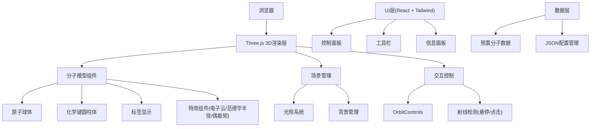

## 1. 架构设计



## 2. 技术描述

- **前端框架**: React 18 + TypeScript
- **构建工具**: Vite 5
- **样式方案**: TailwindCSS 3
- **3D渲染**: Three.js + @types/three
- **UI组件**: lucide-react 图标库
- **无后端，纯前端应用**

## 3. 核心模块

| 模块 | 文件名 | 功能描述 |
|------|--------|----------|
| 主应用 | App.tsx | 应用入口，状态管理 |
| 3D场景 | components/MoleculeScene.tsx | Three.js场景初始化与渲染 |
| 分子模型 | components/Molecule.tsx | 分子模型构建逻辑 |
| 控制面板 | components/ControlPanel.tsx | 显示选项开关 |
| 工具栏 | components/Toolbar.tsx | 分子选择、导出、背景切换 |
| 信息面板 | components/InfoPanel.tsx | 分子尺寸、测量结果 |
| 分子数据 | data/molecules.ts | 预置分子结构数据 |
| 工具函数 | utils/helpers.ts | 坐标计算、测量、导出等 |
| 类型定义 | types/index.ts | TypeScript类型定义 |

## 4. 数据模型

### 4.1 分子结构数据定义

```typescript
interface Atom {
  id: string;
  element: 'H' | 'O' | 'C' | 'N' | 'S' | 'P';
  position: [number, number, number];
}

interface Bond {
  from: string;
  to: string;
  order: 1 | 2 | 3;
}

interface MoleculeData {
  name: string;
  formula: string;
  atoms: Atom[];
  bonds: Bond[];
  dipoleMoment?: [number, number, number];
}
```

### 4.2 预置分子数据

- H₂O (水分子): 1个氧原子 + 2个氢原子，键角约104.5°
- CO₂ (二氧化碳): 1个碳原子 + 2个氧原子，直线型
- CH₄ (甲烷): 1个碳原子 + 4个氢原子，正四面体结构

## 5. 关键实现要点

1. **Three.js场景管理**：使用useRef管理场景、相机、渲染器实例
2. **分子构建**：遍历原子和化学键数据，创建SphereGeometry和CylinderGeometry
3. **材质系统**：MeshStandardMaterial实现高光效果，金属度和粗糙度参数调整
4. **坐标转换**：化学键圆柱体需要计算两个原子间的旋转矩阵
5. **交互检测**：使用THREE.Raycaster实现鼠标悬停和点击检测
6. **标签显示**：使用CSS2DRenderer实现原子标签跟随
7. **导出功能**：利用renderer.domElement.toDataURL()导出PNG
8. **JSON序列化**：分子数据直接JSON.stringify保存和加载
