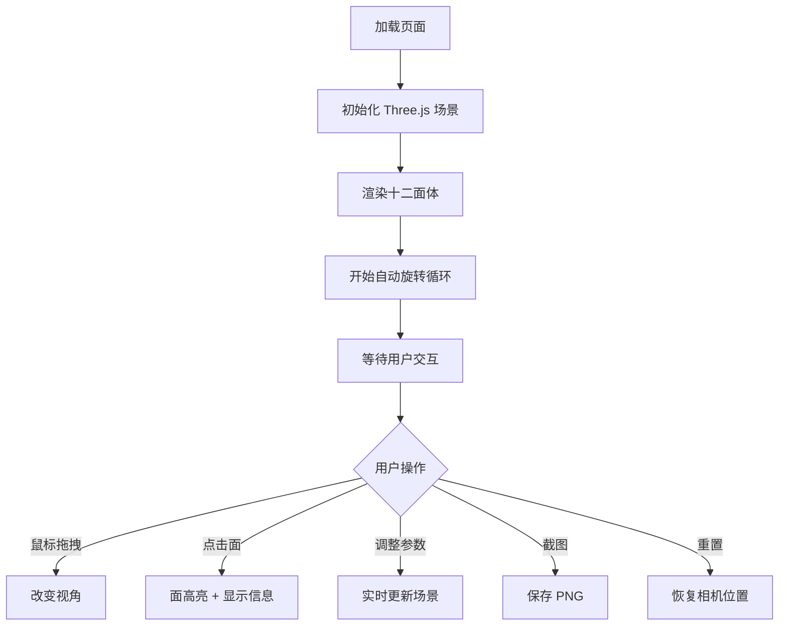

## 1. 产品概述
基于 Three.js 的 3D 旋转十二面体交互演示网页，展示十二面体几何结构与多种交互控制，用于教育演示和可视化设计。
- 核心目标：通过交互式 3D 场景直观展示十二面体的 12 个五边形面，支持丰富的交互和视觉定制
- 价值：提供可视化的几何教学体验与炫酷的 3D 交互效果

## 2. 核心功能

### 2.1 用户角色
| 角色 | 注册方式 | 核心权限 |
|------|---------|---------|
| 访客用户 | 无需注册 | 浏览 3D 场景、使用所有交互控件 |

### 2.2 功能模块
1. **主场景页面**：十二面体渲染、控制面板、状态信息

### 2.3 页面详情
| 页面名称 | 模块名称 | 功能描述 |
|---------|---------|---------|
| 主场景页面 | 3D 场景 | 十二面体渲染，12 个半透明彩色面，绕 Y 轴自动旋转 |
| 主场景页面 | 面数字标签 | 每个面显示 1-12 数字标签，始终面向相机 |
| 主场景页面 | 面交互 | 点击面高亮发光，控制台输出编号，屏幕角落显示信息 |
| 主场景页面 | 控制面板 | 旋转速度滑块、线框开关、材质模式切换、自动旋转开关 |
| 主场景页面 | 辅助功能 | 截图保存 PNG、重置相机、面数统计、背景切换、外发光强度 |

## 3. 核心流程
用户进入页面后自动加载 3D 场景，十二面体自动旋转。用户可通过鼠标拖拽改变视角、点击面查看信息、通过控制面板调整各项参数、截图保存、重置视角。

## 4. 用户界面设计
### 4.1 设计风格
- 主色调：黑色背景，鲜艳的彩色面
- 按钮样式：圆角半透明玻璃拟态
- 字体：系统默认无衬线字体，信息显示使用 monospace
- 布局：全屏 3D 场景 + 左上角控制面板 + 右上角统计信息 + 右下角点击信息
- 风格：深色、科技感、霓虹高亮

### 4.2 页面设计概要
| 页面名称 | 模块名称 | UI 元素 |
|---------|---------|---------|
| 主场景页面 | 3D 场景 | 全屏 Canvas，十二面体居中 |
| 主场景页面 | 控制面板 | 左上角固定面板，滑块、开关、按钮 |
| 主场景页面 | 状态信息 | 右上角显示顶点/面数统计 |
| 主场景页面 | 点击反馈 | 右下角显示最近点击的面编号 |

### 4.3 响应式
桌面优先，支持窗口大小自适应，面板固定在屏幕角落。

### 4.4 3D 场景指引
- 环境：纯色背景（黑/深蓝/灰）
- 光照：环境光 + 方向光，保证彩色面清晰可见
- 相机：透视相机，默认距离适中
- 交互：OrbitControls 鼠标拖拽，自动旋转 Y 轴
- 后处理：外发光光晕效果
- 性能：单一几何体，12 个面材质，标签使用 CSS2D
