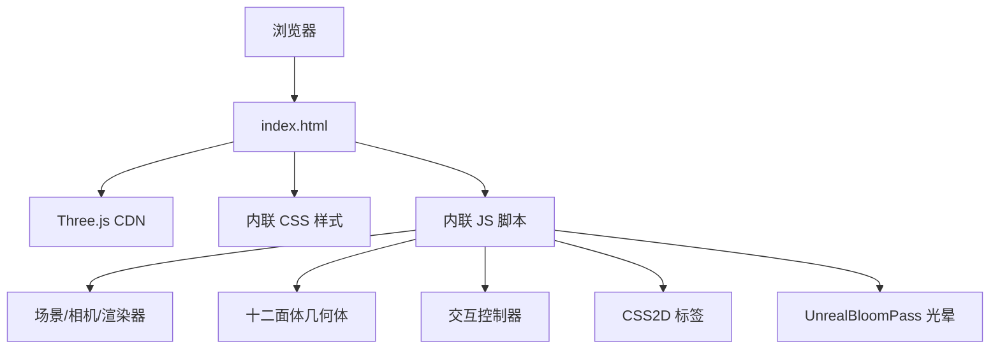

## 1. 架构设计

## 2. 技术说明
- 前端：原生 HTML + CSS + JavaScript（单文件）
- 3D 库：Three.js r128+（通过 CDN importmap 加载）
- 3D 扩展：OrbitControls、CSS2DRenderer、EffectComposer、UnrealBloomPass、RenderPass
- 构建：无需构建，直接浏览器运行
- 后端：无

## 3. 路由定义
| 路由 | 用途 |
|------|------|
| /index.html | 主场景页面 |

## 4. API 定义
无后端，全部使用浏览器原生 API（Canvas、File API 用于截图保存）

## 5. 服务器架构
无后端，纯静态文件，可通过任意 HTTP 服务器托管

## 6. 数据模型
无持久化数据，所有状态在内存中维护
