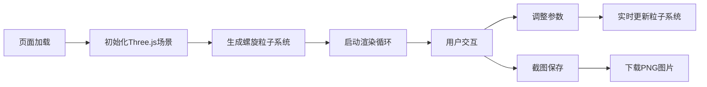

## 1. 产品概述

基于Three.js的3D螺旋粒子效果可视化网页，提供沉浸式的粒子艺术体验。用户可以通过丰富的控制面板实时调整粒子参数，创造独特的视觉效果。

- 主要用途：视觉艺术展示、性能测试、创意工具
- 目标用户：设计师、开发者、艺术爱好者
- 产品价值：提供高性能、可定制的3D粒子效果展示平台

## 2. 核心功能

### 2.1 功能模块

1. **3D螺旋粒子场景**：数千个粒子沿螺旋线运动，呈现旋转流动效果
2. **实时控制面板**：多维度参数调节，所见即所得
3. **视觉特效系统**：拖尾效果、光晕效果、背景切换
4. **辅助功能**：帧率监控、截图保存、视角控制

### 2.2 页面详情

| 页面名称 | 模块名称 | 功能描述 |
|-----------|-------------|---------------------|
| 主页面 | 3D渲染区域 | 全屏Three.js画布，展示螺旋粒子效果 |
| 主页面 | 控制面板 | 折叠式侧边栏，包含所有参数调节滑块和开关 |
| 主页面 | 状态显示 | 左上角显示当前帧率和粒子数量 |

## 3. 核心流程

## 4. 用户界面设计

### 4.1 设计风格
- **设计方向**：科技感、未来主义、沉浸式
- **主色调**：深空黑与霓虹蓝紫渐变
- **强调色**：粒子颜色从红色(#ff3366)渐变到蓝色(#3366ff)
- **面板风格**：半透明玻璃拟态，毛玻璃背景
- **字体**：现代无衬线字体，科技感数字显示

### 4.2 页面设计概述

| 页面名称 | 模块名称 | UI元素 |
|-----------|-------------|-------------|
| 主页面 | 3D渲染区域 | 全屏画布、OrbitControls鼠标交互 |
| 主页面 | 控制面板 | 折叠按钮、滑块控件、开关按钮、下拉选择 |
| 主页面 | 状态显示 | FPS计数器、粒子数量指示器 |

### 4.3 响应性
- 桌面端：侧边栏控制面板，可折叠收起
- 移动端：底部滑出式面板，优化触摸交互
- 自适应分辨率，保持渲染性能

### 4.4 3D场景设计
- **环境**：纯黑或渐变蓝色背景，可选星空粒子点缀
- **光照**：无需额外光源，使用自发光粒子材质
- **相机**：PerspectiveCamera，初始距离15，支持OrbitControls
- **后期处理**：UnrealBloomPass光晕效果，可开关
- **粒子系统**：BufferGeometry + PointsMaterial，高性能渲染
- **拖尾效果**：历史位置数组实现粒子轨迹
