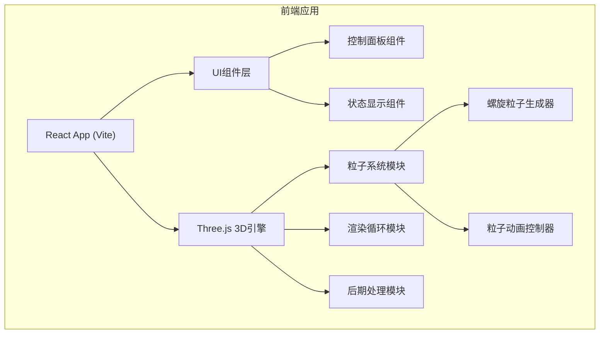

## 1. 架构设计



## 2. 技术描述

- **前端框架**: React@18 + TypeScript + Vite
- **3D引擎**: three@0.160.0
- **后期处理**: @react-three/postprocessing + @react-three/drei
- **UI框架**: TailwindCSS@3
- **状态管理**: React useState/useRef (轻量级场景)

## 3. 项目结构

```
src/
├── components/
│   ├── ControlPanel.tsx      # 控制面板组件
│   ├── StatsDisplay.tsx      # FPS/粒子数显示
│   └── SpiralParticles.tsx   # 螺旋粒子3D组件
├── hooks/
│   └── useParticleSystem.ts  # 粒子系统自定义Hook
├── utils/
│   └── spiralGenerator.ts    # 螺旋数学计算工具
├── App.tsx                   # 主应用组件
├── main.tsx                  # 入口文件
└── index.css                 # 全局样式
```

## 4. 核心技术实现

### 4.1 粒子系统
- 使用 `THREE.BufferGeometry` 存储粒子位置、颜色、大小
- `THREE.PointsMaterial` 实现圆形/方形粒子切换
- 自定义Shader实现粒子颜色渐变和大小衰减

### 4.2 螺旋运动算法
```typescript
// 螺旋参数方程
x = radius * cos(angle + phase) * (1 + t * expansion)
y = (t - 0.5) * height
z = radius * sin(angle + phase) * (1 + t * expansion)
```

### 4.3 拖尾效果实现
- 维护粒子历史位置环形缓冲区
- 使用 `THREE.Line` 渲染轨迹线
- 透明度渐变模拟拖尾衰减

### 4.4 后期处理管线
- `EffectComposer` 组合后期效果
- `UnrealBloomPass` 实现光晕效果
- 可动态开关节省性能

### 4.5 性能优化策略
- BufferGeometry 批量渲染
- 对象池复用减少GC
- 自适应分辨率缩放
- WebGLRenderer 性能参数优化

## 5. 关键接口定义

```typescript
// 粒子配置类型
interface ParticleConfig {
  count: number;           // 粒子数量 1000-10000
  radius: number;          // 螺旋半径 1-10
  rotationSpeed: number;   // 旋转速度 0.1-5
  particleSize: number;    // 粒子大小 0.01-0.5
  trailEnabled: boolean;   // 拖尾开关
  bloomEnabled: boolean;   // 光晕开关
  particleShape: 'circle' | 'square'; // 粒子形状
  background: 'space' | 'gradient';   // 背景类型
}

// 螺旋粒子生成器
function generateSpiralParticles(count: number, radius: number): {
  positions: Float32Array;
  colors: Float32Array;
  phases: Float32Array;
}
```
