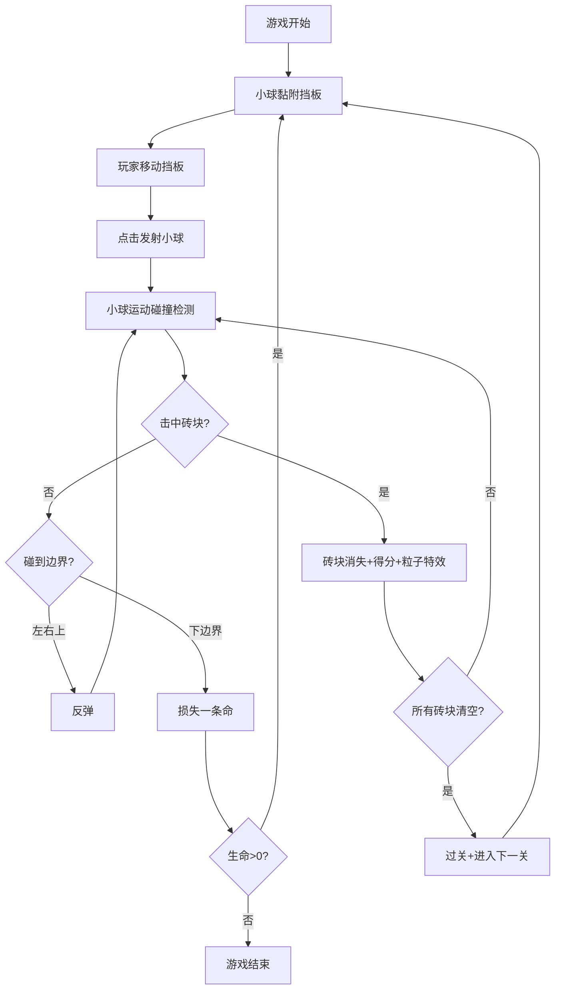

## 1. 产品概述

弹球打砖块是一款经典的休闲小游戏，玩家通过控制挡板反弹小球击碎上方砖块获得分数。游戏包含多关卡设计、特殊砖块效果、粒子特效和音效系统，为玩家提供丰富有趣的游戏体验。

- 主要目的：提供休闲娱乐，考验玩家反应能力
- 目标用户：所有年龄段的休闲游戏玩家
- 市场价值：经典玩法结合现代特效，具有广泛的受众基础

## 2. 核心功能

### 2.1 用户角色

| 角色 | 注册方式 | 核心权限 |
|------|----------|----------|
| 普通玩家 | 无需注册 | 进行游戏、查看分数、设置音效 |

### 2.2 功能模块

1. **游戏主界面**：游戏画布、分数显示、关卡显示、生命显示
2. **游戏控制**：挡板移动、小球发射、暂停/恢复、重置游戏
3. **砖块系统**：普通砖块、特殊砖块（双倍分、加命、加速、变长）
4. **关卡系统**：多关卡递进、砖块密度增加、背景色变化
5. **特效系统**：粒子爆炸效果、音效播放
6. **数据存储**：最高分本地存储（localStorage）

### 2.3 页面详情

| 页面名称 | 模块名称 | 功能描述 |
|---------|---------|----------|
| 游戏主页面 | 游戏画布 | Canvas绘制游戏场景、小球、挡板、砖块、粒子 |
| 游戏主页面 | 信息面板 | 显示当前分数、关卡数、剩余生命、最高分 |
| 游戏主页面 | 控制面板 | 音效开关、暂停按钮、重置按钮 |
| 游戏主页面 | 游戏状态 | 游戏开始、暂停、结束、过关提示 |

## 3. 核心流程

用户进入游戏页面，小球黏附在挡板上，通过鼠标或方向键移动挡板位置，点击鼠标发射小球。小球反弹击打砖块，砖块消失并获得分数。收集特殊砖块获得增益效果。清空所有砖块进入下一关，砖块更密集。小球掉落损失生命，3条命耗尽游戏结束。

## 4. 用户界面设计

### 4.1 设计风格

- **主色调**：深色背景配合鲜艳的彩色砖块，营造霓虹复古游戏风格
- **按钮风格**：圆角矩形按钮，悬停时有颜色变化和缩放效果
- **字体**：使用Press Start 2P等像素风格字体，增强复古游戏感
- **布局风格**：游戏画布居中，信息面板在顶部，控制面板在底部
- **视觉效果**：砖块有渐变和阴影，小球有发光效果，粒子爆炸动画

### 4.2 页面设计概述

| 页面名称 | 模块名称 | UI元素 |
|---------|---------|--------|
| 游戏主页面 | 信息面板 | 分数、关卡、生命、最高分显示，使用像素字体 |
| 游戏主页面 | 游戏画布 | 深色渐变背景，彩色砖块，发光小球，渐变挡板 |
| 游戏主页面 | 控制面板 | 音效开关（toggle）、暂停按钮、重置按钮 |
| 游戏主页面 | 状态提示 | 居中显示开始、暂停、过关、结束文字 |

### 4.3 响应式

- **桌面端优先**：Canvas尺寸固定为800x600
- **移动端适配**：Canvas自适应屏幕宽度，触摸控制挡板
- **触摸优化**：支持触摸滑动控制挡板，点击发射小球

### 4.4 动画效果

- 砖块爆炸：彩色粒子向四周飞散并逐渐消失
- 小球移动：平滑运动轨迹，碰撞时有轻微缩放
- 挡板移动：跟随鼠标/键盘平滑移动
- 按钮交互：悬停缩放、点击按压效果
- 状态切换：淡入淡出动画
