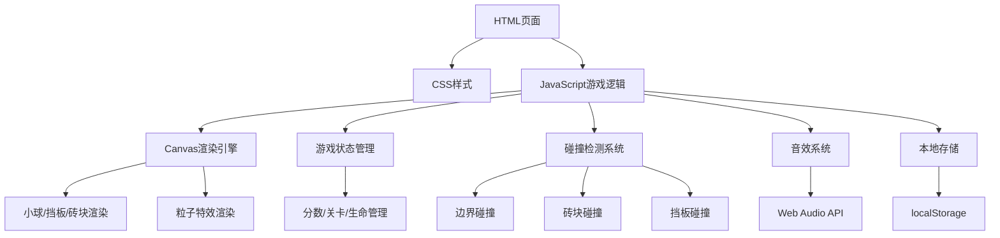

## 1. 架构设计



## 2. 技术描述

- **前端技术**：原生HTML5 + CSS3 + JavaScript (ES6+)
- **渲染技术**：HTML5 Canvas 2D API
- **音效技术**：Web Audio API（生成合成音效）
- **数据存储**：浏览器localStorage
- **构建工具**：无，纯静态文件

## 3. 文件结构

| 文件路径 | 用途 |
|---------|------|
| /index.html | 游戏主页面，包含Canvas和UI元素 |
| /style.css | 游戏样式文件 |
| /game.js | 游戏核心逻辑 |

## 4. 核心类/对象定义

### 4.1 游戏状态对象
```javascript
const gameState = {
  score: number,           // 当前分数
  level: number,           // 当前关卡
  lives: number,           // 剩余生命
  highScore: number,       // 最高分
  isPaused: boolean,       // 是否暂停
  isGameOver: boolean,     // 是否游戏结束
  isLevelComplete: boolean,// 是否过关
  ballLaunched: boolean,   // 小球是否已发射
  soundEnabled: boolean,   // 音效是否开启
  doubleScore: boolean,    // 双倍分状态
  paddleExtended: boolean  // 挡板变长状态
}
```

### 4.2 小球对象
```javascript
const ball = {
  x: number,       // x坐标
  y: number,       // y坐标
  dx: number,      // x方向速度
  dy: number,      // y方向速度
  radius: number,  // 半径
  speed: number    // 基础速度
}
```

### 4.3 挡板对象
```javascript
const paddle = {
  x: number,      // x坐标
  y: number,      // y坐标
  width: number,  // 宽度
  height: number, // 高度
  speed: number   // 移动速度
}
```

### 4.4 砖块对象
```javascript
const brick = {
  x: number,        // x坐标
  y: number,        // y坐标
  width: number,    // 宽度
  height: number,   // 高度
  type: string,     // 类型: normal, doubleScore, extraLife, speedUp, extendPaddle
  color: string,    // 颜色
  visible: boolean  // 是否可见
}
```

### 4.5 粒子对象
```javascript
const particle = {
  x: number,      // x坐标
  y: number,      // y坐标
  dx: number,     // x方向速度
  dy: number,     // y方向速度
  color: string,  // 颜色
  size: number,   // 大小
  life: number    // 生命值
}
```

## 5. 核心函数定义

| 函数名 | 功能描述 |
|-------|---------|
| initGame() | 初始化游戏状态 |
| initLevel() | 初始化当前关卡的砖块布局 |
| gameLoop() | 主游戏循环 |
| update() | 更新游戏状态 |
| draw() | 绘制所有游戏元素 |
| movePaddle() | 移动挡板 |
| launchBall() | 发射小球 |
| checkCollisions() | 检测所有碰撞 |
| hitBrick() | 处理砖块被击中 |
| loseLife() | 处理损失生命 |
| levelComplete() | 处理关卡完成 |
| gameOver() | 处理游戏结束 |
| createParticles() | 创建粒子特效 |
| updateParticles() | 更新粒子状态 |
| playSound() | 播放音效 |
| saveHighScore() | 保存最高分 |
| loadHighScore() | 加载最高分 |
| togglePause() | 切换暂停状态 |
| resetGame() | 重置游戏 |

## 6. 砖块类型配置

| 类型 | 颜色 | 效果 | 出现概率 |
|------|------|------|---------|
| normal | 多色渐变 | 得10分 | 80% |
| doubleScore | 金色 | 得20分，10秒内双倍得分 | 5% |
| extraLife | 粉色 | 增加1条生命 | 3% |
| speedUp | 红色 | 小球速度+20% | 6% |
| extendPaddle | 蓝色 | 挡板宽度+50%，持续15秒 | 6% |

## 7. 关卡配置

| 关卡 | 行数 | 列数 | 砖块密度 | 背景色 |
|------|------|------|---------|--------|
| 1 | 4 | 8 | 100% | #1a1a2e |
| 2 | 5 | 8 | 100% | #16213e |
| 3 | 5 | 9 | 100% | #0f3460 |
| 4 | 6 | 9 | 100% | #1a1a2e |
| 5 | 6 | 10 | 100% | #2d132c |
| 6+ | 递增 | 递增 | 100% | 循环变化 |

## 8. 音效配置

使用Web Audio API生成合成音效：
- **击砖音效**：短促的高频音
- **损失生命**：下降的低频音
- **过关音效**：上升的音阶
- **特殊砖块**：不同频率的音效区分
