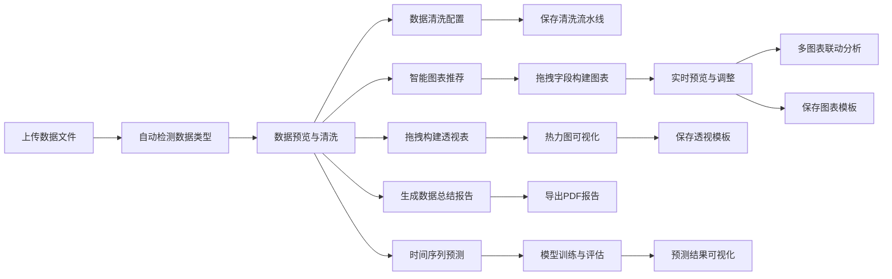

## 1. 产品概述

数据可视化仪表板是一个基于Python和Streamlit的交互式数据分析平台，支持多种数据源导入，提供智能图表推荐、拖拽式图表构建、多图表联动、数据透视表、数据清洗流水线、自动报告生成和预测分析等功能。

- **核心价值**：让用户无需编写代码即可完成从数据导入、清洗、分析到可视化的全流程工作
- **目标用户**：数据分析师、业务分析师、运营人员、科研人员、企业管理者

## 2. 核心功能

### 2.1 用户角色

| 角色 | 注册方式 | 核心权限 |
|------|----------|----------|
| 普通用户 | 无需注册，本地使用 | 完整功能访问，数据上传、清洗、分析、可视化、导出、模板管理 |

### 2.2 功能模块

1. **数据导入**：支持CSV、Excel、JSON文件上传，自动解析数据结构
2. **智能图表推荐**：自动检测数据类型，推荐折线图、柱状图、散点图、箱线图、热力图、地理地图
3. **拖拽式图表构建**：将数据列拖拽分配到X轴、Y轴、颜色、分组，实时预览
4. **多图表联动**：点击图表数据点自动筛选其他图表显示对应数据子集
5. **数据透视表**：拖拽行、列、值字段，自动计算汇总并显示热力图
6. **数据清洗工具**：缺失值处理（删除/填充）、异常值检测（Z分数/IQR）、重复值去重、列类型转换
7. **清洗流水线**：保存清洗步骤为可复用的Python脚本
8. **数据总结报告**：每列基本统计、缺失值比例、偏度峰度、分布直方图，一键导出PDF
9. **预测分析**：选择时间列和数值列，自动训练ARIMA或线性回归模型，显示预测曲线和置信区间
10. **模板系统**：保存/加载图表和透视表配置，一键应用

### 2.3 页面详情

| 页面名称 | 模块名称 | 功能描述 |
|---------|----------|----------|
| 数据导入页 | 文件上传区 | 支持拖拽上传CSV/Excel/JSON文件，显示解析进度 |
| 数据导入页 | 数据预览 | 显示数据前10行、列类型、基本统计信息 |
| 数据导入页 | 数据类型检测 | 自动识别数值型、分类型、时间型、地理型数据 |
| 图表构建页 | 字段面板 | 可拖拽的字段列表，显示数据类型图标 |
| 图表构建页 | 图表配置区 | X轴、Y轴、颜色、分组四个拖放区域 |
| 图表构建页 | 图表类型选择 | 智能推荐的图表类型列表，包含折线图、柱状图、散点图、箱线图、热力图、地图 |
| 图表构建页 | 实时预览区 | 交互式Plotly图表，支持缩放、悬停、下载 |
| 图表构建页 | 多图表联动 | 点击数据点触发全局筛选，支持清除筛选 |
| 透视分析页 | 透视表配置 | 行、列、值三个拖放区域，支持聚合函数选择 |
| 透视分析页 | 透视结果展示 | 可折叠的透视表，支持排序、筛选 |
| 透视分析页 | 热力图展示 | 透视结果自动生成热力图，颜色深浅表示数值大小 |
| 数据清洗页 | 缺失值处理 | 按列配置删除/均值/中位数/众数/自定义填充 |
| 数据清洗页 | 异常值检测 | Z分数或IQR方法，阈值可调节，支持标记/删除/盖帽 |
| 数据清洗页 | 重复值处理 | 选择去重列，预览重复数据 |
| 数据清洗页 | 类型转换 | 数值、字符串、日期、布尔类型互转 |
| 数据清洗页 | 流水线管理 | 记录清洗步骤，导出Python脚本，保存/加载流水线 |
| 报告生成页 | 列统计信息 | 每列的计数、均值、标准差、最小值、最大值、四分位数 |
| 报告生成页 | 高级统计 | 缺失值比例、偏度、峰度、唯一值计数 |
| 报告生成页 | 分布直方图 | 每列的分布图，自动分箱 |
| 报告生成页 | PDF导出 | 一键生成完整报告，支持下载 |
| 预测分析页 | 模型配置 | 选择时间列、预测列、模型类型（ARIMA/线性回归） |
| 预测分析页 | 参数调节 | 预测期数、置信区间、模型参数 |
| 预测分析页 | 结果展示 | 历史数据+预测曲线，置信区间填充 |
| 模板管理页 | 保存模板 | 保存当前所有图表和透视表配置 |
| 模板管理页 | 加载模板 | 选择已有模板一键应用 |
| 模板管理页 | 模板列表 | 查看、删除、重命名模板 |

## 3. 核心流程

用户上传数据后，系统自动识别数据类型并提供智能图表推荐。用户可通过拖拽方式构建图表和透视表，支持多图表联动分析。数据清洗步骤可保存为流水线脚本重复使用。完成分析后可生成包含完整统计信息和直方图的PDF报告，或进行时间序列预测。所有配置均可保存为模板以便下次使用。

## 4. 用户界面设计

### 4.1 设计风格
- **主色调**：深蓝色系 (#1e3a5f) 作为主色，传达专业、可信赖的数据分析感
- **辅助色**：橙色 (#f97316) 作为强调色，用于高亮关键指标和交互元素
- **背景色**：浅灰渐变背景 (#f5f7fa)，卡片使用白色带微妙阴影
- **字体**：使用系统中文字体配合Inter，保证跨平台一致性
- **布局风格**：顶部导航 + 左侧字段面板 + 右侧主内容区，三栏式布局
- **图标风格**：彩色图标配合轻量阴影，直观反映数据类型和功能

### 4.2 页面设计概述

| 页面名称 | 模块名称 | UI元素 |
|---------|----------|--------|
| 图表构建页 | 字段面板 | 可拖拽字段卡片，带数据类型图标、搜索框、折叠/展开 |
| 图表构建页 | 拖放区域 | 四个虚线边框区域，拖拽时高亮，显示当前分配字段 |
| 图表构建页 | 图表类型选择器 | 网格布局的图表卡片，推荐图标注星标，悬停预览 |
| 图表构建页 | 图表预览区 | 大尺寸交互式图表，工具栏提供下载、重置、全屏功能 |
| 透视分析页 | 透视配置区 | 行、列、值三个拖放区域，值字段支持聚合函数下拉选择 |
| 透视分析页 | 结果展示区 | 可滚动透视表，支持行展开/折叠，热力图颜色渐变 |
| 数据清洗页 | 步骤列表 | 时间线式步骤展示，每个步骤可编辑/删除/上下移动 |
| 数据清洗页 | 配置面板 | 折叠式配置面板，实时预览清洗效果 |
| 数据清洗页 | 对比视图 | 左右分栏显示原始数据和清洗后数据 |
| 报告生成页 | 统计卡片 | 网格布局的统计卡片，每列一张，包含关键指标和迷你直方图 |
| 预测分析页 | 结果展示 | 双轴趋势图，历史数据实线、预测数据虚线、置信区间半透明填充 |
| 模板管理页 | 模板卡片 | 网格布局，显示模板名称、创建时间、预览图、操作按钮 |

### 4.3 响应式
- 采用桌面端优先设计，支持1280px及以上分辨率
- 字段面板在小屏幕可折叠收起为图标栏
- 图表组件自适应容器宽度，移动端优化触摸交互
- 透视表在小屏幕转为卡片式展示

### 4.4 视觉动效
- 页面加载时组件依次淡入上移（staggered reveal）
- 拖拽字段时的半透明跟随效果和放置区域高亮
- 数据更新时图表平滑过渡动画
- 点击图表数据点时的波纹扩散效果
- 按钮和卡片悬停有微妙的阴影和缩放反馈
- 清洗步骤添加/删除时的流畅过渡动画
