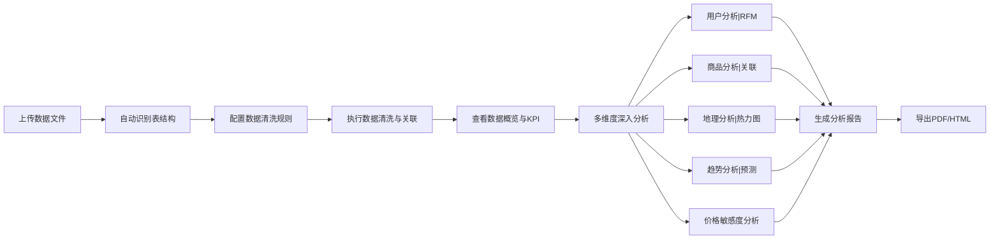

## 1. 产品概述

电商数据分析与可视化工具是一个基于Python的交互式数据分析平台，帮助电商运营人员快速洞察销售数据、用户行为和商品表现。平台提供从数据清洗到深度分析的全流程解决方案，支持多维度数据探索和一键报告导出。

- **核心价值**：降低数据分析门槛，让非技术人员也能快速获取专业的电商数据洞察
- **目标用户**：电商运营人员、数据分析师、市场营销人员、企业管理者

## 2. 核心功能

### 2.1 用户角色

| 角色 | 注册方式 | 核心权限 |
|------|----------|----------|
| 普通用户 | 无需注册，本地使用 | 完整功能访问，数据上传、分析、可视化、导出 |

### 2.2 功能模块

1. **数据导入与清洗**：多文件上传、自动表关联、缺失值处理、异常值检测
2. **核心指标看板**：总销售额、订单量、客单价、复购率、留存率、品类占比
3. **时间序列分析**：日/周/月销售趋势、高峰低谷识别、同比环比对比
4. **用户价值分析**：RFM模型、用户分层、高价值用户列表
5. **地理销售分析**：区域销售热力图、地区销售排名
6. **商品关联分析**：频繁项集挖掘、关联规则、置信度支持度计算
7. **销售预测分析**：移动平均预测、指数平滑预测、未来30天预测
8. **价格敏感度分析**：折扣区间销量影响、价格弹性分析
9. **报告导出**：PDF/HTML格式导出、一键生成完整分析报告

### 2.3 页面详情

| 页面名称 | 模块名称 | 功能描述 |
|---------|----------|----------|
| 数据导入页 | 文件上传区 | 支持拖拽上传CSV/Excel文件，多文件同时上传 |
| 数据导入页 | 表结构识别 | 自动识别订单表、商品表、用户表，显示字段预览 |
| 数据导入页 | 数据清洗配置 | 缺失值处理方式选择、异常值检测方法、清洗预览 |
| 数据概览页 | KPI指标卡片 | 展示6大核心指标，支持时间范围筛选 |
| 数据概览页 | 销售趋势图 | 交互式时间序列图表，支持日/周/月切换 |
| 用户分析页 | RFM模型展示 | 用户分层金字塔图、各层级用户数量与价值 |
| 用户分析页 | 高价值用户列表 | 可筛选导出的用户明细表 |
| 商品分析页 | 品类销售占比 | 饼图/环形图展示各品类销售贡献 |
| 商品分析页 | 关联分析结果 | 商品组合规则表、置信度/支持度/提升度指标 |
| 地理分析页 | 销售热力图 | 交互式地图展示各地区销售分布 |
| 预测分析页 | 预测模型配置 | 算法选择（移动平均/指数平滑）、参数调整 |
| 预测分析页 | 预测结果展示 | 历史+预测趋势图、置信区间 |
| 价格分析页 | 价格敏感度曲线 | 不同折扣区间销量分布、价格弹性系数 |
| 报告导出页 | 报告配置 | 选择分析模块、设置报告标题、导出格式选择 |

## 3. 核心流程

用户上传电商数据文件后，系统自动识别表结构并提供清洗配置。清洗完成后进入数据概览页面查看核心指标，随后可深入各个分析模块进行探索，最终一键导出完整的分析报告。

## 4. 用户界面设计

### 4.1 设计风格
- **主色调**：深蓝色系 (#1e3a5f) 作为主色，传达专业、可信赖的数据分析感
- **辅助色**：橙色 (#f97316) 作为强调色，用于高亮关键指标和交互元素
- **背景色**：浅灰渐变背景，卡片使用白色带微妙阴影
- **字体**：使用思源宋体作为标题字体，Inter作为正文字体，营造专业报告感
- **布局风格**：侧边栏导航 + 主内容区卡片式布局，信息层次清晰
- **图标风格**：线性图标配合轻微阴影，保持简洁专业

### 4.2 页面设计概述

| 页面名称 | 模块名称 | UI元素 |
|---------|----------|--------|
| 数据导入页 | 文件上传区 | 拖拽区域、文件列表、上传进度条、表类型自动标记 |
| 数据导入页 | 数据清洗配置 | 折叠面板、滑块控件、预览表格、对比图表 |
| 数据概览页 | KPI指标卡片 | 带趋势箭头的指标卡、同比环比微图表、悬停动效 |
| 数据概览页 | 销售趋势图 | 交互式Plotly图表、时间粒度切换器、峰值标注 |
| 用户分析页 | RFM分层 | 金字塔可视化、用户数量分布、价值对比柱状图 |
| 商品分析页 | 关联规则 | 可排序规则表、网络图可视化、商品搜索过滤 |
| 地理分析页 | 热力图 | 交互式地图、区域悬停详情、颜色渐变图例 |
| 预测分析页 | 预测展示 | 双轴趋势图、置信区间填充、参数调节滑块 |
| 报告导出页 | 导出配置 | 模块选择器、预览窗口、格式切换按钮 |

### 4.3 响应式
- 采用桌面端优先设计，支持1280px及以上分辨率
- 侧边栏在移动端可折叠收起
- 图表组件自适应容器宽度，移动端优化触摸交互
- 表格在小屏幕转为卡片式展示

### 4.4 视觉动效
- 页面加载时指标卡片依次淡入上移（staggered reveal）
- 数据更新时数字平滑过渡动画
- 图表支持渐入动画和交互悬停高亮
- 侧边栏切换使用平滑过渡效果
- 按钮和卡片悬停有微妙的阴影和缩放反馈
