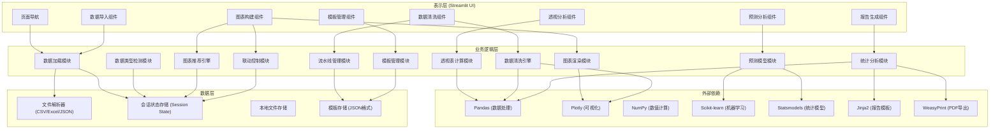
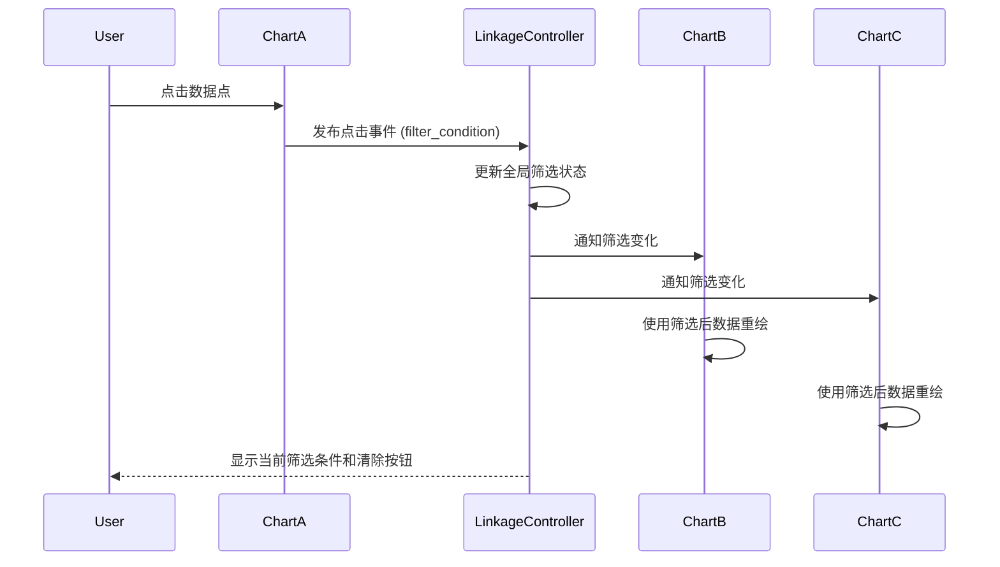

## 1. 架构设计



## 2. 技术描述

### 2.1 核心技术栈
- **前端框架**: Streamlit 1.30+ - 快速构建交互式数据应用
- **数据处理**: Pandas 2.0+, NumPy 1.24+ - 高性能数据处理
- **可视化**: Plotly 5.18+ - 交互式图表渲染
- **机器学习**: Scikit-learn 1.3+ - 线性回归模型
- **统计模型**: Statsmodels 0.14+ - ARIMA时间序列模型
- **报告生成**: Jinja2 3.1+ - HTML模板引擎
- **PDF导出**: WeasyPrint 60+ - HTML转PDF
- **数据格式**: JSON - 模板和流水线存储格式

### 2.2 目录结构
```
/Users/mac/code/solo coder/7/
├── main.py                    # Streamlit主程序入口
├── requirements.txt           # Python依赖包列表
├── src/
│   ├── __init__.py
│   ├── data_loader.py         # 数据加载与解析模块
│   ├── type_detector.py       # 数据类型自动检测模块
│   ├── chart_recommender.py   # 智能图表推荐引擎
│   ├── chart_builder.py       # 图表构建与渲染模块
│   ├── pivot_table.py         # 数据透视表模块
│   ├── data_cleaner.py        # 数据清洗引擎
│   ├── pipeline.py            # 清洗流水线管理模块
│   ├── report_generator.py    # 数据总结报告模块
│   ├── predictor.py           # 预测分析模块
│   ├── template_manager.py    # 模板管理模块
│   ├── linkage_controller.py  # 多图表联动控制器
│   ├── data_processor.py      # 现有：数据处理基础功能
│   ├── visualizer.py          # 现有：专业图表绘制
│   ├── analytics.py           # 现有：高级分析功能
│   ├── metrics.py             # 现有：指标计算
│   ├── exporter.py            # 现有：报告导出
│   └── sample_data.py         # 现有：示例数据生成
├── .trae/
│   └── documents/             # 产品文档
├── templates/                 # 报告模板文件
├── pipelines/                 # 清洗流水线存储
└── saved_templates/           # 用户图表模板存储
```

### 2.3 模块职责说明

| 模块名称 | 核心职责 | 关键函数 |
|---------|----------|----------|
| data_loader.py | 支持CSV/Excel/JSON文件解析，自动编码检测 | `load_file()`, `parse_json()`, `auto_detect_encoding()` |
| type_detector.py | 自动识别数值型、分类型、时间型、地理型数据 | `detect_column_type()`, `classify_columns()`, `is_geographic()` |
| chart_recommender.py | 根据数据类型组合推荐合适的图表类型 | `recommend_charts()`, `score_chart_type()`, `get_supported_charts()` |
| chart_builder.py | 接收字段配置，生成Plotly图表对象 | `build_line_chart()`, `build_bar_chart()`, `build_scatter_chart()`, `build_box_chart()`, `build_heatmap()`, `build_geo_map()` |
| pivot_table.py | 拖拽式透视表构建，支持多种聚合函数 | `build_pivot()`, `aggregate_values()`, `pivot_to_heatmap()` |
| data_cleaner.py | 缺失值、异常值、重复值处理，类型转换 | `handle_missing()`, `detect_outliers()`, `remove_duplicates()`, `convert_type()` |
| pipeline.py | 记录清洗步骤，导出/导入流水线脚本 | `add_step()`, `execute_pipeline()`, `export_pipeline_script()`, `save_pipeline()` |
| report_generator.py | 生成列统计、直方图、完整PDF报告 | `generate_column_stats()`, `plot_histograms()`, `build_report_html()`, `export_pdf()` |
| predictor.py | ARIMA和线性回归预测模型 | `train_arima()`, `train_linear_regression()`, `forecast()`, `calculate_confidence_interval()` |
| template_manager.py | 保存/加载/管理图表和透视表配置 | `save_template()`, `load_template()`, `list_templates()`, `delete_template()` |
| linkage_controller.py | 多图表联动，点击筛选传播 | `register_chart()`, `on_point_click()`, `apply_filter()`, `clear_filter()`, `get_filtered_data()` |

## 3. 关键数据结构

### 3.1 会话状态 (Session State)
```python
session_state = {
    'raw_data': pd.DataFrame,              # 原始数据
    'cleaned_data': pd.DataFrame,          # 清洗后数据
    'active_data': pd.DataFrame,           # 当前活跃数据（含筛选）
    'column_types': Dict[str, str],        # 列类型映射
    'charts': Dict[str, ChartConfig],      # 图表配置字典
    'pivot_tables': Dict[str, PivotConfig],# 透视表配置字典
    'current_filter': FilterCondition,     # 当前筛选条件
    'cleaning_steps': List[CleanStep],     # 清洗步骤列表
    'selected_chart_type': str,            # 当前选中的图表类型
}
```

### 3.2 图表配置 (ChartConfig)
```python
@dataclass
class ChartConfig:
    chart_id: str
    chart_type: str                    # line, bar, scatter, box, heatmap, geo
    title: str
    x_axis: Optional[str]
    y_axis: List[str]
    color: Optional[str]
    group: Optional[str]
    aggregation: str                   # sum, mean, count, min, max
    config: Dict                       # 额外配置参数
```

### 3.3 透视表配置 (PivotConfig)
```python
@dataclass
class PivotConfig:
    pivot_id: str
    rows: List[str]
    columns: List[str]
    values: List[PivotValue]
    show_heatmap: bool
    heatmap_colorscale: str

@dataclass
class PivotValue:
    column: str
    aggregation: str                   # sum, mean, count, min, max
    display_name: str
```

### 3.4 清洗步骤 (CleanStep)
```python
@dataclass
class CleanStep:
    step_id: str
    step_type: str                     # missing, outlier, duplicate, convert, filter
    params: Dict[str, Any]
    description: str
    order: int
```

### 3.5 模板格式 (JSON)
```json
{
  "template_id": "uuid",
  "template_name": "销售分析模板",
  "created_at": "2024-01-01T00:00:00",
  "data_hash": "abc123",
  "charts": [...],
  "pivot_tables": [...],
  "cleaning_pipeline": [...]
}
```

## 4. API 接口定义

### 4.1 数据加载模块
```python
def load_file(file_obj: UploadedFile) -> Tuple[Optional[pd.DataFrame], str]:
    """
    加载并解析上传的文件
    Args:
        file_obj: Streamlit上传文件对象
    Returns:
        (DataFrame, 状态消息)
    """

def detect_column_types(df: pd.DataFrame) -> Dict[str, str]:
    """
    检测DataFrame各列的数据类型
    Returns:
        {列名: 类型} 字典，类型包括: numeric, categorical, datetime, geographic, text
    """
```

### 4.2 图表推荐模块
```python
def recommend_charts(
    df: pd.DataFrame,
    column_types: Dict[str, str],
    selected_columns: Optional[List[str]] = None
) -> List[Dict]:
    """
    基于数据类型推荐合适的图表
    Returns:
        推荐列表，每项包含: chart_type, score, reason, required_fields
    """
```

### 4.3 图表构建模块
```python
def build_chart(
    df: pd.DataFrame,
    config: ChartConfig,
    filter_condition: Optional[FilterCondition] = None
) -> go.Figure:
    """
    根据配置构建Plotly图表
    Args:
        df: 数据源
        config: 图表配置
        filter_condition: 联动筛选条件
    Returns:
        Plotly Figure对象
    """
```

### 4.4 透视表模块
```python
def build_pivot_table(
    df: pd.DataFrame,
    config: PivotConfig
) -> Tuple[pd.DataFrame, go.Figure]:
    """
    构建透视表及热力图
    Returns:
        (透视结果DataFrame, 热力图Figure)
    """
```

### 4.5 数据清洗模块
```python
def execute_cleaning_step(
    df: pd.DataFrame,
    step: CleanStep
) -> Tuple[pd.DataFrame, Dict]:
    """
    执行单个清洗步骤
    Returns:
        (处理后DataFrame, 处理报告)
    """

def export_pipeline_script(steps: List[CleanStep]) -> str:
    """
    导出清洗流水线为可执行的Python脚本
    Returns:
        Python脚本代码字符串
    """
```

### 4.6 预测模块
```python
def train_and_predict(
    df: pd.DataFrame,
    time_col: str,
    value_col: str,
    model_type: str = 'auto',       # auto, arima, linear
    periods: int = 30,
    confidence: float = 0.95
) -> Tuple[pd.DataFrame, go.Figure, Dict]:
    """
    训练模型并生成预测结果
    Returns:
        (预测结果DataFrame, 预测图表, 模型评估指标)
    """
```

## 5. 联动机制设计

### 5.1 联动控制器
使用发布-订阅模式实现图表间通信：



### 5.2 筛选条件数据结构
```python
@dataclass
class FilterCondition:
    source_chart_id: str
    column: str
    operator: str           # equals, in, between, greater, less
    values: List[Any]
    display_text: str
```

## 6. 性能优化策略

1. **数据缓存**: 使用`@st.cache_data`缓存数据加载和处理结果
2. **增量更新**: 图表配置变更时仅重新计算必要部分
3. **分页加载**: 大数据量时表格分页显示
4. **采样显示**: 超过10万行数据自动采样用于图表渲染
5. **并行处理**: 多图表渲染使用线程池并行执行
6. **延迟加载**: 非激活页面组件延迟初始化

## 7. 安全考虑

1. **文件类型校验**: 严格校验上传文件扩展名和内容类型
2. **沙箱执行**: 导出的流水线脚本在受限环境中执行
3. **数据隔离**: 会话间数据完全隔离
4. **输入验证**: 所有用户输入进行类型和范围校验
5. **敏感数据**: 模板存储时不包含实际数据，仅保留配置
