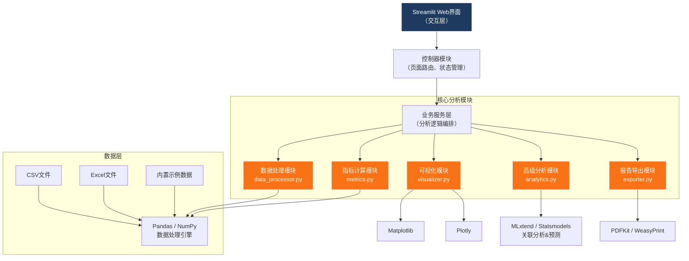
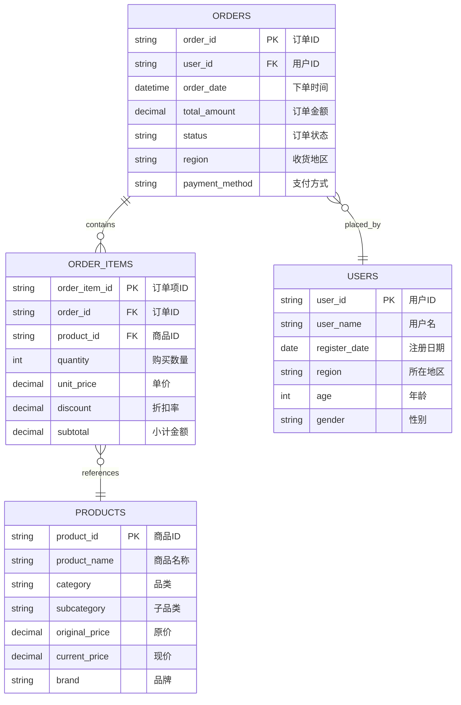

## 1. 架构设计



## 2. 技术描述

### 2.1 核心技术栈

| 层级 | 技术选型 | 版本 | 用途 |
|------|----------|------|------|
| Web框架 | Streamlit | 1.31.0 | 构建交互式Web界面 |
| 数据处理 | Pandas | 2.1.4 | 数据清洗、转换、关联 |
| 数值计算 | NumPy | 1.26.3 | 数值运算、统计分析 |
| 静态可视化 | Matplotlib | 3.8.2 | 静态图表、报告插图 |
| 交互可视化 | Plotly | 5.18.0 | 交互式图表、热力图 |
| 关联分析 | MLxtend | 0.23.0 | Apriori算法、关联规则挖掘 |
| 时间序列预测 | Statsmodels | 0.14.1 | 指数平滑、移动平均模型 |
| 文件读取 | OpenPyXL | 3.1.2 | Excel文件读写 |
| PDF导出 | WeasyPrint | 60.1 | HTML转PDF报告 |
| 样式增强 | Streamlit Extras | 0.0.7 | 额外UI组件 |

### 2.2 项目目录结构

```
ecommerce-analytics/
├── main.py                          # 应用入口
├── requirements.txt                 # 依赖清单
├── src/
│   ├── __init__.py
│   ├── data_processor.py            # 数据处理模块
│   ├── metrics.py                   # 指标计算模块
│   ├── visualizer.py                # 可视化模块
│   ├── analytics.py                 # 高级分析模块
│   ├── exporter.py                  # 报告导出模块
│   └── sample_data.py               # 示例数据生成
├── pages/
│   ├── 1_📊_数据概览.py
│   ├── 2_👥_用户分析.py
│   ├── 3_📦_商品分析.py
│   ├── 4_🗺️_地理分析.py
│   ├── 5_📈_趋势预测.py
│   ├── 6_💰_价格分析.py
│   └── 7_📄_报告导出.py
├── assets/
│   ├── css/
│   │   └── custom.css               # 自定义样式
│   └── templates/
│       └── report_template.html     # 报告模板
└── .trae/
    └── documents/
        ├── PRD-电商数据分析平台.md
        └── 技术架构-电商数据分析平台.md
```

## 3. 模块职责定义

| 模块 | 文件 | 核心职责 | 关键函数 |
|------|------|----------|----------|
| 数据处理 | `src/data_processor.py` | 文件读取、表识别、数据清洗、表关联 | `load_files()`, `detect_table_type()`, `handle_missing_values()`, `detect_outliers()`, `merge_tables()` |
| 指标计算 | `src/metrics.py` | KPI计算、RFM分析、留存率、复购率 | `calculate_kpis()`, `rfm_analysis()`, `calculate_repurchase_rate()`, `calculate_retention()`, `category_sales_ratio()` |
| 可视化 | `src/visualizer.py` | 各类图表生成、主题配置 | `plot_sales_trend()`, `plot_rfm_pyramid()`, `plot_category_pie()`, `plot_geo_heatmap()`, `plot_association_network()`, `plot_forecast()` |
| 高级分析 | `src/analytics.py` | 关联分析、预测模型、价格敏感度 | `apriori_analysis()`, `moving_average_forecast()`, `exponential_smoothing_forecast()`, `price_sensitivity_analysis()`, `detect_peaks_valleys()` |
| 报告导出 | `src/exporter.py` | PDF/HTML报告生成 | `generate_html_report()`, `export_to_pdf()`, `export_to_html()` |
| 示例数据 | `src/sample_data.py` | 生成模拟电商数据 | `generate_orders()`, `generate_products()`, `generate_users()` |

## 4. 数据模型

### 4.1 数据结构定义



### 4.2 表自动识别规则

系统通过字段名称模式自动识别表类型：

| 表类型 | 识别关键字段 | 匹配模式 |
|--------|-------------|----------|
| 订单表 | order_id, order_date, total_amount | `order_id` 或 `订单号` 且含日期字段和金额字段 |
| 商品表 | product_id, product_name, category | `product_id` 或 `商品ID` 且含商品名称 |
| 用户表 | user_id, user_name, register_date | `user_id` 或 `用户ID` 且含用户信息字段 |

## 5. 核心算法设计

### 5.1 RFM模型算法
- **Recency (最近购买)**：计算最后一次购买距分析日期的天数，分5档评分
- **Frequency (购买频率)**：计算用户总订单数，分5档评分
- **Monetary (购买金额)**：计算用户总消费金额，分5档评分
- **用户分层**：基于RFM得分组合分为8个层级：重要价值用户、重要发展用户、重要保持用户、重要挽留用户、一般价值用户、一般发展用户、一般保持用户、流失用户

### 5.2 Apriori关联规则算法
- **支持度(Support)**：P(A∩B) = 同时购买A和B的订单数 / 总订单数
- **置信度(Confidence)**：P(B|A) = 同时购买A和B的订单数 / 购买A的订单数
- **提升度(Lift)**：P(B|A) / P(B) = 置信度 / B的支持度

### 5.3 预测算法
- **简单移动平均(SMA)**：`SMA(n) = (P1 + P2 + ... + Pn) / n`
- **指数平滑(SES)**：`Ft+1 = α*At + (1-α)*Ft`，其中α为平滑系数(0<α<1)

### 5.4 异常值检测
- **IQR方法**：超出 `[Q1-1.5*IQR, Q3+1.5*IQR]` 范围的值判定为异常值
- **Z-score方法**：`|Z| > 3` 的值判定为异常值（Z = (x-μ)/σ）

## 6. 核心API函数签名

### 数据处理模块
```python
def load_files(uploaded_files: List[UploadedFile]) -> Dict[str, pd.DataFrame]:
    """加载上传的CSV/Excel文件，返回DataFrame字典"""

def detect_table_type(df: pd.DataFrame) -> str:
    """自动识别表类型：orders/products/users/unknown"""

def handle_missing_values(df: pd.DataFrame, strategy: str = 'auto') -> Tuple[pd.DataFrame, Dict]:
    """处理缺失值，返回处理后的数据和处理报告"""

def detect_outliers(df: pd.DataFrame, columns: List[str], method: str = 'iqr') -> Tuple[pd.DataFrame, Dict]:
    """检测并处理异常值，返回处理后的数据和异常报告"""

def merge_tables(tables: Dict[str, pd.DataFrame]) -> pd.DataFrame:
    """关联订单、商品、用户表，返回宽表"""
```

### 指标计算模块
```python
def calculate_kpis(df: pd.DataFrame, date_range: Tuple[str, str]) -> Dict[str, float]:
    """计算核心KPI指标"""

def rfm_analysis(df: pd.DataFrame, analysis_date: datetime) -> pd.DataFrame:
    """执行RFM分析，返回带RFM分层的用户表"""

def calculate_retention(df: pd.DataFrame, cohort_type: str = 'month') -> pd.DataFrame:
    """计算用户留存率矩阵"""

def category_sales_ratio(df: pd.DataFrame) -> pd.DataFrame:
    """计算各品类销售占比"""
```

### 高级分析模块
```python
def apriori_analysis(df: pd.DataFrame, min_support: float = 0.01, 
                     min_confidence: float = 0.3) -> pd.DataFrame:
    """执行Apriori关联规则挖掘"""

def moving_average_forecast(series: pd.Series, window: int = 7, 
                            periods: int = 30) -> pd.DataFrame:
    """简单移动平均预测"""

def exponential_smoothing_forecast(series: pd.Series, alpha: float = 0.3, 
                                   periods: int = 30) -> pd.DataFrame:
    """指数平滑预测"""

def price_sensitivity_analysis(df: pd.DataFrame) -> pd.DataFrame:
    """价格敏感度分析，返回不同折扣区间的销量数据"""
```
