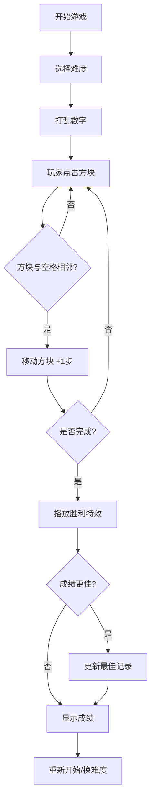

## 1. 产品概述

数字华容道是一款经典益智游戏，玩家通过滑动数字方块将其按顺序排列，锻炼逻辑思维能力。

- 核心玩法：在N×N网格中滑动数字方块，将数字按从左到右、从上到下的顺序排列，空格位于右下角
- 目标用户：所有年龄段的益智游戏爱好者
- 产品价值：提供娱乐性和挑战性，支持多种难度，记录最佳成绩

## 2. 核心功能

### 2.1 功能模块

1. **游戏主界面**：数字网格、控制面板、状态显示
2. **难度切换**：支持3×3、4×4、5×5三种难度
3. **游戏控制**：打乱、提示、撤回、重置功能
4. **状态记录**：步数、用时、差异数显示
5. **历史记录**：各难度最佳成绩（最少步数、最短时间）
6. **视觉设置**：数字模式/彩色模式切换
7. **音效设置**：移动和胜利音效开关
8. **胜利效果**：烟花粒子特效庆祝

### 2.2 功能详情

| 页面名称 | 模块名称 | 功能描述 |
|-----------|-------------|---------------------|
| 游戏主界面 | 数字网格 | 可点击的数字方块，平滑滑动动画 |
| 游戏主界面 | 状态栏 | 实时显示步数、用时、与目标的差异数 |
| 游戏主界面 | 控制面板 | 打乱、提示、撤回、重置按钮 |
| 设置面板 | 难度选择 | 3×3、4×4、5×5难度切换 |
| 设置面板 | 显示模式 | 纯数字模式/彩色渐变模式 |
| 设置面板 | 音效开关 | 开启/关闭移动和胜利音效 |
| 历史记录 | 最佳成绩 | 显示各难度的最少步数和最短时间 |
| 胜利界面 | 庆祝效果 | 烟花粒子特效，显示完成成绩 |

## 3. 核心流程

## 4. 用户界面设计

### 4.1 设计风格

- **主色调**：深蓝色渐变背景 (#1a1a2e → #16213e)，科技感十足
- **强调色**：青蓝色 (#00d4ff) 用于按钮和高亮
- **成功色**：绿色渐变用于胜利提示
- **按钮风格**：圆角、微立体、悬停放大动效
- **字体**：现代无衬线字体，数字使用等宽字体
- **布局风格**：居中卡片式布局，周围留有呼吸空间
- **图标风格**：简洁线性图标，配合emoji增加趣味性

### 4.2 页面设计概览

| 页面名称 | 模块名称 | UI元素 |
|-----------|-------------|-------------|
| 游戏主界面 | 数字网格 | 圆角方块、阴影、滑动动画、彩色渐变背景 |
| 游戏主界面 | 状态栏 | 清晰的数字展示、实时更新 |
| 游戏主界面 | 控制按钮 | 图标+文字、悬停效果、点击反馈 |
| 设置面板 | 开关选项 | 滑动开关、单选按钮组 |
| 胜利界面 | 弹窗效果 | 淡入动画、烟花背景、庆祝文案 |

### 4.3 响应式设计

- 桌面端优先，自适应移动端
- 手机端：单列布局，网格自适应屏幕宽度
- 触摸优化：增大点击热区，支持触摸滑动
- 字体和间距随屏幕尺寸动态调整

### 4.4 动效设计

- 方块移动：0.2秒平滑过渡动画
- 按钮交互：缩放+阴影变化
- 提示高亮：呼吸闪烁效果
- 胜利烟花：粒子爆发动画
- 页面加载：元素依次淡入
