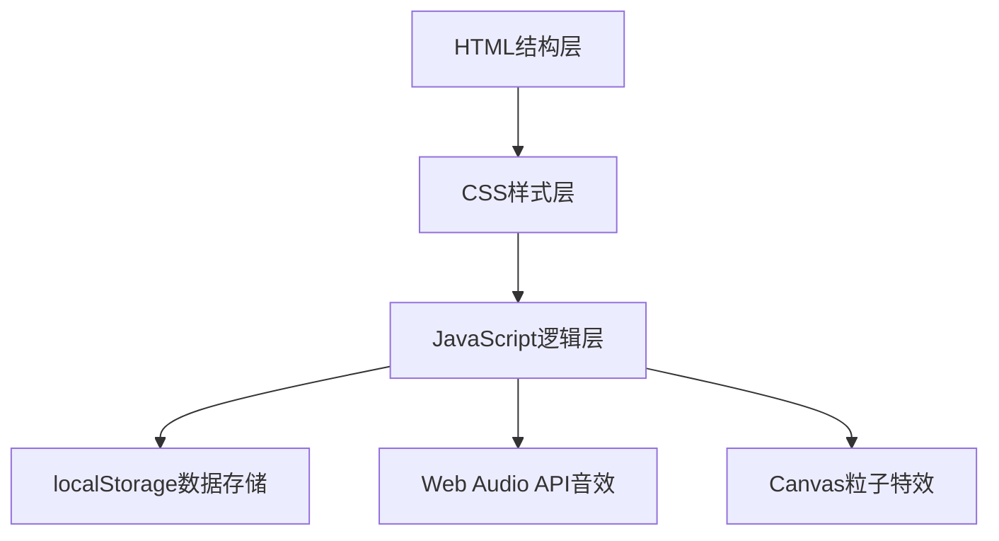

## 1. 架构设计



## 2. 技术选型说明

- **前端技术栈**：原生HTML5 + CSS3 + JavaScript (ES6+)
- **构建工具**：无需构建工具，纯静态文件
- **数据存储**：localStorage 存储最佳记录
- **音效**：Web Audio API 生成合成音效（无需音频文件）
- **粒子特效**：Canvas 2D API 实现烟花效果
- **响应式**：CSS Media Queries + vmin/vw 单位

## 3. 文件结构

```
/
├── index.html          # 主页面
├── css/
│   └── style.css       # 样式文件
├── js/
│   └── app.js          # 游戏逻辑
└── .trae/
    └── documents/      # 项目文档
```

## 4. 核心数据结构

### 4.1 游戏状态

```javascript
{
  size: number,           // 网格大小 (3/4/5)
  tiles: number[],        // 数字数组，0表示空格
  moves: number,          // 步数
  startTime: number,      // 开始时间戳
  elapsed: number,        // 已用时间(秒)
  isPlaying: boolean,     // 是否进行中
  history: TileState[],   // 历史状态（最多5步）
  soundEnabled: boolean,  // 音效开关
  colorMode: boolean      // 彩色模式开关
}
```

### 4.2 最佳记录

```javascript
{
  "3": { moves: number, time: number },
  "4": { moves: number, time: number },
  "5": { moves: number, time: number }
}
```

## 5. 核心算法

### 5.1 打乱算法（保证有解）
- Fisher-Yates 随机打乱
- 检查逆序数奇偶性，确保可解
- 3x3/4x4: 逆序数为偶数时有解
- 5x5: 空格所在行（从下往上）+ 逆序数 为偶数时有解

### 5.2 移动逻辑
- 点击方块时检查与空格的位置关系
- 相邻（上下左右）则交换位置
- 记录历史状态用于撤回

### 5.3 提示算法
- 找到应该移动到空格当前位置的正确数字
- 高亮显示该数字

## 6. 模块划分

### 6.1 Game 类
- `init(size)`: 初始化游戏
- `shuffle()`: 打乱方块
- `moveTile(index)`: 移动方块
- `undo()`: 撤回操作
- `checkWin()`: 检查胜利
- `getHint()`: 获取提示

### 6.2 UI 模块
- `renderBoard()`: 渲染游戏板
- `updateStats()`: 更新统计信息
- `showWinModal()`: 显示胜利弹窗
- `toggleHint()`: 显示/隐藏提示

### 6.3 Storage 模块
- `saveBestRecord(size, moves, time)`: 保存最佳记录
- `getBestRecord(size)`: 获取最佳记录

### 6.4 Audio 模块
- `playMoveSound()`: 播放移动音效
- `playWinSound()`: 播放胜利音效

### 6.5 Particle 模块
- `initFireworks()`: 初始化烟花
- `launchFirework()`: 发射烟花粒子
