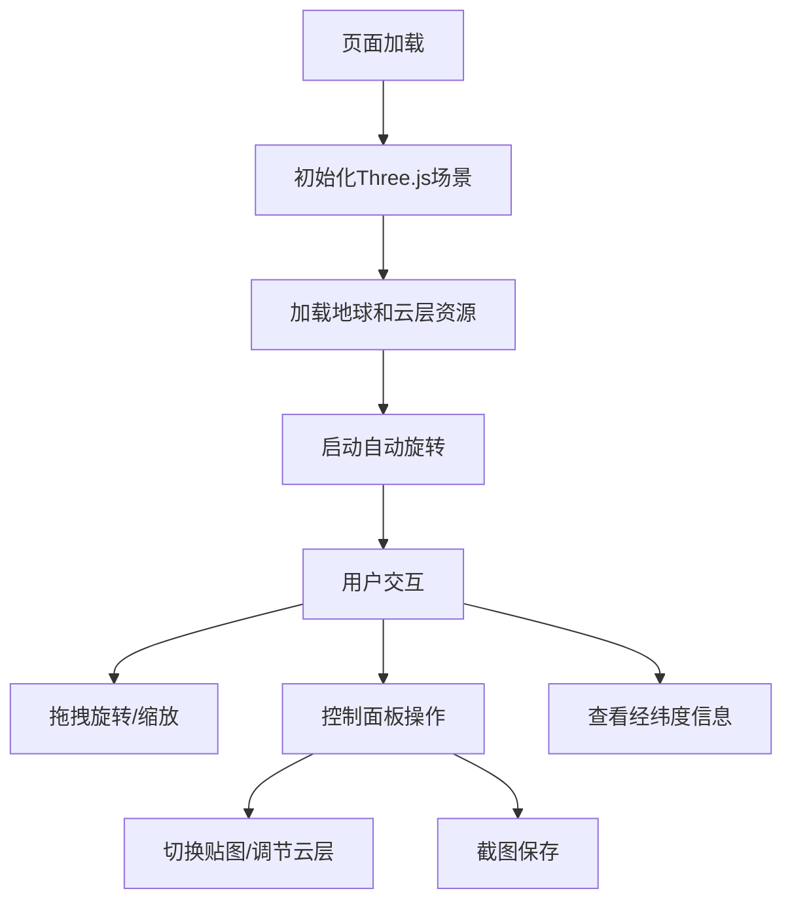

## 1. 产品概述
基于Three.js的交互式3D地球可视化网页，提供沉浸式的宇宙视角体验。用户可以自由探索地球，查看昼夜变化、城市灯光、大气层效果等丰富的视觉呈现。

- 主要用途：教育演示、数据可视化、地理信息展示
- 目标用户：教育工作者、地理爱好者、数据可视化从业者
- 产品价值：通过交互式3D技术让用户直观地了解地球的地理特征和空间概念

## 2. 核心功能

### 2.1 功能模块
1. **3D地球场景**：高分辨率贴图地球、半透明云层、法线贴图增强立体感
2. **昼夜系统**：根据太阳方向模拟昼夜变化，背光面显示城市灯光
3. **交互控制**：OrbitControls支持缩放旋转、自动旋转模式
4. **视觉效果**：星空背景、大气层光晕、经纬度网格辅助线
5. **城市标签**：主要城市3D文本标签，始终面向相机
6. **控制面板**：云层密度调节、贴图风格切换、截图功能、经纬度显示

### 2.3 页面详情
| 页面名称 | 模块名称 | 功能描述 |
|-----------|-------------|---------------------|
| 主页面 | 3D渲染区域 | 全屏Three.js场景，包含地球、云层、星空 |
| 主页面 | 控制面板 | 右上角悬浮控制界面，包含各种开关和滑块 |
| 主页面 | 信息显示 | 底部显示当前相机指向的经纬度坐标 |
| 主页面 | 城市标签 | 地球表面主要城市位置的3D文本 |

## 3. 核心流程
用户打开页面 → 看到自动旋转的地球（默认自动旋转开启）→ 使用鼠标拖拽旋转、滚轮缩放 → 通过控制面板切换不同功能 → 点击截图按钮保存当前视角 → 查看经纬度坐标信息

## 4. 用户界面设计

### 4.1 设计风格
- **主题色彩**：深空蓝黑色背景，地球呈现真实自然色彩，大气层使用淡蓝色光晕
- **视觉风格**：科技感、沉浸式、简约大气
- **控制面板**：半透明深色毛玻璃效果，圆角设计
- **字体**：现代无衬线字体，清晰易读

### 4.2 页面设计概述
| 页面名称 | 模块名称 | UI元素 |
|-----------|-------------|-------------|
| 主页面 | 3D场景 | 居中地球、星空粒子、光晕效果 |
| 主页面 | 控制面板 | 开关按钮、滑块、下拉选择器、功能按钮 |
| 主页面 | 城市标签 | 白色半透明文本，淡色描边 |
| 主页面 | 坐标显示 | 底部居中，白色半透明背景 |

### 4.3 响应性
- 桌面端优先，自适应不同屏幕尺寸
- 控制面板在小屏幕上自动调整布局
- 触摸设备支持手势操作

### 4.4 3D场景指导
- **环境**：纯黑背景 + 星空粒子系统，营造宇宙空间感
- **光照**：方向光模拟太阳光，配合环境光提升暗部细节
- **相机**：PerspectiveCamera，初始距离适中，可自由缩放
- **动画**：云层缓慢自转，地球自转（可开关），标签始终面向相机
- **后处理**：大气层光晕使用自定义着色器实现
- **资源**：使用公共CDN的Three.js库，贴图使用在线纹理资源
