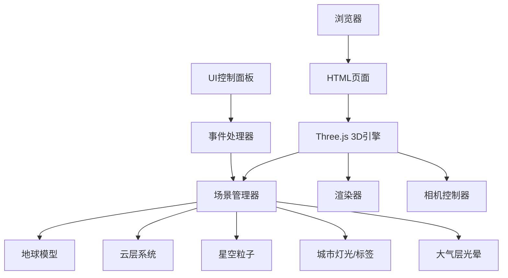

## 1. 架构设计



## 2. 技术描述
- **前端**：原生HTML5 + CSS3 + JavaScript (ES6+)
- **3D引擎**：Three.js (r128+) 通过CDN引入
- **构建工具**：无，直接使用浏览器原生支持
- **依赖库**：
  - Three.js：3D渲染核心
  - OrbitControls：相机交互控制
  - 自定义着色器：大气层光晕、昼夜效果

## 3. 文件结构
| 文件路径 | 用途 |
|-------|---------|
| /index.html | 主页面入口 |
| /css/style.css | 样式文件 |
| /js/app.js | 主应用逻辑 |
| /js/earth.js | 地球模型相关代码 |
| /js/controls.js | UI控制面板逻辑 |
| /js/utils.js | 工具函数（经纬度转换等） |

## 4. 核心数据结构

### 4.1 城市数据
```javascript
const CITIES = [
  { name: "北京", lat: 39.9042, lon: 116.4074 },
  { name: "上海", lat: 31.2304, lon: 121.4737 },
  { name: "纽约", lat: 40.7128, lon: -74.0060 },
  { name: "伦敦", lat: 51.5074, lon: -0.1278 },
  { name: "东京", lat: 35.6762, lon: 139.6503 },
  // ... 更多城市
];
```

### 4.2 配置参数
```javascript
const CONFIG = {
  earthRadius: 5,
  cloudHeight: 0.15,
  atmosphereHeight: 0.3,
  starCount: 10000,
  rotationSpeed: 0.001,
  cloudRotationSpeed: 0.0015,
  autoRotate: true,
  showGrid: false,
  showLabels: true,
  cloudOpacity: 0.6,
  mapStyle: "satellite" // satellite, terrain, political
};
```

## 5. 关键技术实现

### 5.1 昼夜系统
使用自定义着色器实现：
- 计算顶点法线与太阳方向的点积
- 点积小于0的区域为夜晚，显示城市灯光纹理
- 过渡区域使用平滑混合

### 5.2 大气层光晕
使用BackSide渲染的扩展球体：
- 自定义片段着色器实现菲涅尔效果
- 视线与法线夹角越大，光晕越强
- 颜色使用淡蓝色渐变

### 5.3 经纬度转换
```javascript
function latLonToVector3(lat, lon, radius) {
  const phi = (90 - lat) * (Math.PI / 180);
  const theta = (lon + 180) * (Math.PI / 180);
  return new THREE.Vector3(
    -radius * Math.sin(phi) * Math.cos(theta),
    radius * Math.cos(phi),
    radius * Math.sin(phi) * Math.sin(theta)
  );
}
```

### 5.4 截图功能
使用`renderer.domElement.toDataURL('image/png')`获取画布数据，创建下载链接。
